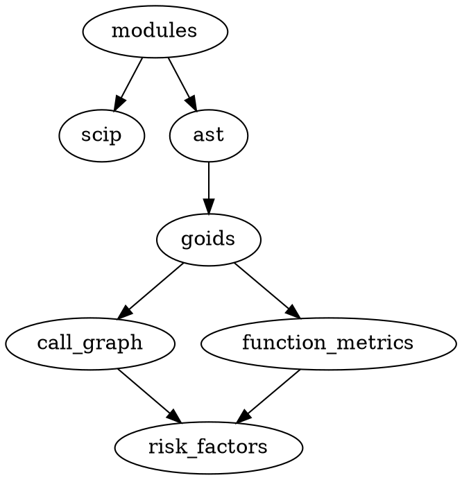
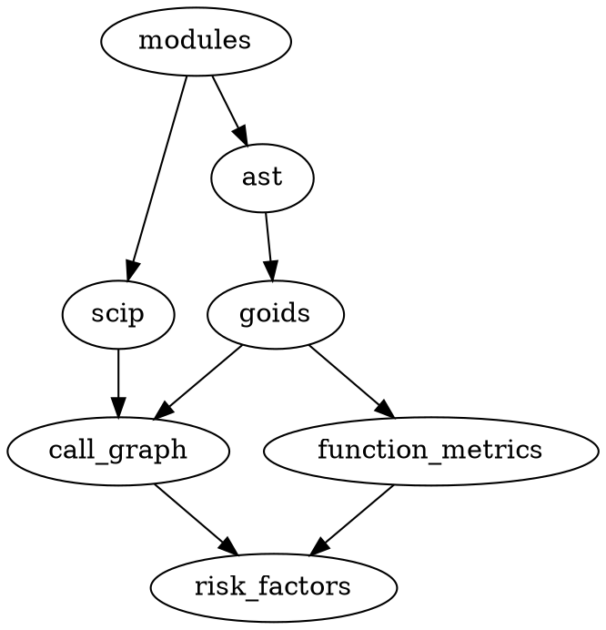
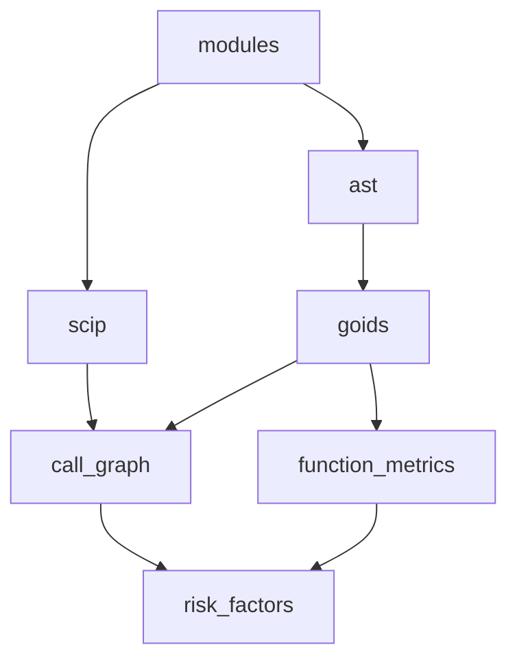

Below is a **Phase 2 PR-by-PR DoD gate sheet (PR‑08…PR‑15)** with:

* **exact new/modified tests** to add under `tests/build/`
* **CLI “golden output” snapshots** (JSON-first, deterministic fields)
* and at the end an explicit **Phase 3 migration map** + the “flip mechanism” (how to switch target-by-target from wrapper → native pipeline)

I’m anchoring this on the Phase 1 state described in your Phase 1 implementation report (full DAG coverage via generated nodes, closure execution, upstream failure gating, `--force`, run tracking to `build.runs`, universal dataset lineage, and graph export tooling). 

---

# Phase 2 PR-by-PR DoD Gate Sheet

## Conventions used in this gate sheet

### Test location convention

* Put new tests in: `tests/build/hamilton/`
* Keep “one PR → one main test module” when possible.

### Golden output convention

To make CLI snapshots stable, Phase 2 should prefer **JSON outputs** for plan/graph/explain commands and tests should assert **parsed JSON** after normalizing “nondeterministic fields”.

**Recommended normalization rules in tests:**

* Remove or wildcard fields like:

  * `run_id`, `duration_ms`, `started_at`, `recorded_at`
* Sort lists where ordering isn’t guaranteed (but for closure/topological order, *it should be deterministic*).
* When comparing long node lists, compare:

  * counts (`node_count`, `edge_count`)
  * presence of key targets
  * presence of key edges
  * and a stable `closure` array for small target sets

I recommend creating a helper in PR‑09:

```python
# tests/build/hamilton/_snapshots.py
from __future__ import annotations
import json
from typing import Any

DYNAMIC_KEYS = {"run_id", "duration_ms", "started_at", "recorded_at"}

def normalize(obj: Any) -> Any:
    if isinstance(obj, dict):
        return {k: normalize(v) for k, v in obj.items() if k not in DYNAMIC_KEYS}
    if isinstance(obj, list):
        return [normalize(x) for x in obj]
    return obj

def assert_json_snapshot(actual_text: str, expected: dict) -> None:
    actual = normalize(json.loads(actual_text))
    assert actual == expected
```

---

## PR‑08 — Make Hamilton the default + add `--hamilton-mode`

### Primary deliverables

1. Hamilton is the default build engine (aggressive transition).
2. Keep `--engine legacy` for emergency fallback (or gate behind env var).
3. Add `--hamilton-mode phase0|generated` (default: `generated`) to control node mode.

### DoD gates

* [ ] `codeintel build run --all` uses Hamilton by default (no engine flag).
* [ ] `codeintel build run --engine legacy --all` still works (if retained).
* [ ] `codeintel build run risk_factors --hamilton-mode phase0` still works.
* [ ] `codeintel build graph ...` defaults to generated mode.

### Tests to add/modify (`tests/build/…`)

**Modify**

* `tests/build/hamilton/test_executor_smoke.py` (or your existing equivalent):

  * Ensure default mode is `generated` unless explicitly set.

**Add**

* `tests/build/hamilton/test_pr08_cli_default_engine.py`

  * Uses CLI runner to execute `build graph risk_factors --format json`
  * Asserts `"mode": "generated"` in output JSON.

### CLI golden snapshots

**Command**

```bash
codeintel build graph risk_factors --format json
```

**Expected JSON shape (partial; assert key fields only)**

```json
{
  "requested": ["risk_factors"],
  "mode": "generated",
  "node_count": 7,
  "edge_count": 6
}
```

> In tests: parse JSON, then assert `mode`, and that `closure` contains expected upstream targets (modules/scip/ast/goids/call_graph/function_metrics/risk_factors) for this path.

---

## PR‑09 — Planner command: `build plan` + rich dry-run parity

### Primary deliverables

1. Add a real planner that produces **closure-complete** plan entries.
2. Add `codeintel build plan ... --format json` (and optionally `--output`).
3. Make `codeintel build run --dry-run ...` call the planner and return the same output.

### DoD gates

* [ ] `build plan risk_factors` returns a JSON plan with:

  * `requested`, `closure`
  * `entries[]` with:

    * `target`, `node`
    * `status: compute|skip|blocked|missing`
    * `reason: forced|no_manifest|hash_changed|up_to_date|upstream_failed|...`
    * `input_hash`, `prior_input_hash` (when available)
    * `options_hash`
    * `dependencies`
    * `table_keys` / contract outputs
* [ ] `build run --dry-run ...` returns exactly the same plan as `build plan ...`.

### Tests to add (`tests/build/…`)

**Add**

* `tests/build/hamilton/test_pr09_planner_status_matrix.py`

  * Arrange: fake manifest index with cases:

    * no manifest → compute/no_manifest
    * matching input_hash → skip/up_to_date
    * mismatched input_hash → compute/hash_changed
    * forced → compute/forced
* `tests/build/hamilton/test_pr09_dry_run_equals_plan.py`

  * Asserts `build run --dry-run` output JSON equals `build plan` JSON for same inputs.

### CLI golden snapshots

**Command**

```bash
codeintel build plan risk_factors --format json
```

**Expected JSON shape (example; you’ll assert exact for a tiny test graph)**

```json
{
  "requested": ["risk_factors"],
  "closure": ["modules", "scip", "ast", "goids", "call_graph", "function_metrics", "risk_factors"],
  "entries": [
    {
      "target": "modules",
      "node": "t__modules",
      "status": "compute",
      "reason": "no_manifest",
      "dependencies": [],
      "table_keys": ["ingestion.modules"]
    }
  ]
}
```

> In tests, use a tiny in-memory TargetGraph fixture (3 nodes) so the snapshot is short and deterministic.

---

## PR‑10 — Manifest index prefetch + shared hash/skip logic for plan & run

### Primary deliverables

1. `BuildEnv` carries a preloaded manifest index (repo+commit → manifests).
2. Hash computation cascades deterministically using dependency hashes.
3. Planner + executor both use the same:

   * options hash
   * input hash
   * skip decision function

### DoD gates

* [ ] One run does **at most one “list manifests”** query (or otherwise bounded).
* [ ] Hash cascade works:

  * changing one upstream hash changes downstream `input_hash`.
* [ ] Planner and executor agree on skip decisions for unchanged builds.

### Tests to add (`tests/build/…`)

**Add**

* `tests/build/hamilton/test_pr10_manifest_prefetch_used.py`

  * Use a fake gateway/build accessor that:

    * allows `list_manifests(...)`
    * raises if `load_manifest(...)` is called N times
  * Run planner and ensure no per-target manifest fetch happens.
* `tests/build/hamilton/test_pr10_hash_cascade_changes_downstream.py`

  * Two manifests differ for an upstream target; assert downstream `input_hash` changes.

### CLI golden snapshots

This PR is mostly non-user-facing, but you can still add a “sanity” snapshot:

**Command**

```bash
codeintel build plan risk_factors --format json
```

**Assertion idea**

* In test, assert that `entries[i].input_hash` changes if you alter one upstream prior manifest hash.

---

## PR‑11 — DatasetRef v2 + skipped targets yield dataset refs + ArtifactRef scaffolding

### Primary deliverables

1. `DatasetRef` includes snapshot identity (`repo`, `commit`) and consistent metadata.
2. When a target is “skipped as up-to-date”, it still returns dataset refs (row_count may be None).
3. Introduce `ArtifactRef` plumbing (even if not fully utilized yet):

   * `ArtifactRef` data class
   * optional `a__*` nodes for artifacts (behind a flag if you want)

### DoD gates

* [ ] `TargetRunRecord.datasets` exists for skipped targets.
* [ ] Dataset nodes (`d__*`) work even when upstream target was skipped.
* [ ] `DatasetRef` round-trips through JSON/export cleanly.

### Tests to add (`tests/build/…`)

**Add**

* `tests/build/hamilton/test_pr11_skipped_targets_have_datasets.py`

  * Force a skip (manifest matches), assert returned `TargetRunRecord.datasets` non-empty.
* `tests/build/hamilton/test_pr11_dataset_nodes_work_when_skipped.py`

  * Evaluate `d__...` dataset node that depends on a skipped target record.
* (Optional) `tests/build/hamilton/test_pr11_artifactref_dataclass.py`

  * Ensure serialization/fields correct.

### CLI golden snapshots

**Command**

```bash
codeintel build plan risk_factors --format json
```

**Expected addition (assert presence):**

* Each entry contains `table_keys` and optionally `artifact_keys`.
* DatasetRef is not in the plan yet, but if you include “outputs” in plan, snapshot them.

---

## PR‑12 — Loader nodes: `q__*` (Ibis) + `df__*` (pandas) + optional validation flag

### Primary deliverables

1. For every dataset key, generate:

   * `q__schema__table` → Ibis expression
   * `df__schema__table` → pandas DataFrame
2. Add optional `--validate-outputs`:

   * when enabled, validate produced datasets via Pandera/SCHEMA_REGISTRY post-write.

### DoD gates

* [ ] Generated module contains `q__*` and `df__*` nodes for each `d__*`.
* [ ] Loader nodes filter by repo/commit when possible (only if columns exist).
* [ ] With `--validate-outputs`, schema validation failures fail the run and block downstream targets.

### Tests to add (`tests/build/…`)

**Add**

* `tests/build/hamilton/test_pr12_loader_nodes_exist.py`

  * Build driver, list variables, assert:

    * `d__analytics__risk_factors`
    * `q__analytics__risk_factors`
    * `df__analytics__risk_factors`
* `tests/build/hamilton/test_pr12_validate_outputs_flag.py`

  * Mock validation function to fail for one table.
  * Assert:

    * target marked failed
    * downstream is blocked/skipped with upstream_failed reason.

### CLI golden snapshots

You’ll want a CLI entry to exercise loaders deterministically. Two options:

**Option A (recommended): add `build dataset head` command in PR‑12**

```bash
codeintel build dataset head analytics.function_metrics --rows 3 --format json
```

**Expected JSON shape**

```json
{
  "table_key": "analytics.function_metrics",
  "rows": [
    {"function_id": "f1", "cyclomatic_complexity": 3}
  ]
}
```

**Option B: don’t add new command; assert via python tests only**

* That’s fine, but you asked for CLI snapshots, so Option A is better DX anyway.

---

## PR‑13 — Persist per-target run records into `build.run_targets`

### Primary deliverables

1. Create a new persisted table/dataset `build.run_targets`.
2. After each Hamilton run, insert one row per target in closure:

   * `run_id`, `repo`, `commit`, `target`, `status`, `duration_ms`, `input_hash`, `options_hash`, `error`, `row_counts_json`
3. Add CLI retrieval:

   * `codeintel build run-info --run-id ... --format json` (or extend history)

### DoD gates

* [ ] Every run inserts exactly `len(closure)` rows.
* [ ] Skipped targets are persisted too (status=skipped).
* [ ] CLI can return the per-target breakdown for a run_id.

### Tests to add (`tests/build/…`)

**Add**

* `tests/build/hamilton/test_pr13_run_targets_persisted.py`

  * Execute a tiny “fake run” path (stub driver returning TargetRunRecords)
  * Assert run_targets has exactly N rows.
* `tests/build/hamilton/test_pr13_run_info_cli.py`

  * Run CLI `build run-info --run-id ... --format json`
  * Compare JSON snapshot after normalization (remove timestamps).

### CLI golden snapshots

**Command**

```bash
codeintel build run-info --run-id hamilton-... --format json
```

**Expected JSON shape (example)**

```json
{
  "run_id": "hamilton-...redacted...",
  "repo": "example",
  "commit": "abc123",
  "targets": [
    {"target": "modules", "status": "skipped"},
    {"target": "risk_factors", "status": "succeeded"}
  ]
}
```

---

## PR‑14 — Graph exports: add DOT + stabilize Mermaid + enrich node metadata

### Primary deliverables

1. Extend graph export formats:

   * JSON (already)
   * Mermaid (already, but stabilize output)
   * DOT (new)
2. Ensure node metadata is present:

   * module/domain
   * produced table keys
   * (optional) “node kind”: target|dataset|loader|artifact

### DoD gates

* [ ] `codeintel build graph risk_factors --format dot` outputs valid DOT.
* [ ] Mermaid output renders correctly for the closure.
* [ ] Export is deterministic (stable ordering) so you can snapshot it.

### Tests to add (`tests/build/…`)

**Add**

* `tests/build/hamilton/test_pr14_graph_dot_export.py`

  * For a tiny graph, assert DOT contains key edges.
* `tests/build/hamilton/test_pr14_graph_mermaid_export.py`

  * Assert Mermaid contains key edges and no duplicates.
* (Optional) `tests/build/hamilton/test_pr14_graph_metadata_fields.py`

  * Ensure JSON nodes include `tables`, `dependencies`, etc.

### CLI golden snapshots

**Command**

```bash
codeintel build graph risk_factors --format dot
```

**Expected snippet (partial assert)**



---

## PR‑15 — Explain staleness: `build explain` + plan diff (why will it run?)

### Primary deliverables

1. Add `codeintel build explain <target>` (or `build plan --diff`) returning:

   * why compute vs skip
   * what changed (deps vs options)
   * minimal upstream cause chain (optional but extremely valuable)
2. Make output JSON-first for golden snapshots.

### DoD gates

* [ ] Explain output includes:

  * target status + reason
  * changed dependencies list (dep → prior hash vs current hash)
  * options change indication (prior options hash vs current)
* [ ] Explain respects `--force` (forced reason).
* [ ] Explain respects upstream failure gating (blocked reason).

### Tests to add (`tests/build/…`)

**Add**

* `tests/build/hamilton/test_pr15_explain_dep_change.py`

  * Create manifests where dep hash changes → assert explain points to that dep.
* `tests/build/hamilton/test_pr15_explain_options_change.py`

  * Same dep hash, options hash changes → assert explain says options changed.
* `tests/build/hamilton/test_pr15_explain_forced.py`

  * force target → reason forced.

### CLI golden snapshots

**Command**

```bash
codeintel build explain risk_factors --format json
```

**Expected JSON shape**

```json
{
  "target": "risk_factors",
  "status": "compute",
  "reason": "hash_changed",
  "diff": {
    "options_changed": false,
    "deps_changed": [
      {
        "dep": "call_graph",
        "prior_input_hash": "aaaa",
        "current_input_hash": "bbbb"
      }
    ]
  }
}
```

---

# Phase 3 Migration Map

Phase 3 is “turn selected targets into *pure* Hamilton pipelines with explicit materializers” while everything else continues to run via the current plugin wrapper nodes. Phase 1 already gives you a stable DAG and execution semantics; Phase 2 makes planning/assets/observability excellent; Phase 3 makes the *computation itself* Hamilton-native.

## Phase 3 “flip” mechanism (how you switch gradually)

### The core idea

You keep the generated node factory for the full graph, but you **exclude** targets that have a native implementation and load their native modules into the driver.

#### Recommended implementation strategy

1. Add a registry:

```python
# codeintel/build/hamilton/native_registry.py
NATIVE_TARGETS: dict[str, str] = {
    "risk_factors": "codeintel.build.hamilton.dataflow.analytics.risk_factors",
    "function_metrics_ext": "codeintel.build.hamilton.dataflow.analytics.function_metrics_ext",
}
```

2. Update `get_generated_module(...)` to accept `exclude_targets=...`
3. In `build_driver(...)`:

   * build generated module excluding enabled native targets
   * import native modules for enabled targets
   * pass modules to Hamilton driver in deterministic order

This avoids name collisions and makes it explicit which targets are native.

### How to flip targets in practice

Introduce a config knob (per run or per profile):

* `hamilton.native_targets = ["risk_factors", "function_metrics_ext"]`

Then:

* in dev: enable a few native targets
* in CI: enable more native targets once stable
* eventually: all targets native (or all “data transform” targets native; ingestion may remain hybrid longer)

---

## Phase 3 target migration waves

### Wave 1 (fast ROI, low risk): analytics transforms

These are best to start with because they’re typically deterministic transforms over existing tables.

| Target                                   | Current in Phase 1/2                          | Phase 3 native form                                   | Outputs                          |
| ---------------------------------------- | --------------------------------------------- | ----------------------------------------------------- | -------------------------------- |
| `risk_factors`                           | wrapper node runs plugin + side-effect writes | pure compute Ibis node(s) + explicit materialize node | `analytics.risk_factors`         |
| `function_metrics_ext` (new or existing) | wrapper or derived later                      | pure compute Ibis node(s) + explicit materialize      | `analytics.function_metrics_ext` |
| `hotspots` (if present)                  | wrapper                                       | pure compute over commit/edges/metrics                | `analytics.hotspots`             |

**Flip criteria**

* Deterministic inputs from upstream tables (`q__*` nodes)
* Clearly defined contract schema exists in SCHEMA_REGISTRY
* Easy to validate post-write

### Wave 2: graph/analytics hybrids (still mostly transform)

| Target                                   | Native approach                                                                 |
| ---------------------------------------- | ------------------------------------------------------------------------------- |
| `call_graph_views` (if you create views) | compute views as Ibis expressions; materialize to tables or create DuckDB views |
| “derived edges” / “summary tables”       | same                                                                            |

### Wave 3: ingestion (harder, but huge performance wins)

These tend to interact with filesystem/tools (SCIP, AST extraction). They can still become Hamilton-native, but often require:

* dynamic execution patterns (per-file parallelism)
* careful caching policies
* explicit artifact materializers (files on disk, indexes, etc.)

---

## Phase 3 “native target” template

For each native target `X` (e.g., `risk_factors`):

### 1) Compute node(s): pure, cacheable

* input: `q__...` nodes (Ibis tables)
* output: Ibis expression or Arrow/pandas for certain steps

```python
def t__risk_factors_compute(...)-> ir.Table:
    ...
```

### 2) Materialize node: the only side-effect boundary

* writes to DuckDB (`env.gateway.ibis.write(...)`)
* returns a `TargetRunRecord` consistent with Phase 1 semantics:

  * status
  * hashes
  * datasets populated (including repo/commit if you implemented DatasetRef v2)
  * row_counts if available

```python
def t__risk_factors(env, graph, t__risk_factors_compute)-> TargetRunRecord:
    env.gateway.ibis.write("analytics.risk_factors", t__risk_factors_compute, overwrite=True)
    return record
```

### 3) Validation node (optional but recommended)

* validate schema (Pandera)
* validate invariants (non-null keys, range checks)

---

## Phase 3 “how to flip safely” checklist

For each target you migrate:

* [ ] Native module exists and is imported by registry
* [ ] Generated module excludes that target
* [ ] Plan output shows implementation = `native` (add a field to plan entries: `impl_kind`)
* [ ] Run inserts consistent `build.run_targets` row (Phase 2 PR‑13)
* [ ] `d__*` dataset nodes still work
* [ ] `q__*` and `df__*` loaders still work
* [ ] Validation can be enabled without false positives

---

If you want, I can turn this into an **explicit “Phase 2/3 combined tracking board”** where each PR has:

* a checklist of tasks
* a checklist of tests
* and the specific CLI goldens to add to a `tests/build/hamilton/snapshots/` directory (with file names and exact contents).


# combined phase 2 and phase 3 tracking board #

Absolutely — here’s an explicit **Phase 2/3 combined tracking board**, PR-by-PR, with:

* **Task checklist** (what to build)
* **Test checklist** (what to add/change under `tests/build`)
* **CLI goldens** to add under `tests/build/hamilton/snapshots/` including **exact file names and suggested contents**
* Plus the **Phase 3 migration tracking board** (targets → native pipeline), and the **flip mechanism** to migrate gradually.

This is designed to align with your current Phase 1 baseline: full DAG coverage via generated nodes, closure execution, upstream gating, `--force`, run tracking, universal dataset nodes, and DAG export tooling. 

---

# Directory + snapshot harness (add once, used by all PRs)

## Add snapshot directory

```
tests/build/hamilton/snapshots/
```

## Add minimal snapshot harness helpers

Create:

### `tests/build/hamilton/snapshots/_snapshot.py`

```python
from __future__ import annotations

import json
from pathlib import Path
from typing import Any

# Strip nondeterministic keys from CLI JSON payloads.
_DYNAMIC_KEYS = {
    "run_id",
    "duration_ms",
    "started_at",
    "recorded_at",
    "timestamp",
}

def _normalize(obj: Any) -> Any:
    if isinstance(obj, dict):
        return {k: _normalize(v) for k, v in obj.items() if k not in _DYNAMIC_KEYS}
    if isinstance(obj, list):
        return [_normalize(x) for x in obj]
    return obj

def assert_cli_json_snapshot(*, actual_json_text: str, snapshot_path: Path) -> None:
    expected = json.loads(snapshot_path.read_text(encoding="utf-8"))
    actual = _normalize(json.loads(actual_json_text))
    expected = _normalize(expected)
    assert actual == expected
```

### `tests/build/hamilton/snapshots/_cli.py`

(Use whatever CLI runner you already have in tests; here’s the intended interface.)

```python
from __future__ import annotations

from dataclasses import dataclass

@dataclass(frozen=True)
class CliRun:
    stdout: str
    stderr: str
    exit_code: int

def run_cli(args: list[str]) -> CliRun:
    """
    Hook this up to your existing CLI invocation helper.
    Must return stdout text (JSON for --format json commands).
    """
    raise NotImplementedError("Wire to your existing test CLI runner.")
```

> You’ll implement `run_cli` once using the conventions already present in `tests.zip`.

---

# Phase 2 tracking board (PR‑08 … PR‑15)

## PR‑08 — Default to Hamilton + add `--hamilton-mode`

### Tasks

* [ ] Default `codeintel build run` engine to Hamilton (aggressive transition).
* [ ] Add `--hamilton-mode generated|phase0` (default: `generated`).
* [ ] Ensure `build graph` respects hamilton mode.
* [ ] (Optional) Keep `--engine legacy` behind env flag if you want to force Hamilton adoption.

### Tests (`tests/build`)

* [ ] Add `tests/build/hamilton/test_pr08_cli_defaults.py`

  * asserts:

    * default engine is Hamilton
    * default mode is generated
* [ ] Update any existing tests that assumed legacy default.

### CLI goldens

Add:

#### `tests/build/hamilton/snapshots/pr08_graph_default.json`

**Command** (in test):

```bash
codeintel build graph risk_factors --format json
```

**Snapshot contents (example shape; keep minimal + stable):**

```json
{
  "requested": ["risk_factors"],
  "mode": "generated",
  "node_count": 7,
  "edge_count": 6,
  "closure": ["modules", "scip", "ast", "goids", "call_graph", "function_metrics", "risk_factors"]
}
```

*(If your closure list differs because you renamed targets, adjust accordingly — but keep the “must include closure” property.)*

---

## PR‑09 — Planner: `build plan` + `--dry-run` parity

### Tasks

* [ ] Implement `codeintel build plan ... --format json`.
* [ ] Make `codeintel build run --dry-run` output the same JSON plan.
* [ ] Plan entry fields (required):

  * `target`, `node`, `status`, `reason`, `input_hash`, `prior_input_hash`, `options_hash`, `dependencies`, `table_keys`.
* [ ] Deterministic topological ordering + stable JSON ordering.

### Tests (`tests/build`)

* [ ] Add `tests/build/hamilton/test_pr09_plan_status_matrix.py`
* [ ] Add `tests/build/hamilton/test_pr09_dry_run_equals_plan.py`
* [ ] Add a small fixture graph (3 targets) if not already present.

### CLI goldens

Add:

#### `tests/build/hamilton/snapshots/pr09_plan_small_graph.json`

**Command**

```bash
codeintel build plan tiny_c --format json
```

**Snapshot contents (for a tiny graph A→B→C; you control this via test fixture):**

```json
{
  "requested": ["tiny_c"],
  "closure": ["tiny_a", "tiny_b", "tiny_c"],
  "entries": [
    {
      "target": "tiny_a",
      "node": "t__tiny_a",
      "status": "compute",
      "reason": "no_manifest",
      "dependencies": [],
      "table_keys": ["tiny.tiny_a"]
    },
    {
      "target": "tiny_b",
      "node": "t__tiny_b",
      "status": "compute",
      "reason": "no_manifest",
      "dependencies": ["tiny_a"],
      "table_keys": ["tiny.tiny_b"]
    },
    {
      "target": "tiny_c",
      "node": "t__tiny_c",
      "status": "compute",
      "reason": "no_manifest",
      "dependencies": ["tiny_b"],
      "table_keys": ["tiny.tiny_c"]
    }
  ]
}
```

#### `tests/build/hamilton/snapshots/pr09_dry_run_equals_plan.json`

This can simply duplicate `pr09_plan_small_graph.json` and the test asserts equality.

---

## PR‑10 — Manifest index prefetch + shared hash/skip logic

### Tasks

* [ ] Add `manifest_index` to `BuildEnv`.
* [ ] Ensure planner and executor:

  * compute hashes using same functions
  * consult preloaded manifest index (no per-target manifest fetch).
* [ ] Ensure hash cascade uses dependency input hashes deterministically.

### Tests (`tests/build`)

* [ ] Add `tests/build/hamilton/test_pr10_manifest_prefetch_used.py`

  * use a fake gateway/build accessor that fails if per-target loads occur.
* [ ] Add `tests/build/hamilton/test_pr10_hash_cascade.py`

  * change a dep manifest hash and assert downstream input_hash changes.

### CLI goldens

This PR is largely internal, but add a lightweight golden that demonstrates that plan output includes `prior_input_hash` when manifests exist.

#### `tests/build/hamilton/snapshots/pr10_plan_with_prior_hashes.json`

**Command**

```bash
codeintel build plan tiny_c --format json
```

**Snapshot contents** (same as PR‑09 but with `prior_input_hash` present; keep hashes as stable test fixture values):

```json
{
  "requested": ["tiny_c"],
  "closure": ["tiny_a", "tiny_b", "tiny_c"],
  "entries": [
    {
      "target": "tiny_a",
      "status": "skip",
      "reason": "up_to_date",
      "input_hash": "hashA",
      "prior_input_hash": "hashA"
    },
    {
      "target": "tiny_b",
      "status": "skip",
      "reason": "up_to_date",
      "input_hash": "hashB",
      "prior_input_hash": "hashB"
    },
    {
      "target": "tiny_c",
      "status": "skip",
      "reason": "up_to_date",
      "input_hash": "hashC",
      "prior_input_hash": "hashC"
    }
  ]
}
```

*(Your test sets those hashes by faking the hash function or by using a deterministic hashing stub in test.)*

---

## PR‑11 — DatasetRef v2 + skipped targets still yield datasets + ArtifactRef scaffolding

### Tasks

* [ ] Upgrade `DatasetRef` to carry repo/commit (or snapshot id).
* [ ] When a target is skipped, still populate datasets based on contract table keys.
* [ ] Add `ArtifactRef` + (optional) artifact nodes `a__*` generation behind a flag.

### Tests (`tests/build`)

* [ ] Add `tests/build/hamilton/test_pr11_skipped_targets_have_datasets.py`
* [ ] Add `tests/build/hamilton/test_pr11_dataset_nodes_work_when_skipped.py`
* [ ] (Optional) Add `tests/build/hamilton/test_pr11_artifactref.py`

### CLI goldens

Add a plan golden that shows dataset outputs for skipped targets if your plan includes “outputs”, or add a new CLI command:

**Recommended new CLI command (very useful):**

* `codeintel build outputs <target> --format json`

  * returns produced datasets/artifacts for that target from the last run or from contract.

#### `tests/build/hamilton/snapshots/pr11_outputs_risk_factors.json`

**Command**

```bash
codeintel build outputs risk_factors --format json
```

**Snapshot contents**

```json
{
  "target": "risk_factors",
  "table_keys": ["analytics.risk_factors"],
  "artifact_keys": []
}
```

*(This is stable even without running builds; it reads contract.)*

---

## PR‑12 — Loader nodes: `q__*` (Ibis) + `df__*` (pandas) + `--validate-outputs`

### Tasks

* [ ] Generate loader nodes per dataset key:

  * `q__schema__table` → ibis expr
  * `df__schema__table` → pandas df
* [ ] Add `--validate-outputs` to build run:

  * validate produced datasets post-write (Pandera)
  * failure marks target failed and blocks downstream

### Tests (`tests/build`)

* [ ] Add `tests/build/hamilton/test_pr12_loader_nodes_exist.py`
* [ ] Add `tests/build/hamilton/test_pr12_validate_outputs_blocks_downstream.py`

### CLI goldens

If you add a dataset inspect command (highly recommended), add:

#### `tests/build/hamilton/snapshots/pr12_dataset_head.json`

**Command**

```bash
codeintel build dataset head analytics.function_metrics --rows 2 --format json
```

**Snapshot contents** (small stable fixture table)

```json
{
  "table_key": "analytics.function_metrics",
  "rows": [
    {"function_id": "f1", "cyclomatic_complexity": 3},
    {"function_id": "f2", "cyclomatic_complexity": 1}
  ]
}
```

If you don’t want a new command, then treat PR‑12 as test-only verification and skip CLI snapshot here.

---

## PR‑13 — Persist per-target run records: `build.run_targets` + `build run-info`

### Tasks

* [ ] Add `build.run_targets` dataset/table schema.
* [ ] On each run, insert one row per closure target with:

  * run_id, repo, commit, target, status, duration_ms, hashes, row_counts, error.
* [ ] Add CLI: `codeintel build run-info --run-id ... --format json`

  * returns run header + per-target breakdown.

### Tests (`tests/build`)

* [ ] Add `tests/build/hamilton/test_pr13_run_targets_persisted.py`
* [ ] Add `tests/build/hamilton/test_pr13_run_info_cli.py`

### CLI goldens

Add:

#### `tests/build/hamilton/snapshots/pr13_run_info.json`

**Command**

```bash
codeintel build run-info --run-id hamilton-test-0001 --format json
```

**Snapshot contents**

```json
{
  "repo": "tiny_repo",
  "commit": "deadbeef",
  "requested": ["tiny_c"],
  "closure": ["tiny_a", "tiny_b", "tiny_c"],
  "targets": [
    {"target": "tiny_a", "status": "skipped"},
    {"target": "tiny_b", "status": "skipped"},
    {"target": "tiny_c", "status": "succeeded"}
  ]
}
```

*(Test inserts deterministic run_id `hamilton-test-0001`.)*

---

## PR‑14 — Graph exports: add DOT + stabilize Mermaid + enrich metadata

### Tasks

* [ ] Extend `build graph --format` to include `dot`.
* [ ] Ensure Mermaid output is deterministic and clean.
* [ ] Ensure graph JSON includes node metadata:

  * module/domain, node_kind (target/dataset/loader), table_keys.

### Tests (`tests/build`)

* [ ] Add `tests/build/hamilton/test_pr14_graph_dot_export.py`
* [ ] Add `tests/build/hamilton/test_pr14_graph_mermaid_export.py`
* [ ] Add `tests/build/hamilton/test_pr14_graph_json_metadata.py`

### CLI goldens

Add:

#### `tests/build/hamilton/snapshots/pr14_graph_risk_factors.dot`

**Command**

```bash
codeintel build graph risk_factors --format dot
```

**Snapshot contents**



#### `tests/build/hamilton/snapshots/pr14_graph_risk_factors.mmd`

**Command**

```bash
codeintel build graph risk_factors --format mermaid
```

**Snapshot contents**



---

## PR‑15 — Explain staleness: `build explain` and plan diff

### Tasks

* [ ] Add `codeintel build explain <target> --format json`
* [ ] Explain must report:

  * status + reason
  * options changed or not
  * dependency hash diffs
  * (optional) minimal upstream root cause chain

### Tests (`tests/build`)

* [ ] Add `tests/build/hamilton/test_pr15_explain_dep_change.py`
* [ ] Add `tests/build/hamilton/test_pr15_explain_options_change.py`
* [ ] Add `tests/build/hamilton/test_pr15_explain_forced.py`

### CLI goldens

Add:

#### `tests/build/hamilton/snapshots/pr15_explain_dep_change.json`

**Command**

```bash
codeintel build explain tiny_c --format json
```

**Snapshot contents**

```json
{
  "target": "tiny_c",
  "status": "compute",
  "reason": "hash_changed",
  "diff": {
    "options_changed": false,
    "deps_changed": [
      {"dep": "tiny_b", "prior_input_hash": "hashB1", "current_input_hash": "hashB2"}
    ]
  }
}
```

---

# Phase 3 tracking board (native pipeline migration)

Phase 3 is where you begin replacing wrapper plugin execution nodes with native Hamilton pipelines (pure compute nodes + explicit materializers).

## Mechanism to flip gradually (core PR for Phase 3 start)

### PR‑16 (Phase 3 kickoff) — Native registry + “exclude from generated” driver wiring

**Tasks**

* [ ] Add `native_registry.py` mapping `target -> module`.
* [ ] Update `node_factory.get_generated_module(exclude_targets=...)`.
* [ ] Update `driver_factory.build_driver(...)` to:

  * load generated module excluding enabled native targets
  * import native modules and include them in driver modules list
* [ ] Add config switch:

  * `hamilton.native_targets = [...]`
  * CLI override: `--native-target risk_factors` (repeatable)

**Tests**

* [ ] `tests/build/hamilton/test_phase3_native_override.py`

  * Asserts that when `risk_factors` is marked native:

    * generated module does not define `t__risk_factors`
    * driver has `t__risk_factors` from native module
    * plan marks implementation kind as `native`

**CLI golden**

* `tests/build/hamilton/snapshots/phase3_native_plan.json`

  * plan entries include `impl_kind: wrapper|native`

---

## Phase 3 migration map (recommended initial waves)

### Wave 1 (analytics-only, highest ROI)

| Target                                   | Current | Native approach                                                | Key dependencies                                                   |
| ---------------------------------------- | ------- | -------------------------------------------------------------- | ------------------------------------------------------------------ |
| `function_metrics_ext` (new or existing) | wrapper | Ibis compute + materialize to `analytics.function_metrics_ext` | `q__ingestion__ast`, `q__graphs__goids`                            |
| `risk_factors`                           | wrapper | Ibis compute + materialize to `analytics.risk_factors`         | `q__analytics__function_metrics_ext`, `q__graph__call_graph_edges` |

### Wave 2 (graph+analytics derived)

| Target                   | Native approach                        |
| ------------------------ | -------------------------------------- |
| derived call graph views | compute Ibis views/tables, materialize |
| summarizations           | compute Ibis transforms                |

### Wave 3 (ingestion, dynamic/parallel)

| Target           | Native approach                                       |
| ---------------- | ----------------------------------------------------- |
| `ast` extraction | dynamic execution per-file + artifact materialization |
| `scip` ingestion | dynamic per-module/index job                          |

---

## Per-target migration checklist (apply to each migrated target)

For each target X:

**Tasks**

* [ ] Create `codeintel/build/hamilton/dataflow/<domain>/<x>.py`
* [ ] Implement:

  * `t__x_compute(...) -> ibis.expr.types.Table` (pure)
  * `t__x(env, graph, t__x_compute) -> TargetRunRecord` (materialize + record)
* [ ] Hook schema validation (optional but recommended):

  * validate before materialize (if feasible)
  * validate after write (Pandera)
* [ ] Add to native registry and enable via config.

**Tests**

* [ ] Unit test compute node:

  * uses tiny in-memory tables (or mocks) and validates output columns exist
* [ ] Integration test:

  * run just that target and ensure:

    * produced table exists
    * dataset nodes return DatasetRef
    * loader nodes can read

**CLI goldens**
Add a plan golden showing `impl_kind: native` and a run-info golden showing the new target completed.

---

# Suggested snapshot file list (complete)

Create these files as you implement PRs:

```
tests/build/hamilton/snapshots/
  pr08_graph_default.json
  pr09_plan_small_graph.json
  pr09_dry_run_equals_plan.json
  pr10_plan_with_prior_hashes.json
  pr11_outputs_risk_factors.json
  pr12_dataset_head.json               # if you add dataset head CLI
  pr13_run_info.json
  pr14_graph_risk_factors.dot
  pr14_graph_risk_factors.mmd
  pr15_explain_dep_change.json
  phase3_native_plan.json              # Phase 3 kickoff
```

---

If you want one more layer of polish: I can also provide **a single “golden snapshot test runner”** that iterates these snapshot files and executes the associated commands (declared in a YAML/JSON manifest), so adding new CLI goldens becomes a one-liner.

# single golden snapshot test runner #

Below is a **single “golden snapshot test runner”** that:

* reads a **manifest** (`manifest.json`) describing CLI commands + expected snapshot files
* runs each command via a **Typer/Click `CliRunner`**
* compares output to snapshots (JSON or text) with normalization
* supports **one-liner snapshot additions**: add a case to the manifest, run `pytest --update-cli-snapshots`, and the snapshot file is created/updated automatically. 

---

## File layout to add

```
tests/
  build/
    hamilton/
      conftest.py
      test_cli_snapshots.py
      snapshots/
        manifest.json
        _snapshot.py
        _manifest.py
        _runner.py
        README.md
        # snapshot files live here too:
        # pr09_plan_small_graph.json
        # pr14_graph_risk_factors.dot
        # ...
```

---

## 1) Snapshot manifest format

Create: `tests/build/hamilton/snapshots/manifest.json`

### Manifest schema (informal)

* `app_import`: import path for your Typer app, e.g. `"codeintel.cli.app:app"`
* `defaults`: default settings for cases
* `cases[]`: list of snapshot cases

  * `name`: unique identifier
  * `args`: CLI args list (no program name)
  * `snapshot`: optional; default is `<name>.<ext>` (ext derived from `kind`)
  * `kind`: `"json"` or `"text"`
  * `output`: `"stdout" | "stderr" | "both"`
  * `env`: optional dict of environment variables
  * `exit_code`: expected exit code (default 0)
  * `strip_keys`: optional list of JSON keys to remove in addition to defaults
  * `replace`: optional list of `{ "pattern": "...", "repl": "..." }` applied to output text before compare (useful for paths)

### Example manifest (ready to paste)

```json
{
  "app_import": "codeintel.cli.app:app",
  "defaults": {
    "kind": "json",
    "output": "stdout",
    "exit_code": 0,
    "env": {
      "CODEINTEL_TEST_MODE": "1",
      "CODEINTEL_LOG_LEVEL": "WARNING"
    }
  },
  "cases": [
    {
      "name": "pr09_plan_small_graph",
      "args": ["build", "plan", "tiny_c", "--format", "json"]
    },
    {
      "name": "pr14_graph_risk_factors_dot",
      "kind": "text",
      "args": ["build", "graph", "risk_factors", "--format", "dot"],
      "snapshot": "pr14_graph_risk_factors.dot"
    },
    {
      "name": "pr14_graph_risk_factors_mermaid",
      "kind": "text",
      "args": ["build", "graph", "risk_factors", "--format", "mermaid"],
      "snapshot": "pr14_graph_risk_factors.mmd"
    }
  ]
}
```

Notes:

* If you omit `snapshot`, the runner will use `snapshots/<name>.json` for JSON cases, or `snapshots/<name>.txt` for text cases.
* `CODEINTEL_TEST_MODE` is just an example toggle; use whatever your CLI already respects (or remove it).

---

## 2) Snapshot normalization helpers

Create: `tests/build/hamilton/snapshots/_snapshot.py`

```python
from __future__ import annotations

import json
import re
from dataclasses import dataclass
from pathlib import Path
from typing import Any, Iterable


DEFAULT_DYNAMIC_KEYS = {
    "run_id",
    "duration_ms",
    "started_at",
    "recorded_at",
    "timestamp",
    "now",
}


@dataclass(frozen=True)
class TextReplace:
    pattern: str
    repl: str


def normalize_json(obj: Any, *, strip_keys: set[str]) -> Any:
    if isinstance(obj, dict):
        return {k: normalize_json(v, strip_keys=strip_keys) for k, v in obj.items() if k not in strip_keys}
    if isinstance(obj, list):
        return [normalize_json(x, strip_keys=strip_keys) for x in obj]
    return obj


def normalize_text(text: str, *, replaces: Iterable[TextReplace]) -> str:
    # Normalize line endings + trim trailing whitespace.
    t = text.replace("\r\n", "\n").replace("\r", "\n")
    t = "\n".join(line.rstrip() for line in t.split("\n")).strip() + "\n"

    # Apply optional regex replaces (paths, run ids, timings, etc.)
    for r in replaces:
        t = re.sub(r.pattern, r.repl, t)
    return t


def load_json(text: str) -> Any:
    return json.loads(text)


def dump_json(obj: Any) -> str:
    return json.dumps(obj, indent=2, sort_keys=True) + "\n"


def assert_or_update_snapshot(
    *,
    actual: str,
    snapshot_path: Path,
    update: bool,
) -> None:
    if update:
        snapshot_path.parent.mkdir(parents=True, exist_ok=True)
        snapshot_path.write_text(actual, encoding="utf-8")
        return

    expected = snapshot_path.read_text(encoding="utf-8")
    assert actual == expected, f"Snapshot mismatch: {snapshot_path}"
```

---

## 3) Manifest loader (typed)

Create: `tests/build/hamilton/snapshots/_manifest.py`

```python
from __future__ import annotations

import json
from dataclasses import dataclass
from pathlib import Path
from typing import Any, Literal, Mapping, Sequence

from ._snapshot import TextReplace


SnapshotKind = Literal["json", "text"]
OutputSelect = Literal["stdout", "stderr", "both"]


@dataclass(frozen=True)
class SnapshotDefaults:
    kind: SnapshotKind = "json"
    output: OutputSelect = "stdout"
    exit_code: int = 0
    env: Mapping[str, str] | None = None


@dataclass(frozen=True)
class SnapshotCase:
    name: str
    args: tuple[str, ...]
    kind: SnapshotKind
    output: OutputSelect
    exit_code: int
    env: Mapping[str, str] | None
    snapshot: str
    strip_keys: tuple[str, ...]
    replace: tuple[TextReplace, ...]


@dataclass(frozen=True)
class SnapshotManifest:
    app_import: str
    defaults: SnapshotDefaults
    cases: tuple[SnapshotCase, ...]


def _get_str(d: Mapping[str, Any], key: str, *, default: str | None = None) -> str:
    v = d.get(key, default)
    if not isinstance(v, str):
        raise TypeError(f"Expected string for '{key}', got {type(v).__name__}")
    return v


def _get_int(d: Mapping[str, Any], key: str, *, default: int) -> int:
    v = d.get(key, default)
    if not isinstance(v, int):
        raise TypeError(f"Expected int for '{key}', got {type(v).__name__}")
    return v


def _get_kind(d: Mapping[str, Any], key: str, *, default: SnapshotKind) -> SnapshotKind:
    v = d.get(key, default)
    if v not in ("json", "text"):
        raise ValueError(f"Invalid kind: {v!r}")
    return v  # type: ignore[return-value]


def _get_output(d: Mapping[str, Any], key: str, *, default: OutputSelect) -> OutputSelect:
    v = d.get(key, default)
    if v not in ("stdout", "stderr", "both"):
        raise ValueError(f"Invalid output: {v!r}")
    return v  # type: ignore[return-value]


def _get_env(d: Mapping[str, Any], key: str) -> Mapping[str, str] | None:
    v = d.get(key)
    if v is None:
        return None
    if not isinstance(v, dict) or not all(isinstance(k, str) and isinstance(val, str) for k, val in v.items()):
        raise TypeError(f"Expected dict[str,str] for '{key}'")
    return v


def _get_args(d: Mapping[str, Any]) -> tuple[str, ...]:
    v = d.get("args")
    if not isinstance(v, list) or not all(isinstance(x, str) for x in v):
        raise TypeError("Expected list[str] for 'args'")
    return tuple(v)


def _get_replace(d: Mapping[str, Any]) -> tuple[TextReplace, ...]:
    raw = d.get("replace") or []
    if not isinstance(raw, list):
        raise TypeError("Expected list for 'replace'")
    out: list[TextReplace] = []
    for item in raw:
        if not isinstance(item, dict):
            raise TypeError("Expected dict items in 'replace'")
        out.append(TextReplace(pattern=_get_str(item, "pattern"), repl=_get_str(item, "repl")))
    return tuple(out)


def _get_strip_keys(d: Mapping[str, Any]) -> tuple[str, ...]:
    raw = d.get("strip_keys") or []
    if not isinstance(raw, list) or not all(isinstance(x, str) for x in raw):
        raise TypeError("Expected list[str] for 'strip_keys'")
    return tuple(raw)


def load_snapshot_manifest(path: Path) -> SnapshotManifest:
    data = json.loads(path.read_text(encoding="utf-8"))
    if not isinstance(data, dict):
        raise TypeError("Manifest root must be an object")

    app_import = _get_str(data, "app_import")
    defaults_raw = data.get("defaults") or {}
    if not isinstance(defaults_raw, dict):
        raise TypeError("'defaults' must be an object")

    defaults = SnapshotDefaults(
        kind=_get_kind(defaults_raw, "kind", default="json"),
        output=_get_output(defaults_raw, "output", default="stdout"),
        exit_code=_get_int(defaults_raw, "exit_code", default=0),
        env=_get_env(defaults_raw, "env"),
    )

    cases_raw = data.get("cases")
    if not isinstance(cases_raw, list):
        raise TypeError("'cases' must be a list")

    cases: list[SnapshotCase] = []
    for c in cases_raw:
        if not isinstance(c, dict):
            raise TypeError("Each case must be an object")

        name = _get_str(c, "name")
        args = _get_args(c)
        kind = _get_kind(c, "kind", default=defaults.kind)
        output = _get_output(c, "output", default=defaults.output)
        exit_code = _get_int(c, "exit_code", default=defaults.exit_code)

        # Merge env (defaults overridden by case)
        env_default = dict(defaults.env or {})
        env_case = dict(_get_env(c, "env") or {})
        env = {**env_default, **env_case} if (env_default or env_case) else None

        # Snapshot path inference
        snapshot = c.get("snapshot")
        if snapshot is None:
            snapshot = f"{name}.json" if kind == "json" else f"{name}.txt"
        if not isinstance(snapshot, str):
            raise TypeError("Expected string for 'snapshot'")

        cases.append(
            SnapshotCase(
                name=name,
                args=args,
                kind=kind,
                output=output,
                exit_code=exit_code,
                env=env,
                snapshot=snapshot,
                strip_keys=_get_strip_keys(c),
                replace=_get_replace(c),
            )
        )

    return SnapshotManifest(app_import=app_import, defaults=defaults, cases=tuple(cases))
```

---

## 4) The runner: execute CLI + compare/update snapshots

Create: `tests/build/hamilton/snapshots/_runner.py`

```python
from __future__ import annotations

import importlib
import os
from dataclasses import dataclass
from pathlib import Path
from typing import Any

import pytest
from typer.testing import CliRunner

from ._manifest import SnapshotCase, SnapshotManifest
from ._snapshot import (
    DEFAULT_DYNAMIC_KEYS,
    assert_or_update_snapshot,
    dump_json,
    load_json,
    normalize_json,
    normalize_text,
)


def import_object(import_path: str) -> Any:
    """
    Import an object from "pkg.module:attr" form.
    """
    if ":" not in import_path:
        raise ValueError(f"Invalid import path: {import_path!r} (expected 'module:attr')")
    module_name, attr = import_path.split(":", 1)
    module = importlib.import_module(module_name)
    return getattr(module, attr)


@dataclass(frozen=True)
class SnapshotRunResult:
    stdout: str
    stderr: str
    exit_code: int


def run_case(*, app: Any, case: SnapshotCase) -> SnapshotRunResult:
    runner = CliRunner(mix_stderr=False)

    # Build env for CLI invocation (inherits actual env + overrides).
    env = os.environ.copy()
    if case.env:
        env.update(case.env)

    result = runner.invoke(app, list(case.args), env=env)
    return SnapshotRunResult(stdout=result.stdout, stderr=result.stderr, exit_code=result.exit_code)


def select_output(run: SnapshotRunResult, mode: str) -> str:
    if mode == "stdout":
        return run.stdout
    if mode == "stderr":
        return run.stderr
    if mode == "both":
        # Keep deterministic separator.
        return f"{run.stdout}\n--- STDERR ---\n{run.stderr}"
    raise ValueError(f"Unknown output selection: {mode}")


def render_expected_content(
    *,
    case: SnapshotCase,
    raw_text: str,
) -> str:
    if case.kind == "text":
        return normalize_text(raw_text, replaces=case.replace)

    # JSON kind
    data = load_json(raw_text)
    strip_keys = set(DEFAULT_DYNAMIC_KEYS).union(case.strip_keys)
    data = normalize_json(data, strip_keys=strip_keys)
    return dump_json(data)


def execute_and_assert_snapshot(
    *,
    manifest: SnapshotManifest,
    snapshots_dir: Path,
    case: SnapshotCase,
    update: bool,
) -> None:
    app = import_object(manifest.app_import)

    run = run_case(app=app, case=case)
    assert run.exit_code == case.exit_code, (
        f"Exit code mismatch for {case.name}: expected {case.exit_code}, got {run.exit_code}\n"
        f"STDOUT:\n{run.stdout}\n\nSTDERR:\n{run.stderr}"
    )

    raw = select_output(run, case.output)
    rendered = render_expected_content(case=case, raw_text=raw)

    snapshot_path = snapshots_dir / case.snapshot
    assert_or_update_snapshot(actual=rendered, snapshot_path=snapshot_path, update=update)
```

---

## 5) Pytest integration: option + one parametrized test

### `tests/build/hamilton/conftest.py`

```python
from __future__ import annotations

import pytest


def pytest_addoption(parser: pytest.Parser) -> None:
    parser.addoption(
        "--update-cli-snapshots",
        action="store_true",
        default=False,
        help="Update CLI golden snapshots instead of asserting.",
    )
    parser.addoption(
        "--cli-snapshot-manifest",
        action="store",
        default=None,
        help="Path to snapshot manifest JSON (defaults to tests/build/hamilton/snapshots/manifest.json).",
    )


def pytest_configure(config: pytest.Config) -> None:
    config.addinivalue_line("markers", "cli_snapshot: CLI golden snapshot tests")
```

### `tests/build/hamilton/test_cli_snapshots.py`

```python
from __future__ import annotations

from pathlib import Path

import pytest

from tests.build.hamilton.snapshots._manifest import load_snapshot_manifest
from tests.build.hamilton.snapshots._runner import execute_and_assert_snapshot


@pytest.mark.cli_snapshot
def test_cli_snapshots(request: pytest.FixtureRequest) -> None:
    update = bool(request.config.getoption("--update-cli-snapshots"))

    manifest_override = request.config.getoption("--cli-snapshot-manifest")
    snapshots_dir = Path(__file__).parent / "snapshots"
    manifest_path = Path(manifest_override) if manifest_override else (snapshots_dir / "manifest.json")

    manifest = load_snapshot_manifest(manifest_path)

    failures: list[str] = []
    for case in manifest.cases:
        try:
            execute_and_assert_snapshot(
                manifest=manifest,
                snapshots_dir=snapshots_dir,
                case=case,
                update=update,
            )
        except Exception as e:  # noqa: BLE001
            failures.append(f"{case.name}: {e}")

    if failures:
        joined = "\n".join(failures)
        raise AssertionError(f"CLI snapshot failures:\n{joined}")
```

> Why not parametrized? You *can* do parametrized, but the single-test loop gives you a single failure report listing all cases. If you prefer per-case failures in pytest UI, I can provide the parametrized variant too.

---

## 6) README for contributors

Create: `tests/build/hamilton/snapshots/README.md`

````md
# CLI Golden Snapshots

This directory contains golden snapshot tests for the CodeIntel CLI.

## Add a new snapshot (one-liner + update run)

1) Add a case to `manifest.json`:

```json
{ "name": "my_new_case", "args": ["build", "plan", "risk_factors", "--format", "json"] }
````

2. Generate snapshot file automatically:

```bash
pytest -m cli_snapshot --update-cli-snapshots
```

This will create `my_new_case.json` in this directory (unless `snapshot` was specified).

## Run snapshot tests

```bash
pytest -m cli_snapshot
```

## Notes

* Prefer `--format json` for stable snapshots.
* If output includes nondeterministic fields, add them to `strip_keys` in the manifest case.
* Use `replace` patterns for nondeterministic paths or IDs in text snapshots.

````

---

## How this makes “new CLI goldens” a one-liner

To add a new golden:
1) Add **one new case** to `manifest.json`
2) Run:
```bash
pytest -m cli_snapshot --update-cli-snapshots
````

The runner will generate/update the snapshot file automatically.

---

## Optional enhancements (easy follow-ons)

If you want to go even further:

* **Parametrized pytest cases** with per-case reporting (`@pytest.mark.parametrize`)
* Allow `manifest.yaml` as well (only if you want to add PyYAML)
* Add a `--fail-fast` option (stop on first mismatch)
* Add “snapshot subsets” (tags) to run only PR‑14 graph goldens, etc.

If you want the parametrized version (nicer per-case failure UX), say so and I’ll provide the drop-in replacement for `test_cli_snapshots.py`.


# optional enhancements to implement #

Below are the optional enhancements, fully specified with **exact file edits + code**. I’m keeping everything compatible with the runner/manifest design you already have, and I’ll give you a **drop‑in replacement** for `tests/build/hamilton/test_cli_snapshots.py` that uses **parametrized pytest cases** (per-case reporting).

---

## 1) Parametrized pytest cases (per-case reporting)

### What you get

* Each manifest case becomes its **own pytest test item** (better failure UX).
* Pytest shows failures like:

  * `test_cli_snapshot[pr14_graph_risk_factors_dot] FAILED`
* You can rerun a single snapshot case via:

  * `pytest -k pr14_graph_risk_factors_dot -m cli_snapshot`

### Drop‑in replacement: `tests/build/hamilton/test_cli_snapshots.py`

Replace your current `test_cli_snapshots.py` with:

```python
from __future__ import annotations

from functools import lru_cache
from pathlib import Path
import fnmatch

import pytest

from tests.build.hamilton.snapshots._manifest import SnapshotCase, load_snapshot_manifest
from tests.build.hamilton.snapshots._runner import execute_and_assert_snapshot


def _default_snapshots_dir() -> Path:
    return Path(__file__).parent / "snapshots"


def _manifest_path(config: pytest.Config) -> Path:
    override = config.getoption("--cli-snapshot-manifest")
    if override:
        return Path(override)
    return _default_snapshots_dir() / "manifest.json"


@lru_cache(maxsize=8)
def _load_manifest_cached(manifest_path_str: str):
    path = Path(manifest_path_str)
    return load_snapshot_manifest(path)


def _parse_csv_opt(value: str | None) -> set[str]:
    if not value:
        return set()
    return {x.strip() for x in value.split(",") if x.strip()}


def _parse_patterns(value: str | None) -> list[str]:
    if not value:
        return []
    # allow comma-separated glob patterns
    return [p.strip() for p in value.split(",") if p.strip()]


def _select_cases(
    *,
    cases: tuple[SnapshotCase, ...],
    tags: set[str],
    patterns: list[str],
) -> list[SnapshotCase]:
    selected: list[SnapshotCase] = []
    for c in cases:
        # Tag filtering
        if tags:
            case_tags = set(c.tags)
            if case_tags.isdisjoint(tags):
                continue

        # Pattern filtering
        if patterns:
            if not any(fnmatch.fnmatch(c.name, pat) for pat in patterns):
                continue

        selected.append(c)
    return selected


def pytest_generate_tests(metafunc: pytest.Metafunc) -> None:
    """
    Parametrize snapshot cases dynamically from the manifest at collection time.
    This enables per-case reporting while still respecting config overrides.
    """
    if "snapshot_case" not in metafunc.fixturenames:
        return

    manifest_path = _manifest_path(metafunc.config)
    manifest = _load_manifest_cached(str(manifest_path))

    tag_filter = _parse_csv_opt(metafunc.config.getoption("--cli-snapshot-tags"))
    patterns = _parse_patterns(metafunc.config.getoption("--cli-snapshot-pattern"))

    selected = _select_cases(cases=manifest.cases, tags=tag_filter, patterns=patterns)
    metafunc.parametrize(
        "snapshot_case",
        selected,
        ids=[c.name for c in selected],
    )


@pytest.fixture(scope="session")
def cli_snapshot_context(request: pytest.FixtureRequest):
    """
    Shared context (manifest + snapshot dir) for all parametrized cases.
    """
    snapshots_dir = _default_snapshots_dir()
    manifest_path = _manifest_path(request.config)
    manifest = _load_manifest_cached(str(manifest_path))
    return snapshots_dir, manifest


@pytest.mark.cli_snapshot
def test_cli_snapshot(snapshot_case: SnapshotCase, cli_snapshot_context, request: pytest.FixtureRequest) -> None:
    snapshots_dir, manifest = cli_snapshot_context
    update = bool(request.config.getoption("--update-cli-snapshots"))

    execute_and_assert_snapshot(
        manifest=manifest,
        snapshots_dir=snapshots_dir,
        case=snapshot_case,
        update=update,
    )
```

This assumes you implement tags filtering in the manifest loader (see section 4).

---

## 2) Allow `manifest.yaml` as well (optional PyYAML)

### What you get

* You can maintain the snapshot manifest as YAML (often nicer to edit).
* Still supports JSON with no extra dependencies.
* If `.yaml`/`.yml` is used and PyYAML isn’t installed, it raises a clear error.

### Changes

#### A) Update the loader to support JSON or YAML

Modify: `tests/build/hamilton/snapshots/_manifest.py`

Add helper at top:

```python
def _load_manifest_data(path: Path) -> dict[str, Any]:
    suffix = path.suffix.lower()
    text = path.read_text(encoding="utf-8")

    if suffix == ".json":
        data = json.loads(text)
    elif suffix in (".yaml", ".yml"):
        try:
            import yaml  # type: ignore
        except Exception as e:  # noqa: BLE001
            raise RuntimeError(
                "PyYAML is required to load YAML manifests. "
                "Install with: pip install pyyaml"
            ) from e
        data = yaml.safe_load(text)
    else:
        raise ValueError(f"Unsupported manifest extension: {suffix} (use .json, .yaml, or .yml)")

    if not isinstance(data, dict):
        raise TypeError("Manifest root must be an object")
    return data
```

Then change your existing `load_snapshot_manifest(...)` to start with:

```python
def load_snapshot_manifest(path: Path) -> SnapshotManifest:
    data = _load_manifest_data(path)
    ...
```

#### B) Optional: add a dev dependency

If you have a `pyproject.toml` or requirements extras:

* `pyyaml` under `[dev]` or `[test]` extras.

### Example YAML manifest

`tests/build/hamilton/snapshots/manifest.yaml`

```yaml
app_import: "codeintel.cli.app:app"
defaults:
  kind: "json"
  output: "stdout"
  exit_code: 0
  env:
    CODEINTEL_TEST_MODE: "1"
    CODEINTEL_LOG_LEVEL: "WARNING"

cases:
  - name: "pr09_plan_small_graph"
    tags: ["pr09", "plan"]
    args: ["build", "plan", "tiny_c", "--format", "json"]

  - name: "pr14_graph_risk_factors_dot"
    tags: ["pr14", "graph"]
    kind: "text"
    args: ["build", "graph", "risk_factors", "--format", "dot"]
    snapshot: "pr14_graph_risk_factors.dot"
```

---

## 3) Add a `--fail-fast` option (stop on first mismatch)

### What you get

* `pytest -m cli_snapshot --cli-snapshot-fail-fast` stops after the first failing snapshot.
* Works naturally with parametrized tests by setting `maxfail=1`.

### Changes: `tests/build/hamilton/conftest.py`

Add option:

```python
def pytest_addoption(parser: pytest.Parser) -> None:
    ...
    parser.addoption(
        "--cli-snapshot-fail-fast",
        action="store_true",
        default=False,
        help="Stop after the first failing CLI snapshot (sets maxfail=1).",
    )
```

Then in `pytest_configure`:

```python
def pytest_configure(config: pytest.Config) -> None:
    config.addinivalue_line("markers", "cli_snapshot: CLI golden snapshot tests")

    if config.getoption("--cli-snapshot-fail-fast"):
        # maxfail==0 means "no limit"; set to 1 to stop early.
        if getattr(config.option, "maxfail", 0) in (0, None):
            config.option.maxfail = 1
```

Usage:

```bash
pytest -m cli_snapshot --cli-snapshot-fail-fast
```

---

## 4) Add “snapshot subsets” (tags) + name/pattern filters

### What you get

* Run only a subset of snapshots, e.g.:

  * only PR‑14 graph snapshots
  * only “plan” snapshots
  * or by glob pattern (`pr14_*`)

### A) Extend manifest schema with `tags`

#### Update `SnapshotCase` in `_manifest.py`

Add field:

```python
@dataclass(frozen=True)
class SnapshotCase:
    ...
    tags: tuple[str, ...]
```

Add parser:

```python
def _get_tags(d: Mapping[str, Any]) -> tuple[str, ...]:
    raw = d.get("tags") or []
    if not isinstance(raw, list) or not all(isinstance(x, str) for x in raw):
        raise TypeError("Expected list[str] for 'tags'")
    return tuple(raw)
```

Then when constructing `SnapshotCase(...)`, include:

```python
tags=_get_tags(c),
```

### B) Add pytest options for filtering

In `tests/build/hamilton/conftest.py` add:

```python
parser.addoption(
    "--cli-snapshot-tags",
    action="store",
    default=None,
    help="Comma-separated tags to select snapshot cases (e.g. pr14,graph).",
)
parser.addoption(
    "--cli-snapshot-pattern",
    action="store",
    default=None,
    help="Comma-separated glob patterns to select cases by name (e.g. pr14_*,*graph*).",
)
```

### C) Filtering behavior

The parametrized `test_cli_snapshots.py` I provided above already:

* filters by tags (intersection)
* filters by glob patterns (any match)

### Usage examples

Run only PR‑14:

```bash
pytest -m cli_snapshot --cli-snapshot-tags pr14
```

Run only graph snapshots:

```bash
pytest -m cli_snapshot --cli-snapshot-tags graph
```

Run PR‑14 graph snapshots only:

```bash
pytest -m cli_snapshot --cli-snapshot-tags pr14,graph
```

Run only cases matching a name pattern:

```bash
pytest -m cli_snapshot --cli-snapshot-pattern "pr14_*"
```

Combine:

```bash
pytest -m cli_snapshot --cli-snapshot-tags pr14 --cli-snapshot-pattern "*risk_factors*"
```

---

## Small additional polish (recommended)

### 1) Add a “list snapshot cases” command

This is super handy for dev UX.

Add a pytest option:

* `--list-cli-snapshots` to print case names and exit.

In `conftest.py`:

```python
parser.addoption(
    "--list-cli-snapshots",
    action="store_true",
    default=False,
    help="List CLI snapshot cases from the manifest and exit.",
)
```

Then in `pytest_configure`, if set, load manifest and print names/tags; call `pytest.exit(...)`.

### 2) Add tag conventions

Decide conventions like:

* `["pr14", "graph"]`
* `["plan"]`, `["explain"]`, `["run-info"]`
* `["text"]` for DOT/Mermaid snapshots

That makes subsets predictable.

---

## Summary of what to implement

If you want to implement all optional enhancements cleanly:

1. **Replace** `test_cli_snapshots.py` with the parametrized version above
2. **Extend** `_manifest.py` to parse `tags` and optionally YAML
3. **Extend** `conftest.py` with:

   * `--cli-snapshot-tags`
   * `--cli-snapshot-pattern`
   * `--cli-snapshot-fail-fast`

If you tell me whether you prefer:

* **JSON-only** manifests (simpler), or
* **YAML** manifests (nicer to edit)

…I can tailor the final manifest examples and recommended tag taxonomy accordingly.

# tailored manifest #

Got it — YAML manifests it is. Below are the **tailored final manifest examples** (YAML-first), a **recommended tag taxonomy**, and the “extra polish” output: a **`--list-cli-snapshots` mode** that prints cases (respecting tag/pattern filters) and exits. This assumes your Phase 1 baseline is in place (full DAG, parity, observability, etc.) as described in your report. 

---

# Recommended tag taxonomy

The goal is: **tags are composable**, and you can select snapshots by:

* PR number (`pr14`)
* command family (`graph`, `plan`, `explain`, `run-info`)
* output format (`json`, `dot`, `mermaid`, `text`)
* scope (`tiny`, `integration`, `slow`)
* mode (`generated`, `phase0`)
* feature toggles (`validate-outputs`, `native`)

## Tag families

### 1) PR tags

* `pr08`, `pr09`, …
  Use one PR tag per case.

### 2) Command tags

* `plan` — `build plan` or `build run --dry-run` equivalents
* `graph` — `build graph`
* `explain` — `build explain`
* `run-info` — `build run-info` or history detail
* `outputs` — `build outputs <target>` (if you add it)
* `dataset` — dataset inspection commands (`dataset head`, etc.)

### 3) Format tags

* `json`, `text`, `dot`, `mermaid`

*(Note: `dot` and `mermaid` are also `text`.)*

### 4) Scope tags

* `tiny` — uses tiny fixture graph/data, deterministic and fast
* `integration` — hits a real DuckDB file or a more realistic run
* `slow` — anything that is legitimately slow

### 5) Mode tags

* `generated`, `phase0`

### 6) Feature toggle tags

* `validate-outputs`
* `native` (for Phase 3 native targets)

---

# YAML manifest (final example)

Create: `tests/build/hamilton/snapshots/manifest.yaml`

This version:

* uses YAML anchors for defaults/env
* includes tags everywhere
* uses explicit snapshot filenames where helpful (DOT/Mermaid)

```yaml
app_import: "codeintel.cli.app:app"

defaults: &defaults
  kind: "json"          # json|text
  output: "stdout"      # stdout|stderr|both
  exit_code: 0
  env: &default_env
    CODEINTEL_TEST_MODE: "1"
    CODEINTEL_LOG_LEVEL: "WARNING"

cases:
  # ---- PR-08 ----
  - name: "pr08_graph_default"
    tags: ["pr08", "graph", "json", "generated", "tiny"]
    args: ["build", "graph", "risk_factors", "--format", "json"]
    snapshot: "pr08_graph_default.json"
    <<: *defaults

  # ---- PR-09 ----
  - name: "pr09_plan_small_graph"
    tags: ["pr09", "plan", "json", "generated", "tiny"]
    args: ["build", "plan", "tiny_c", "--format", "json"]
    snapshot: "pr09_plan_small_graph.json"
    <<: *defaults

  - name: "pr09_dry_run_equals_plan"
    tags: ["pr09", "plan", "json", "generated", "tiny"]
    args: ["build", "run", "tiny_c", "--dry-run", "--format", "json"]
    snapshot: "pr09_dry_run_equals_plan.json"
    <<: *defaults

  # ---- PR-10 ----
  - name: "pr10_plan_with_prior_hashes"
    tags: ["pr10", "plan", "json", "generated", "tiny"]
    args: ["build", "plan", "tiny_c", "--format", "json"]
    snapshot: "pr10_plan_with_prior_hashes.json"
    # Example extra strip keys beyond defaults
    strip_keys: ["input_hash", "prior_input_hash", "options_hash"]
    <<: *defaults

  # ---- PR-11 ----
  - name: "pr11_outputs_risk_factors"
    tags: ["pr11", "outputs", "json", "generated", "tiny"]
    args: ["build", "outputs", "risk_factors", "--format", "json"]
    snapshot: "pr11_outputs_risk_factors.json"
    <<: *defaults

  # ---- PR-12 ----
  - name: "pr12_dataset_head"
    tags: ["pr12", "dataset", "json", "generated", "tiny"]
    args: ["build", "dataset", "head", "analytics.function_metrics", "--rows", "2", "--format", "json"]
    snapshot: "pr12_dataset_head.json"
    <<: *defaults

  # ---- PR-13 ----
  - name: "pr13_run_info"
    tags: ["pr13", "run-info", "json", "generated", "integration"]
    args: ["build", "run-info", "--run-id", "hamilton-test-0001", "--format", "json"]
    snapshot: "pr13_run_info.json"
    strip_keys: ["run_id"]   # keep run_id stable if you want to assert it
    <<: *defaults

  # ---- PR-14 ----
  - name: "pr14_graph_risk_factors_dot"
    tags: ["pr14", "graph", "dot", "text", "generated", "tiny"]
    kind: "text"
    args: ["build", "graph", "risk_factors", "--format", "dot"]
    snapshot: "pr14_graph_risk_factors.dot"
    <<: *defaults

  - name: "pr14_graph_risk_factors_mermaid"
    tags: ["pr14", "graph", "mermaid", "text", "generated", "tiny"]
    kind: "text"
    args: ["build", "graph", "risk_factors", "--format", "mermaid"]
    snapshot: "pr14_graph_risk_factors.mmd"
    <<: *defaults

  # ---- PR-15 ----
  - name: "pr15_explain_dep_change"
    tags: ["pr15", "explain", "json", "generated", "tiny"]
    args: ["build", "explain", "tiny_c", "--format", "json"]
    snapshot: "pr15_explain_dep_change.json"
    <<: *defaults
```

Notes:

* `strip_keys` is **case-local** and is merged with your default dynamic key stripping in code.
* For text cases, you can add `replace:` blocks to normalize file paths or IDs:

  ```yaml
  replace:
    - pattern: "/tmp/[^\\s]+"
      repl: "<TMP>"
  ```

---

# Runner changes to prefer YAML by default

## 1) Allow YAML in `_manifest.py`

Update: `tests/build/hamilton/snapshots/_manifest.py`

Add/replace the manifest reading logic with:

```python
def _load_manifest_data(path: Path) -> dict[str, Any]:
    suffix = path.suffix.lower()
    text = path.read_text(encoding="utf-8")

    if suffix == ".json":
        data = json.loads(text)
    elif suffix in (".yaml", ".yml"):
        try:
            import yaml  # type: ignore
        except Exception as e:  # noqa: BLE001
            raise RuntimeError(
                "PyYAML is required to load YAML manifests. Install with: pip install pyyaml"
            ) from e
        data = yaml.safe_load(text)
    else:
        raise ValueError(f"Unsupported manifest extension: {suffix} (use .json, .yaml, or .yml)")

    if not isinstance(data, dict):
        raise TypeError("Manifest root must be an object")
    return data
```

Then in `load_snapshot_manifest(path)`, start with:

```python
data = _load_manifest_data(path)
```

## 2) Add `tags` parsing to `SnapshotCase`

In `_manifest.py`:

```python
def _get_tags(d: Mapping[str, Any]) -> tuple[str, ...]:
    raw = d.get("tags") or []
    if not isinstance(raw, list) or not all(isinstance(x, str) for x in raw):
        raise TypeError("Expected list[str] for 'tags'")
    return tuple(raw)
```

And include:

```python
tags=_get_tags(c),
```

## 3) Default manifest selection: YAML first, then JSON

Wherever you currently compute the default manifest path (in the parametrized test file), use:

```python
snapshots_dir = Path(__file__).parent / "snapshots"
manifest_yaml = snapshots_dir / "manifest.yaml"
manifest_json = snapshots_dir / "manifest.json"
manifest_path = manifest_yaml if manifest_yaml.exists() else manifest_json
```

---

# Add the “list snapshot cases” mode

This prints cases and exits early. It respects `--cli-snapshot-tags` and `--cli-snapshot-pattern` filters.

## Update `tests/build/hamilton/conftest.py`

Add an option:

```python
parser.addoption(
    "--list-cli-snapshots",
    action="store_true",
    default=False,
    help="List CLI snapshot cases from the manifest and exit.",
)
```

Then in `pytest_configure(config)` add:

```python
def pytest_configure(config: pytest.Config) -> None:
    config.addinivalue_line("markers", "cli_snapshot: CLI golden snapshot tests")

    if config.getoption("--list-cli-snapshots"):
        from pathlib import Path
        import fnmatch

        from tests.build.hamilton.snapshots._manifest import load_snapshot_manifest

        snapshots_dir = Path(__file__).parent / "snapshots"

        override = config.getoption("--cli-snapshot-manifest")
        if override:
            manifest_path = Path(override)
        else:
            manifest_yaml = snapshots_dir / "manifest.yaml"
            manifest_json = snapshots_dir / "manifest.json"
            manifest_path = manifest_yaml if manifest_yaml.exists() else manifest_json

        manifest = load_snapshot_manifest(manifest_path)

        # Apply optional filters
        tags_opt = config.getoption("--cli-snapshot-tags")
        pat_opt = config.getoption("--cli-snapshot-pattern")

        tags = {t.strip() for t in (tags_opt or "").split(",") if t.strip()}
        patterns = [p.strip() for p in (pat_opt or "").split(",") if p.strip()]

        def selected(case) -> bool:
            if tags:
                if set(case.tags).isdisjoint(tags):
                    return False
            if patterns:
                if not any(fnmatch.fnmatch(case.name, p) for p in patterns):
                    return False
            return True

        lines = []
        lines.append(f"Manifest: {manifest_path}")
        lines.append(f"App: {manifest.app_import}")
        lines.append("")
        for c in manifest.cases:
            if not selected(c):
                continue
            tag_str = ", ".join(c.tags) if c.tags else "-"
            lines.append(f"- {c.name}")
            lines.append(f"  tags: [{tag_str}]")
            lines.append(f"  kind: {c.kind}  output: {c.output}  exit_code: {c.exit_code}")
            lines.append(f"  snapshot: {c.snapshot}")
            lines.append(f"  args: {list(c.args)}")
            lines.append("")

        import pytest
        pytest.exit("\n".join(lines), returncode=0)
```

### Usage examples

List all cases:

```bash
pytest -m cli_snapshot --list-cli-snapshots
```

List only PR‑14 graph cases:

```bash
pytest -m cli_snapshot --list-cli-snapshots --cli-snapshot-tags pr14,graph
```

List only cases matching `pr14_*`:

```bash
pytest -m cli_snapshot --list-cli-snapshots --cli-snapshot-pattern "pr14_*"
```

---

# Tagging guidelines to keep the manifest clean

## Naming conventions

Use names that embed PR and function:

* `pr09_plan_small_graph`
* `pr14_graph_risk_factors_dot`
* `phase3_native_plan_risk_factors`

This makes pattern selection ergonomic (`pr14_*`).

## Tag conventions

I recommend this minimal set:

* `prXX` (required)
* one command tag (`plan|graph|explain|run-info|outputs|dataset`)
* one format tag (`json|dot|mermaid|text`)
* one scope tag (`tiny|integration`)
* one mode tag (`generated|phase0`)

---

# PyYAML dependency

Because you prefer YAML manifests, add **PyYAML** to your test dependencies:

* `pip install pyyaml`
* or in `pyproject.toml` dev/test extras.

---

