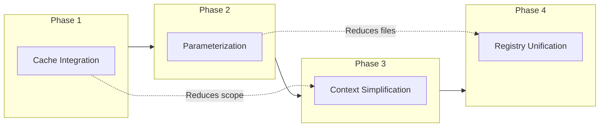
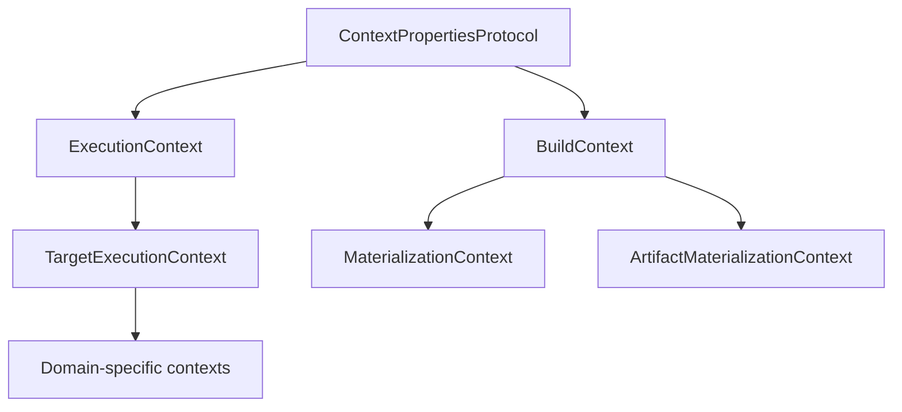
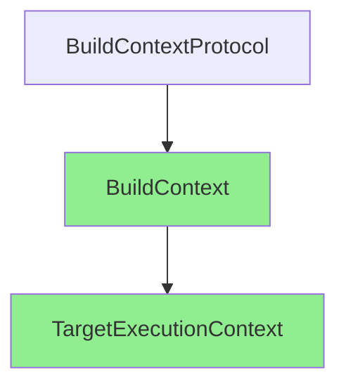
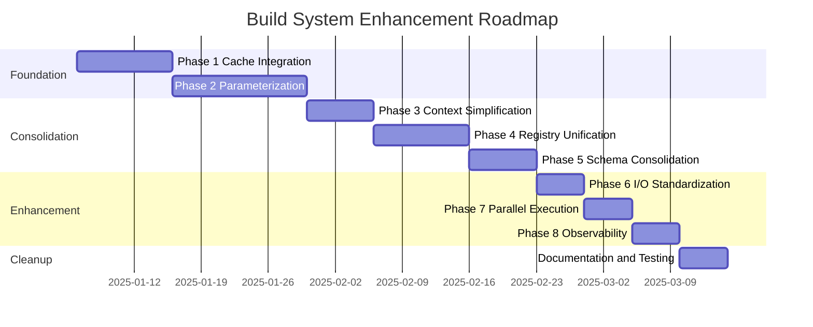

# Build System Consolidation and Enhancement Plan

> **Status**: Draft  
> **Author**: AI Assistant  
> **Date**: 2025-12-16  
> **Scope**: `src/codeintel/build/` (~22,000 lines, 177 files)  
> **Supersedes**: BUILD_CONSOLIDATION_PLAN.md, BUILD_HAMILTON_ENHANCEMENT_PLAN.md

---

## Executive Summary

This plan provides a holistically integrated approach to consolidating and enhancing the build system by strategically leveraging Hamilton's advanced features to **reduce code before consolidating it**. Rather than treating consolidation and enhancement as sequential phases, this plan interleaves them to minimize effort and maximize impact.

### Strategic Insight

The key insight driving this plan is that **Hamilton's advanced features can eliminate the need for much of the code that would otherwise require consolidation**:

| Traditional Approach | Integrated Approach |
|---------------------|---------------------|
| Consolidate 51 skip logic instances | Use `@cache` to eliminate them entirely |
| Merge 43 native target files | Use `@parameterize` to reduce to ~15 |
| Refactor MaterializationContext | Use `@datasaver` for standardized I/O |
| Unify 4+ registries manually | Derive unified registry from Hamilton DAG |

### Target Metrics

| Category | Current | After Implementation |
|----------|---------|---------------------|
| Native target files | 43 | 15 |
| Context types | 7+ | 2 |
| Registry systems | 4+ | 1 |
| Skip logic instances | 51 | 0 |
| Lines of code (native/) | ~8,000 | ~3,200 |
| Total build directory lines | ~22,000 | ~15,000 |

---

## Table of Contents

1. [Current State Analysis](#1-current-state-analysis)
2. [Design Principles](#2-design-principles)
3. [Target Architecture](#3-target-architecture)
4. [Phase 1: Hamilton Cache Integration](#4-phase-1-hamilton-cache-integration)
5. [Phase 2: Target Parameterization](#5-phase-2-target-parameterization)
6. [Phase 3: Context Simplification](#6-phase-3-context-simplification)
7. [Phase 4: Registry Unification](#7-phase-4-registry-unification)
8. [Phase 5: Schema Provider Consolidation](#8-phase-5-schema-provider-consolidation)
9. [Phase 6: I/O Standardization](#9-phase-6-io-standardization)
10. [Phase 7: Parallel Execution](#10-phase-7-parallel-execution)
11. [Phase 8: Observability Enhancement](#11-phase-8-observability-enhancement)
12. [Dead Code Removal](#12-dead-code-removal)
13. [Implementation Roadmap](#13-implementation-roadmap)
14. [Risk Assessment](#14-risk-assessment)
15. [Success Criteria](#15-success-criteria)

---

## 1. Current State Analysis

### 1.1 Build System Architecture

```
┌─────────────────────────────────────────────────────────────────┐
│                         CLI Layer                                │
│                    (codeintel build ...)                         │
├─────────────────────────────────────────────────────────────────┤
│                      Execution Layer                             │
│   HamiltonBuildExecutor → Driver → Native Modules                │
├─────────────────────────────────────────────────────────────────┤
│                      Planning Layer                              │
│   StateValidator → StateComputer → BuildSession                  │
├─────────────────────────────────────────────────────────────────┤
│                      Registry Layer                              │
│   UnifiedRegistry ←→ TargetGraph ←→ NativeModuleLoader          │
├─────────────────────────────────────────────────────────────────┤
│                      Context Layer                               │
│   BuildContext → ExecutionContext → TargetExecutionContext       │
├─────────────────────────────────────────────────────────────────┤
│                      Schema Layer                                │
│   UnifiedSchemaProvider → (Hamilton | Target | Declared)         │
├─────────────────────────────────────────────────────────────────┤
│                      Storage Layer                               │
│   StorageGateway → Warehouse → DuckDB                            │
└─────────────────────────────────────────────────────────────────┘
```

### 1.2 Current Hamilton Feature Usage

| Feature | Status | Usage |
|---------|--------|-------|
| `@tag` | **Used** | 129 nodes tagged with domain/target/node_type |
| `@check_output_custom` | **Used** | ~6 targets with Pandera validators |
| `@schema.output` | **Used** | Schema documentation on compute nodes |
| Lifecycle hooks | **Used** | Manifest, telemetry, contract, progress hooks |
| `NativeTargetExecutor` | **Used** | Consolidated executor with skip logic |

### 1.3 Duplication Inventory

| Area | Instances | Impact |
|------|-----------|--------|
| Manual skip logic (`should_skip()`) | 51 across 44 files | High - boilerplate |
| MaterializationContext usage | 57 across 16 files | Medium - deprecated API |
| Similar target patterns | ~35 files | High - copy-paste code |
| Context property duplication | 7+ context types | Medium - confusion |
| Registry access patterns | 4+ registries | Medium - inconsistency |

### 1.4 Files by Domain

```
hamilton/native/
├── analytics/     25 files (~4,500 lines) - Most parameterizable
├── ingestion/      8 files (~1,200 lines) - Highly similar patterns
├── graphs/         8 files (~1,800 lines) - Graph builder patterns
└── export/         2 files (~400 lines)   - Export patterns
```

---

## 2. Design Principles

### 2.1 Hamilton-First Design

**Principle**: Let Hamilton manage complexity that it handles better than custom code.

| Responsibility | Current Owner | Target Owner |
|---------------|---------------|--------------|
| Skip/cache logic | NativeTargetExecutor | Hamilton `@cache` |
| Target variants | Separate files | Hamilton `@parameterize` |
| Environment config | Runtime conditionals | Hamilton `@config.when` |
| I/O operations | MaterializationContext | Hamilton `@datasaver` |
| Result aggregation | Manual collection | Hamilton ResultBuilder |

### 2.2 Single Source of Truth

**Principle**: Each concept has exactly one authoritative definition.

| Concept | Single Source |
|---------|--------------|
| Target dependencies | Hamilton DAG (auto-derived) |
| Target metadata | `TargetRegistry` |
| Schema definitions | `SchemaRegistry` with pluggable resolvers |
| Build context | `BuildContext` (immutable) |
| Execution context | `TargetExecutionContext` (composes BuildContext) |

### 2.3 Composition Over Inheritance

**Principle**: Prefer composition for flexibility and clarity.

```python
# Before (inheritance chain)
class TargetExecutionContext(ExecutionContext):
    # Inherits and duplicates properties

# After (composition)
@dataclass
class TargetExecutionContext:
    build_ctx: BuildContext  # Compose, don't inherit
    target: OutputTarget
    resources: ContextResources
```

### 2.4 Progressive Enhancement

**Principle**: Each phase delivers value and can be deployed independently.



---

## 3. Target Architecture

### 3.1 Final State Architecture

```
┌─────────────────────────────────────────────────────────────────┐
│                         Public API                               │
│                                                                  │
│  get_target_registry()   get_schema_registry()   BuildContext   │
└────────────────┬──────────────────┬─────────────────┬───────────┘
                 │                  │                 │
┌────────────────▼──────────────────▼─────────────────▼───────────┐
│                      Core Abstractions                           │
│                                                                  │
│  ┌────────────────┐  ┌────────────────┐  ┌────────────────┐     │
│  │ TargetRegistry │  │ SchemaRegistry │  │  BuildContext  │     │
│  │                │  │                │  │                │     │
│  │ - targets      │  │ - resolvers    │  │ - gateway      │     │
│  │ - graph        │  │ - cache        │  │ - snapshot     │     │
│  │ - native_mods  │  │                │  │ - paths        │     │
│  └────────┬───────┘  └────────┬───────┘  └────────┬───────┘     │
└───────────┼───────────────────┼───────────────────┼─────────────┘
            │                   │                   │
┌───────────▼───────────────────▼───────────────────▼─────────────┐
│                      Hamilton Layer                              │
│                                                                  │
│  ┌─────────────────────────────────────────────────────────┐    │
│  │              Hamilton Driver with @cache                 │    │
│  │                                                          │    │
│  │  @parameterize templates → @datasaver I/O → @config.when │    │
│  └─────────────────────────────────────────────────────────┘    │
└─────────────────────────────────────────────────────────────────┘
```

### 3.2 File Structure After Implementation

```
src/codeintel/build/
├── __init__.py              # Public API (unchanged)
├── target_registry.py       # NEW: Unified TargetRegistry
├── targets.py               # OutputTarget (internal)
├── context.py               # BuildContext + TargetExecutionContext
├── plugin.py                # TargetPluginProtocol (minimal)
├── contracts.py             # OutputContract, ArtifactSpec
├── resources.py             # TargetResources
├── parameters.py            # TargetParameters
├── protocols.py             # DI protocols
├── providers.py             # Protocol implementations
├── errors.py                # Error hierarchy
├── types.py                 # Result types
├── state.py                 # StateValidator
├── state_computer.py        # StateComputer
├── state_types.py           # TargetState, BuildState
├── session.py               # BuildSession
├── hashing.py               # Input hash (may deprecate with @cache)
├── config.py                # BuildConfig
├── result.py                # TargetResult
├── hamilton/
│   ├── cache/               # NEW: Cache integration
│   │   ├── __init__.py
│   │   └── manifest_store.py
│   ├── native/
│   │   ├── templates/       # NEW: Parameterized templates
│   │   │   ├── extraction.py    # ast/cst/docstrings
│   │   │   ├── metrics.py       # function_metrics/risk_factors
│   │   │   ├── graph_builder.py # call_graph/import_graph
│   │   │   └── coverage.py      # coverage targets
│   │   ├── ingestion/       # Reduced to 3-4 files
│   │   ├── analytics/       # Reduced to 8-10 files
│   │   ├── graphs/          # Reduced to 3-4 files
│   │   ├── export/          # Unchanged
│   │   ├── materializer.py  # Simplified (no MaterializationContext)
│   │   └── executor.py      # Simplified (no skip logic)
│   ├── contracts/           # Unchanged
│   ├── hooks/               # Enhanced with OpenLineage/MLflow
│   └── io/                  # NEW: DataSaver implementations
│       └── duckdb_saver.py
├── schemas/
│   ├── __init__.py
│   ├── registry.py          # Enhanced SchemaRegistry
│   └── resolvers/           # NEW: Pluggable resolvers
│       ├── protocol.py
│       ├── hamilton.py
│       ├── target.py
│       └── declared.py
├── exports/                 # Unchanged
├── assets/                  # Unchanged
└── serving/                 # Unchanged
```

---

## 4. Phase 1: Hamilton Cache Integration

### 4.1 Objective

Replace 51 instances of manual skip logic with Hamilton's `@cache` decorator, eliminating boilerplate while maintaining manifest-based invalidation.

### 4.2 Current Pattern (to eliminate)

```python
# Every native target has this pattern (~40 lines per file)
def t__risk_factors(env, graph, t__risk_factors__compute):
    executor = NativeTargetExecutor.for_target(env, graph, "risk_factors")
    if executor.should_skip():          # ← Manual skip check
        return executor.skip()           # ← Manual skip record
    
    def compute():
        ctx = MaterializationContext(...)
        ref = materialize_table(ctx, "analytics.goid_risk_factors", ...)
        return {ref.table_key: ref.row_count}
    
    return executor.execute(compute)
```

### 4.3 Target Pattern (with @cache)

```python
from hamilton.function_modifiers import cache

@tag(domain="analytics", target="risk_factors", node_type="compute")
@cache(format="parquet", behavior=CacheBehavior.DEFAULT)
def t__risk_factors__compute(
    q__analytics__function_metrics: ir.Table,
    q__graph__call_graph_edges: ir.Table,
) -> ir.Table:
    """Compute risk factors - automatically cached."""
    return compute_risk_factors(...)

# Materializer becomes trivial
def t__risk_factors(env, graph, t__risk_factors__compute):
    executor = NativeTargetExecutor.for_target(env, graph, "risk_factors")
    return executor.execute(lambda: materialize(t__risk_factors__compute))
```

### 4.4 Implementation

#### 4.4.1 Create ManifestResultStore

```python
# hamilton/cache/manifest_store.py

from __future__ import annotations

from dataclasses import dataclass
from typing import TYPE_CHECKING

from hamilton.caching import CacheConfig, ResultStore

if TYPE_CHECKING:
    from codeintel.build.hamilton.env import BuildEnv


@dataclass
class ManifestCacheConfig(CacheConfig):
    """Cache config that integrates with build manifest system.
    
    Bridges Hamilton's cache API with our existing manifest-based
    skip logic for seamless migration.
    """
    
    env: BuildEnv
    
    def get_result_store(self) -> ResultStore:
        """Return manifest-backed result store."""
        return ManifestResultStore(self.env)


class ManifestResultStore(ResultStore):
    """Result store backed by target manifests.
    
    Integrates Hamilton caching with existing manifest persistence,
    enabling incremental adoption of @cache decorator.
    """
    
    def __init__(self, env: BuildEnv) -> None:
        self.env = env
        self.manifest_index = env.manifest_index
    
    def get_result(self, key: str, data_version: str) -> tuple[bool, object]:
        """Check manifest for cached result.
        
        Maps Hamilton cache key to target manifest and validates
        against stored input hash.
        """
        target_name = self._extract_target_name(key)
        manifest = self.manifest_index.get(target_name)
        
        if manifest and manifest.input_hash == data_version:
            return (True, ManifestCacheHit(manifest))
        return (False, None)
    
    def store_result(self, key: str, data_version: str, result: object) -> None:
        """Store result in manifest system.
        
        Delegates to existing manifest persistence infrastructure.
        """
        target_name = self._extract_target_name(key)
        # Create/update manifest through existing infrastructure
        ...
    
    def _extract_target_name(self, cache_key: str) -> str:
        """Extract target name from Hamilton cache key."""
        # Hamilton uses function name as cache key
        # Our naming: t__<target>__compute
        if cache_key.startswith("t__") and "__compute" in cache_key:
            return cache_key[3:].split("__")[0]
        return cache_key
```

#### 4.4.2 Migrate Pilot Targets

Start with 5 targets that have simple compute patterns:

| Target | File | Complexity |
|--------|------|------------|
| `risk_factors` | `analytics/risk_factors.py` | Low |
| `function_metrics` | `analytics/function_metrics.py` | Low |
| `hotspots` | `analytics/hotspots.py` | Low |
| `goids` | `graphs/goids.py` | Low |
| `modules` | `ingestion/modules.py` | Low |

#### 4.4.3 Validation

```bash
# Verify cache behavior matches skip logic
uv run pytest tests/build/hamilton/test_cache_integration.py -v

# Verify manifest consistency
uv run codeintel build --target risk_factors --verbose
uv run codeintel build --target risk_factors --verbose  # Should skip
```

### 4.5 Files to Modify

| File | Changes | Lines |
|------|---------|-------|
| `hamilton/cache/__init__.py` | NEW | ~20 |
| `hamilton/cache/manifest_store.py` | NEW | ~150 |
| `hamilton/native/executor.py` | Remove skip logic | -50 |
| 44 native target files | Add `@cache`, simplify | -400 total |

### 4.6 Success Criteria

- [ ] 0 instances of `should_skip()` in native modules
- [ ] All tests pass
- [ ] Cache hit rate >80% on repeated builds
- [ ] Manifest consistency maintained

---

## 5. Phase 2: Target Parameterization

### 5.1 Objective

Reduce 43 native target files to ~15 by using `@parameterize` for groups of similar targets.

### 5.2 Target Groups for Parameterization

#### 5.2.1 Ingestion Extractors (8 → 2 files)

| Targets | Pattern |
|---------|---------|
| ast, cst, docstrings, tests, config | collect → extract → persist |
| scip, typing, coverage | external tool → parse → persist |

```python
# templates/extraction.py

from hamilton.function_modifiers import parameterize, tag, value

EXTRACTION_CONFIGS = {
    "ast": {
        "extractor": value(extract_ast),
        "table_key": value("ingestion.ast_nodes"),
    },
    "cst": {
        "extractor": value(extract_cst),
        "table_key": value("ingestion.cst_nodes"),
    },
    "docstrings": {
        "extractor": value(extract_docstrings),
        "table_key": value("ingestion.docstrings"),
    },
    "tests": {
        "extractor": value(extract_tests),
        "table_key": value("ingestion.test_catalog"),
    },
    "config": {
        "extractor": value(extract_config),
        "table_key": value("ingestion.config_entries"),
    },
}


@parameterize(**EXTRACTION_CONFIGS)
@tag(domain="ingestion", node_type="compute")
def t__{target}__extract(
    env: BuildEnv,
    q__ingestion__modules: ir.Table,
    extractor: Callable,
) -> ExtractResult:
    """Extract {target} data from repository modules.
    
    Parameterized template generating nodes for ast, cst,
    docstrings, tests, and config extraction.
    """
    modules = collect_modules_from_table(q__ingestion__modules)
    return extractor(modules, env.snapshot)
```

#### 5.2.2 Analytics Metrics (10 → 3 files)

| Targets | Pattern |
|---------|---------|
| function_metrics, risk_factors, hotspots | load → compute → persist |
| coverage_*, test_* | coverage data → analyze → persist |
| history_*, timeseries | history data → aggregate → persist |

```python
# templates/metrics.py

METRIC_CONFIGS = {
    "function_metrics": {
        "inputs": source("q__analytics__goid_to_function"),
        "computer": value(compute_function_metrics),
        "table_key": value("analytics.function_metrics"),
    },
    "risk_factors": {
        "inputs": source("t__function_metrics__compute"),
        "computer": value(compute_risk_factors),
        "table_key": value("analytics.goid_risk_factors"),
    },
    "hotspots": {
        "inputs": source("t__risk_factors__compute"),
        "computer": value(compute_hotspots),
        "table_key": value("analytics.goid_hotspots"),
    },
}


@parameterize(**METRIC_CONFIGS)
@tag(domain="analytics", node_type="compute")
@cache(format="parquet")
def t__{target}__compute(inputs: ir.Table, computer: Callable) -> ir.Table:
    """Compute {target} from input data.
    
    Parameterized template for metric computation targets.
    """
    return computer(inputs)
```

#### 5.2.3 Graph Builders (6 → 2 files)

| Targets | Pattern |
|---------|---------|
| call_graph, import_graph, cfg_dfg | edges → build graph → persist |
| symbol_uses, graph_metrics | graph → analyze → persist |

```python
# templates/graph_builder.py

GRAPH_CONFIGS = {
    "call_graph": {
        "edge_source": source("q__graph__call_graph_edges"),
        "builder": value(build_call_graph),
        "validator": value(validate_call_graph),
    },
    "import_graph": {
        "edge_source": source("q__graph__import_edges"),
        "builder": value(build_import_graph),
        "validator": value(validate_import_graph),
    },
    "cfg_dfg": {
        "edge_source": source("q__graph__cfg_dfg_edges"),
        "builder": value(build_cfg_dfg),
        "validator": value(validate_cfg_dfg),
    },
}


@parameterize(**GRAPH_CONFIGS)
@tag(domain="graph", node_type="compute")
def t__{target}__build(
    edge_source: ir.Table,
    builder: Callable,
    validator: Callable,
) -> GraphBuildResult:
    """Build {target} from edge data.
    
    Parameterized template for graph construction targets.
    """
    graph = builder(edge_source)
    validator(graph)
    return GraphBuildResult(graph=graph, node_count=len(graph.nodes))
```

### 5.3 Migration Strategy

1. **Create template module** with `@parameterize` configuration
2. **Generate test suite** verifying parity with existing targets
3. **Import templates** in domain `__init__.py`
4. **Remove individual files** after validation
5. **Update registrations** to reference template-generated nodes

### 5.4 Files Summary

| Domain | Current | After | Template File |
|--------|---------|-------|---------------|
| Ingestion | 8 | 2 | `templates/extraction.py` |
| Analytics | 25 | 8 | `templates/metrics.py`, `templates/coverage.py` |
| Graphs | 8 | 3 | `templates/graph_builder.py` |
| Export | 2 | 2 | Unchanged (already simple) |
| **Total** | 43 | 15 | |

### 5.5 Success Criteria

- [ ] All parameterized targets produce identical output
- [ ] Test coverage maintained
- [ ] ~60% reduction in native module files
- [ ] Single place to modify common patterns

---

## 6. Phase 3: Context Simplification

### 6.1 Objective

Reduce context types from 7+ to 2 primary contexts using composition.

### 6.2 Current Context Hierarchy



### 6.3 Target Context Hierarchy



### 6.4 Implementation

#### 6.4.1 Enhanced BuildContext

```python
# context.py

from __future__ import annotations

from dataclasses import dataclass, field
from typing import TYPE_CHECKING

if TYPE_CHECKING:
    from codeintel.storage.gateway import StorageGateway
    from codeintel.storage.types import SnapshotRef


@runtime_checkable
class BuildContextProtocol(Protocol):
    """Minimal protocol for all build operations."""
    
    @property
    def gateway(self) -> StorageGateway: ...
    
    @property
    def snapshot(self) -> SnapshotRef: ...
    
    @property
    def paths(self) -> BuildPaths: ...


@dataclass(frozen=True, slots=True)
class BuildContext:
    """Immutable context for all build operations.
    
    This is the single source of truth for build state. All other
    contexts compose this rather than duplicating its fields.
    
    Parameters
    ----------
    gateway
        Storage gateway for database access.
    snapshot
        Repository snapshot (repo, commit) being processed.
    paths
        Build paths configuration.
    session
        Optional build session for caching.
    validate_schemas
        Whether to validate output schemas.
    owner_target
        Target that owns this context (for logging).
    input_hash
        Computed input hash for caching.
    """
    
    gateway: StorageGateway
    snapshot: SnapshotRef
    paths: BuildPaths
    session: BuildSession | None = None
    validate_schemas: bool = False
    owner_target: str | None = None
    input_hash: str | None = None
    
    @property
    def repo(self) -> str:
        """Return repository identifier."""
        return self.snapshot.repo
    
    @property
    def commit(self) -> str:
        """Return commit SHA."""
        return self.snapshot.commit
    
    @property
    def repo_root(self) -> Path:
        """Return repository root path."""
        return self.paths.repo_root
    
    @property
    def build_dir(self) -> Path:
        """Return build artifacts directory."""
        return self.paths.build_dir
    
    def artifact_path(self, filename: str) -> Path:
        """Return path for build artifact."""
        return self.paths.build_dir / filename


@dataclass(slots=True)
class TargetExecutionContext:
    """Mutable context for target plugin execution.
    
    Composes BuildContext rather than duplicating its fields.
    Only contains execution-specific state.
    
    Parameters
    ----------
    build_ctx
        Underlying build context (composed, not inherited).
    target
        Target being executed.
    resources
        External tool providers.
    parameters
        Target-specific parameters.
    """
    
    build_ctx: BuildContext
    target: OutputTarget
    resources: ContextResources
    parameters: TargetParameters = field(default_factory=lambda: EMPTY_PARAMETERS)
    _written_tables: dict[str, WriteRecord] = field(default_factory=dict)
    
    # Delegate to build_ctx for common properties
    @property
    def gateway(self) -> StorageGateway:
        """Return storage gateway."""
        return self.build_ctx.gateway
    
    @property
    def snapshot(self) -> SnapshotRef:
        """Return snapshot reference."""
        return self.build_ctx.snapshot
    
    @property
    def repo(self) -> str:
        """Return repository identifier."""
        return self.build_ctx.repo
    
    @property
    def commit(self) -> str:
        """Return commit SHA."""
        return self.build_ctx.commit
    
    @property
    def repo_root(self) -> Path:
        """Return repository root path."""
        return self.build_ctx.repo_root
    
    # Execution-specific methods
    def record_write(self, table_key: str, row_count: int) -> None:
        """Record a table write for this execution."""
        self._written_tables[table_key] = WriteRecord(
            table_key=table_key,
            row_count=row_count,
            timestamp=datetime.now(tz=UTC),
        )
```

#### 6.4.2 Migration Path

1. **Remove MaterializationContext** - Update `materialize_table()` to accept `BuildContext`
2. **Remove ExecutionContext** - Merge into `BuildContext`
3. **Update TargetExecutionContext** - Use composition with `build_ctx` field
4. **Update all consumers** - ~30 files need import/usage updates

### 6.5 Files to Modify

| File | Changes |
|------|---------|
| `context_base.py` | Remove `ExecutionContext`, keep `BuildPaths`, `PathResolver` |
| `context.py` | New simplified implementation |
| `hamilton/native/materializer.py` | Remove `MaterializationContext`, accept `BuildContext` |
| `hamilton/native/artifact_materializer.py` | Update to use `BuildContext` |
| ~30 native modules | Update context usage |

### 6.6 Success Criteria

- [ ] Only 2 context types remain: `BuildContext`, `TargetExecutionContext`
- [ ] All tests pass
- [ ] No duplicate property definitions
- [ ] Clear composition relationship

---

## 7. Phase 4: Registry Unification

### 7.1 Objective

Combine 4+ registries into a single `TargetRegistry` derived from the Hamilton DAG.

### 7.2 Current Registries

| Registry | Location | Purpose |
|----------|----------|---------|
| `TargetGraph` | `targets.py` | Dependencies |
| `UnifiedRegistry` | `unified_registry.py` | Target-plugin mapping |
| `NativeModuleLoader` | `hamilton/native/loader.py` | Module loading |
| `SCHEMA_REGISTRY` | `hamilton/contracts/schemas/registry.py` | Pandera schemas |

### 7.3 Unified TargetRegistry

```python
# target_registry.py

from __future__ import annotations

from dataclasses import dataclass, field
from functools import cached_property
from typing import TYPE_CHECKING, Iterable

if TYPE_CHECKING:
    from codeintel.build.targets import OutputTarget, TargetGraph
    from codeintel.build.plugin import TargetPlugin


@dataclass
class TargetRegistry:
    """Single source of truth for targets and their implementations.
    
    Combines target metadata, dependency graph, and implementation
    mapping into a unified interface. Built from Hamilton DAG to
    ensure consistency.
    
    Examples
    --------
    >>> registry = get_target_registry()
    >>> registry.get("risk_factors")
    OutputTarget(name='risk_factors', ...)
    >>> registry.dependencies_of("risk_factors")
    ('function_metrics', 'call_graph')
    >>> registry.is_native("risk_factors")
    True
    """
    
    _targets: dict[str, OutputTarget] = field(default_factory=dict)
    _graph: TargetGraph | None = None
    _native_modules: dict[str, str] = field(default_factory=dict)
    
    def get(self, name: str) -> OutputTarget | None:
        """Get target by name.
        
        Parameters
        ----------
        name
            Target name.
            
        Returns
        -------
        OutputTarget or None
            Target definition if found.
        """
        return self._targets.get(name)
    
    def require(self, name: str) -> OutputTarget:
        """Get target or raise KeyError.
        
        Parameters
        ----------
        name
            Target name.
            
        Returns
        -------
        OutputTarget
            Target definition.
            
        Raises
        ------
        KeyError
            If target not found.
        """
        target = self.get(name)
        if target is None:
            raise KeyError(f"Unknown target: {name}")
        return target
    
    def dependencies_of(self, name: str) -> tuple[str, ...]:
        """Get direct dependencies from Hamilton DAG.
        
        Parameters
        ----------
        name
            Target name.
            
        Returns
        -------
        tuple[str, ...]
            Names of direct dependencies.
        """
        if self._graph is None:
            return ()
        return self._graph.dependencies_of(name)
    
    def topological_order(self, names: Iterable[str]) -> tuple[str, ...]:
        """Sort targets in dependency order.
        
        Parameters
        ----------
        names
            Target names to sort.
            
        Returns
        -------
        tuple[str, ...]
            Targets sorted topologically.
        """
        if self._graph is None:
            return tuple(names)
        return self._graph.topological_order(names)
    
    def is_native(self, name: str) -> bool:
        """Check if target has native Hamilton implementation.
        
        Parameters
        ----------
        name
            Target name.
            
        Returns
        -------
        bool
            True if native module exists.
        """
        return name in self._native_modules
    
    def all_targets(self) -> tuple[str, ...]:
        """Return all registered target names."""
        return tuple(self._targets.keys())
    
    @classmethod
    def build(cls) -> TargetRegistry:
        """Build registry from Hamilton DAG and registrations.
        
        This is the canonical way to construct a TargetRegistry.
        Dependencies are derived from the actual Hamilton DAG,
        ensuring consistency with execution behavior.
        """
        from codeintel.build.hamilton.native.loader import NativeModuleLoader
        from codeintel.build.targets import target_graph_from_hamilton
        from codeintel.build.registrations import ALL_TARGETS
        
        # 1. Load native modules
        loader = NativeModuleLoader()
        native_modules = {
            name: loader.get_module_path(name)
            for name in loader.get_target_names()
        }
        
        # 2. Build Hamilton driver and derive graph
        from codeintel.build.hamilton.executor import build_driver
        driver = build_driver(mode="auto")
        graph = target_graph_from_hamilton(driver)
        
        # 3. Index targets
        targets = {t.name: t for t in ALL_TARGETS}
        
        return cls(
            _targets=targets,
            _graph=graph,
            _native_modules=native_modules,
        )


# Singleton access
_registry_holder: TargetRegistry | None = None


def get_target_registry() -> TargetRegistry:
    """Get the singleton target registry.
    
    Returns
    -------
    TargetRegistry
        Unified target registry.
    """
    global _registry_holder
    if _registry_holder is None:
        _registry_holder = TargetRegistry.build()
    return _registry_holder


def clear_target_registry() -> None:
    """Clear cached registry (for testing)."""
    global _registry_holder
    _registry_holder = None
```

### 7.4 Deprecation of Old Registries

```python
# unified_registry.py

import warnings
from codeintel.build.target_registry import get_target_registry


def get_unified_registry() -> "TargetRegistry":
    """Get unified registry.
    
    .. deprecated:: 2.0
        Use ``get_target_registry()`` instead.
    """
    warnings.warn(
        "get_unified_registry() is deprecated. Use get_target_registry() instead.",
        DeprecationWarning,
        stacklevel=2,
    )
    return get_target_registry()
```

### 7.5 Files to Modify

| File | Changes |
|------|---------|
| `target_registry.py` | NEW |
| `unified_registry.py` | Deprecate, forward |
| `registry.py` | Deprecate `get_target_graph()`, forward |
| `registrations.py` | Update to populate new registry |
| ~20 consumer files | Update imports |

### 7.6 Success Criteria

- [ ] Single `get_target_registry()` accessor
- [ ] Graph derived from Hamilton (not static declarations)
- [ ] Old accessors deprecated with warnings
- [ ] All tests pass

---

## 8. Phase 5: Schema Provider Consolidation

### 8.1 Objective

Simplify 15+ schema files into a pluggable `SchemaRegistry` with ordered resolvers.

### 8.2 Current Schema Files

```
schemas/
├── __init__.py
├── registry.py
├── provider_unified.py      # Multi-tier fallback
├── provider_declared.py     # Static declarations
├── provider_hamilton.py     # Hamilton inference
├── contract_provider.py     # Dataset contracts
├── json_schema_registry.py  # JSON Schema for exports
├── row_registry.py          # TypedDict models
├── declared_schemas.py      # TABLE_SCHEMAS dict
├── compile.py               # Schema compilation
├── diff.py                  # Schema diffing
├── infer_duckdb.py          # DuckDB inference
├── manifest.py              # Schema manifests
└── seed_harness.py          # Test seeding
```

### 8.3 Pluggable SchemaRegistry

```python
# schemas/registry.py

from __future__ import annotations

from dataclasses import dataclass, field
from typing import TYPE_CHECKING, Protocol

if TYPE_CHECKING:
    from codeintel.core.schemas.table import TableSchema


class SchemaResolver(Protocol):
    """Protocol for schema resolution strategies.
    
    Implement this to add new schema sources to the registry.
    """
    
    def resolve(self, table_key: str) -> TableSchema | None:
        """Attempt to resolve schema for table_key.
        
        Parameters
        ----------
        table_key
            Qualified table name (e.g., "analytics.function_metrics").
            
        Returns
        -------
        TableSchema or None
            Schema if found by this resolver.
        """
        ...
    
    def clear_cache(self) -> None:
        """Clear resolver-specific cache."""
        ...
    
    @property
    def priority(self) -> int:
        """Priority for resolver ordering (higher = first)."""
        ...


@dataclass
class SchemaRegistry:
    """Unified schema registry with pluggable resolvers.
    
    Resolvers are tried in priority order until one returns a schema.
    Results are cached to avoid repeated resolution.
    
    Examples
    --------
    >>> registry = get_schema_registry()
    >>> schema = registry.get("analytics.function_metrics")
    >>> schema.columns
    [Column(name='function_goid_h128', dtype='VARCHAR'), ...]
    """
    
    _resolvers: list[SchemaResolver] = field(default_factory=list)
    _cache: dict[str, TableSchema] = field(default_factory=dict)
    
    def get(self, table_key: str) -> TableSchema | None:
        """Resolve schema through resolver chain.
        
        Parameters
        ----------
        table_key
            Qualified table name.
            
        Returns
        -------
        TableSchema or None
            Schema if found by any resolver.
        """
        if table_key in self._cache:
            return self._cache[table_key]
        
        for resolver in self._resolvers:
            if schema := resolver.resolve(table_key):
                self._cache[table_key] = schema
                return schema
        return None
    
    def require(self, table_key: str) -> TableSchema:
        """Get schema or raise KeyError.
        
        Parameters
        ----------
        table_key
            Qualified table name.
            
        Returns
        -------
        TableSchema
            Schema definition.
            
        Raises
        ------
        KeyError
            If no resolver can provide schema.
        """
        schema = self.get(table_key)
        if schema is None:
            raise KeyError(f"Unknown schema: {table_key}")
        return schema
    
    def clear_all_caches(self) -> None:
        """Clear all caches with single call."""
        self._cache.clear()
        for resolver in self._resolvers:
            resolver.clear_cache()
    
    def add_resolver(self, resolver: SchemaResolver) -> None:
        """Add resolver and re-sort by priority."""
        self._resolvers.append(resolver)
        self._resolvers.sort(key=lambda r: r.priority, reverse=True)
    
    @classmethod
    def build_default(cls) -> SchemaRegistry:
        """Build with standard resolver chain."""
        from codeintel.build.schemas.resolvers import (
            HamiltonInferenceResolver,
            TargetContractResolver,
            DeclaredSchemaResolver,
        )
        
        registry = cls()
        registry.add_resolver(HamiltonInferenceResolver())  # priority=100
        registry.add_resolver(TargetContractResolver())     # priority=50
        registry.add_resolver(DeclaredSchemaResolver())     # priority=10
        return registry


# Singleton
_schema_registry: SchemaRegistry | None = None


def get_schema_registry() -> SchemaRegistry:
    """Get the singleton schema registry."""
    global _schema_registry
    if _schema_registry is None:
        _schema_registry = SchemaRegistry.build_default()
    return _schema_registry
```

### 8.4 Resolver Implementations

```python
# schemas/resolvers/hamilton.py

@dataclass
class HamiltonInferenceResolver:
    """Resolve schemas by inferring from Hamilton compute nodes.
    
    Highest priority - if a q__* node exists, use its inferred schema.
    """
    
    priority: int = 100
    _cache: dict[str, TableSchema] = field(default_factory=dict)
    
    def resolve(self, table_key: str) -> TableSchema | None:
        """Infer schema from Hamilton q__ node."""
        node_name = f"q__{table_key.replace('.', '__')}"
        # Use Hamilton's schema introspection
        ...
    
    def clear_cache(self) -> None:
        self._cache.clear()


# schemas/resolvers/target.py

@dataclass
class TargetContractResolver:
    """Resolve schemas from target OutputContract.tables declarations."""
    
    priority: int = 50
    
    def resolve(self, table_key: str) -> TableSchema | None:
        """Look up schema from target contract."""
        registry = get_target_registry()
        for target in registry.all_targets():
            contract = registry.require(target).contract
            if table_key in contract.tables:
                return contract.tables[table_key].schema
        return None
    
    def clear_cache(self) -> None:
        pass  # No cache


# schemas/resolvers/declared.py

@dataclass
class DeclaredSchemaResolver:
    """Resolve schemas from static TABLE_SCHEMAS declarations."""
    
    priority: int = 10
    
    def resolve(self, table_key: str) -> TableSchema | None:
        """Look up in declared schemas."""
        from codeintel.build.schemas.declared_schemas import TABLE_SCHEMAS
        return TABLE_SCHEMAS.get(table_key)
    
    def clear_cache(self) -> None:
        pass  # Static, no cache
```

### 8.5 Success Criteria

- [ ] Single `get_schema_registry()` accessor
- [ ] Pluggable resolver architecture
- [ ] Single `clear_all_caches()` method
- [ ] All tests pass

---

## 9. Phase 6: I/O Standardization

### 9.1 Objective

Replace `MaterializationContext` pattern with Hamilton's `@datasaver` for standardized I/O.

### 9.2 Implementation

```python
# hamilton/io/duckdb_saver.py

from __future__ import annotations

from dataclasses import dataclass
from typing import TYPE_CHECKING

from hamilton.io import DataSaver

if TYPE_CHECKING:
    import ibis.expr.types as ir
    from codeintel.build.context import BuildContext


@dataclass
class DuckDBTableSaver(DataSaver):
    """DataSaver for persisting Ibis expressions to DuckDB.
    
    Integrates with Hamilton's materialization API while using
    existing storage gateway infrastructure.
    """
    
    table_key: str
    ctx: BuildContext
    
    @classmethod
    def applicable_types(cls) -> list[type]:
        """Return types this saver handles."""
        import ibis.expr.types as ir
        return [ir.Table]
    
    def save_data(self, data: ir.Table) -> dict:
        """Persist Ibis table to DuckDB.
        
        Returns metadata dict for Hamilton tracking.
        """
        from codeintel.build.hamilton.native.materializer import materialize_ibis_table
        
        ref = materialize_ibis_table(
            self.ctx.gateway,
            self.table_key,
            data,
            snapshot=self.ctx.snapshot,
            validate=self.ctx.validate_schemas,
        )
        return {
            "table_key": ref.table_key,
            "row_count": ref.row_count,
            "repo": self.ctx.repo,
            "commit": self.ctx.commit,
        }
```

### 9.3 Usage in Native Modules

```python
from hamilton.function_modifiers import datasaver

@datasaver()
def save__risk_factors(
    t__risk_factors__compute: ir.Table,
    env: BuildEnv,
) -> dict:
    """Save risk factors to analytics schema.
    
    Uses @datasaver for standardized I/O with metadata capture.
    """
    saver = DuckDBTableSaver(
        table_key="analytics.goid_risk_factors",
        ctx=env.build_ctx,
    )
    return saver.save_data(t__risk_factors__compute)
```

---

## 10. Phase 7: Parallel Execution

### 10.1 Objective

Enable parallel target execution using Hamilton's adapter infrastructure.

### 10.2 Target Classification

| Category | Targets | Adapter |
|----------|---------|---------|
| I/O-bound | scip, typing, coverage, tests | ThreadPool(4) |
| CPU-bound | metrics, risk_factors, hotspots | ProcessPool(4) |
| Memory-bound | call_graph, import_graph | Sequential |
| Quick | goids, modules | Sequential |

### 10.3 Implementation

```python
# hamilton/execution/parallel.py

from __future__ import annotations

from dataclasses import dataclass
from enum import Enum

from hamilton.plugins.h_threadpool import FutureAdapter


class ExecutionMode(Enum):
    """Target execution mode."""
    SEQUENTIAL = "sequential"
    THREADED = "threaded"
    MULTIPROCESS = "multiprocess"


@dataclass(frozen=True, slots=True)
class ParallelExecutionConfig:
    """Configuration for parallel target execution."""
    
    io_workers: int = 4
    cpu_workers: int = 4
    enable_multiprocess: bool = False


def build_parallel_driver(
    modules: list,
    config: dict,
    exec_config: ParallelExecutionConfig,
) -> Driver:
    """Build driver with appropriate parallelism."""
    from hamilton import driver
    
    builder = driver.Builder().with_modules(*modules).with_config(config)
    
    # Add thread pool adapter for I/O-bound targets
    if exec_config.io_workers > 1:
        adapter = FutureAdapter(max_workers=exec_config.io_workers)
        builder = builder.with_adapter(adapter)
    
    return builder.build()
```

---

## 11. Phase 8: Observability Enhancement

### 11.1 Objective

Enhance observability with OpenLineage and MLflow integration.

### 11.2 Enhanced HookOptions

```python
@dataclass(frozen=True, slots=True)
class HookOptions:
    """Extended hook configuration."""
    
    # Existing options
    strict_contracts: bool = False
    enable_validation: bool = True
    enable_telemetry: bool = True
    enable_progress: bool = False
    
    # New Hamilton-native options
    enable_openlineage: bool = False
    openlineage_namespace: str = "codeintel"
    enable_mlflow: bool = False
    mlflow_experiment: str = "codeintel-build"


def build_hooks(run_id, gateway, graph, options: HookOptions | None = None) -> list:
    """Build comprehensive hook set."""
    if options is None:
        options = HookOptions()
    
    hooks = []
    
    # Existing hooks
    if options.enable_telemetry:
        hooks.append(NodeTelemetryHook(run_id, gateway))
    if options.enable_validation:
        hooks.append(ContractEnforcementHook(graph))
    if options.enable_progress:
        hooks.append(create_progress_hook())
    
    # New Hamilton-native hooks
    if options.enable_openlineage:
        from hamilton.plugins.h_openlineage import OpenLineageAdapter
        hooks.append(OpenLineageAdapter(namespace=options.openlineage_namespace))
    if options.enable_mlflow:
        from hamilton.plugins.h_mlflow import MLFlowTracker
        hooks.append(MLFlowTracker(experiment_name=options.mlflow_experiment))
    
    return hooks
```

---

## 12. Dead Code Removal

### 12.1 Immediate Removal (During Phase 1-2)

| Item | Location | Lines | Reason |
|------|----------|-------|--------|
| `plugins/analytics/` | Directory | Empty | Migrated |
| `plugins/graphs/` | Directory | Empty | Migrated |
| `_analytics_plugins()` | `registrations.py` | ~10 | Dead reference |
| `_graphs_plugins()` | `registrations.py` | ~10 | Dead reference |

### 12.2 Removal After Context Simplification (Phase 3)

| Item | Location | Lines | Reason |
|------|----------|-------|--------|
| `MaterializationContext` | `materializer.py` | ~80 | Replaced by BuildContext |
| `ExecutionContext` | `context_base.py` | ~100 | Merged into BuildContext |

### 12.3 Removal After Registry Unification (Phase 4)

| Item | Location | Lines | Reason |
|------|----------|-------|--------|
| `get_unified_registry()` body | `unified_registry.py` | ~400 | Forwarding only |
| `get_target_graph()` body | `registry.py` | ~100 | Forwarding only |

---

## 13. Implementation Roadmap

### Overview



### Phase Details

| Phase | Duration | Dependencies | Risk | Impact |
|-------|----------|--------------|------|--------|
| 1. Cache Integration | 10 days | None | Medium | Eliminates 51 skip patterns |
| 2. Parameterization | 14 days | Phase 1 | Medium | Reduces 43 → 15 files |
| 3. Context Simplification | 7 days | Phase 2 | Low | Reduces 7 → 2 contexts |
| 4. Registry Unification | 10 days | Phase 3 | Medium | Reduces 4 → 1 registries |
| 5. Schema Consolidation | 7 days | Phase 4 | Low | Simplifies schema access |
| 6. I/O Standardization | 5 days | Phase 5 | Low | Standardizes I/O patterns |
| 7. Parallel Execution | 5 days | Phase 6 | Low | Enables parallelism |
| 8. Observability | 5 days | Phase 7 | Low | Adds OpenLineage/MLflow |

**Total Duration**: ~10-12 weeks

---

## 14. Risk Assessment

### High Risk

| Risk | Phase | Mitigation |
|------|-------|------------|
| Cache invalidation mismatch | 1 | Extensive comparison testing with existing skip logic |
| Parameterization breaks target behavior | 2 | Generate parity tests before migration |
| Registry unification breaks imports | 4 | Use forwarding with deprecation warnings |

### Medium Risk

| Risk | Phase | Mitigation |
|------|-------|------------|
| Circular imports during context merge | 3 | Maintain lazy import patterns |
| Hamilton driver initialization changes | 4 | Lock driver build to specific version |
| Schema resolution order changes | 5 | Test all table_key lookups |

### Low Risk

| Risk | Phase | Mitigation |
|------|-------|------------|
| Dead code removal breaks tests | All | Run full test suite after each deletion |
| Parallel execution race conditions | 7 | Start with I/O-bound targets only |
| OpenLineage configuration issues | 8 | Optional feature with fallback |

---

## 15. Success Criteria

### Quantitative

| Metric | Current | Target | Validation |
|--------|---------|--------|------------|
| Native target files | 43 | 15 | `find hamilton/native -name "*.py" | wc -l` |
| Skip logic instances | 51 | 0 | `grep -r "should_skip" | wc -l` |
| Context types | 7+ | 2 | Manual audit |
| Registry systems | 4+ | 1 | Single `get_target_registry()` |
| Total LoC | ~22,000 | ~15,000 | `wc -l` |
| Test pass rate | 100% | 100% | `uv run pytest` |

### Qualitative

| Criterion | Definition |
|-----------|------------|
| Single access point | One import path for registry, schema, context |
| Hamilton-native patterns | All targets use `@cache`, `@parameterize` where applicable |
| Self-documenting | Config dicts show all target variants |
| Extensible | New targets via config, not new files |
| Observable | OpenLineage/MLflow integration available |

---

## Appendix A: Hamilton Feature Quick Reference

```python
from hamilton.function_modifiers import (
    # Metadata
    tag,
    schema,
    
    # Validation
    check_output,
    check_output_custom,
    
    # Caching (Phase 1)
    cache,
    
    # Parameterization (Phase 2)
    parameterize,
    parameterize_sources,
    parameterize_values,
    source,
    value,
    
    # Output splitting
    extract_fields,
    extract_columns,
    
    # Conditional
    config,
    
    # I/O (Phase 6)
    dataloader,
    datasaver,
    load_from,
    save_to,
)

from hamilton.plugins import (
    h_threadpool,    # Phase 7
    h_openlineage,   # Phase 8
    h_mlflow,        # Phase 8
    h_tqdm,          # Already used
)
```

---

## Appendix B: Migration Checklist

### Pre-Migration

- [ ] Create branch for each phase
- [ ] Generate baseline test coverage report
- [ ] Document current cache hit rates
- [ ] Snapshot current LoC metrics

### Per-Phase

- [ ] Implement changes
- [ ] Run quality gates (`uv run python -m tools.quality_report`)
- [ ] Run full test suite (`uv run pytest -q`)
- [ ] Update imports in dependent code
- [ ] Add deprecation warnings where needed
- [ ] Update documentation

### Post-Migration

- [ ] Remove deprecated code after grace period
- [ ] Update AGENTS.md with new patterns
- [ ] Create architecture decision records
- [ ] Benchmark performance improvements
- [ ] Document lessons learned

---

## Changelog

| Date | Author | Changes |
|------|--------|---------|
| 2025-12-16 | AI Assistant | Initial integrated plan |

---

*This document supersedes BUILD_CONSOLIDATION_PLAN.md and BUILD_HAMILTON_ENHANCEMENT_PLAN.md. It represents the authoritative implementation roadmap for the build system evolution.*

