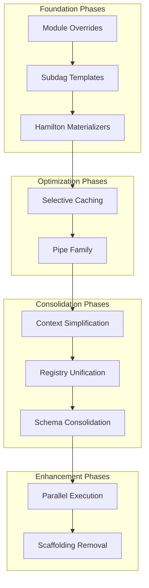
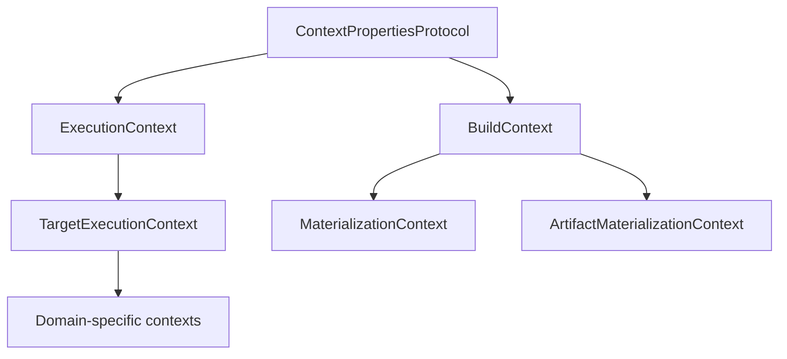
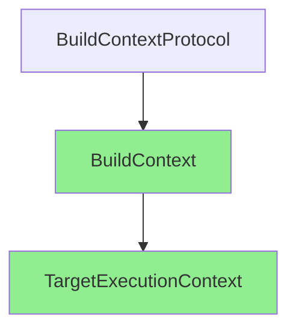
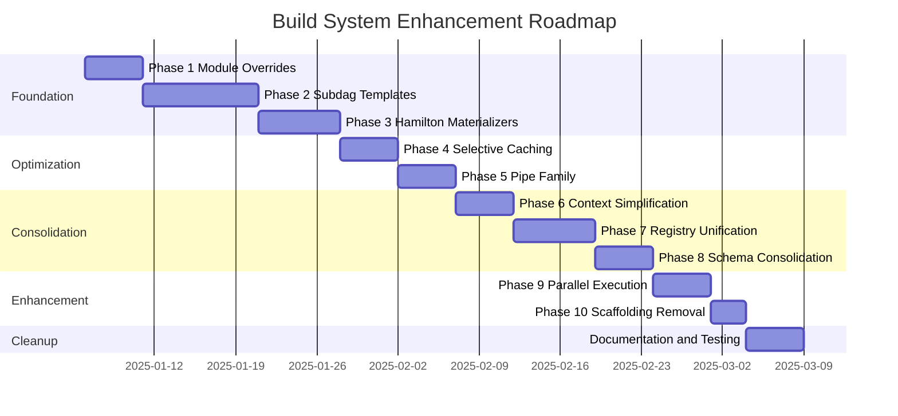

# Build System Consolidation and Enhancement Plan

> **Status**: Draft (Revised)  
> **Author**: AI Assistant  
> **Date**: 2025-12-16 (Revised 2025-12-17)  
> **Scope**: `src/codeintel/build/` (~22,000 lines, 177 files)  
> **Supersedes**: BUILD_CONSOLIDATION_PLAN.md, BUILD_HAMILTON_ENHANCEMENT_PLAN.md

---

## Executive Summary

This plan provides a holistically integrated approach to consolidating and enhancing the build system by strategically leveraging Hamilton's advanced features. The approach prioritizes **Hamilton-native primitives** (module overrides, subdags, materializers) over custom infrastructure.

### Strategic Insight

The key insight is that **Hamilton provides architectural primitives that can replace our custom infrastructure**:

| Custom Infrastructure | Hamilton Replacement |
|----------------------|---------------------|
| Mode switching + filtering logic | `allow_module_overrides()` |
| 43 separate target files | `@subdag` + `@parameterize` templates |
| `materialize_table()` hidden from DAG | Hamilton Materializers (DAG-visible I/O) |
| Manifest-based skip logic | Keep (authoritative for artifacts) |
| `@cache` for Ibis expressions | Selective `@cache` (pure-Python only) |

### Critical Correction: Caching Strategy

> **Important**: The original plan proposed using Hamilton's `@cache` to replace manifest-based skip logic. This is **incorrect** for nodes returning Ibis expressions (`ir.Table`), which are lazy query plans, not data. Caching query plans does not guarantee correctness for artifact-level incremental builds.
>
> **Correct Strategy**: Manifest-based skip remains authoritative for artifacts. `@cache` is used selectively for expensive pure-Python computations (file enumeration, AST parsing, symbol extraction).

### Target Metrics

| Category | Current | After Implementation |
|----------|---------|---------------------|
| Native target files | 43 | 15 |
| Context types | 7+ | 2 |
| Registry systems | 4+ | 1 |
| Skip logic pattern | 51 instances | Consolidated executor pattern |
| Lines of code (native/) | ~8,000 | ~3,200 |
| Total build directory lines | ~22,000 | ~15,000 |

---

## Table of Contents

1. [Current State Analysis](#1-current-state-analysis)
2. [Design Principles](#2-design-principles)
3. [Target Architecture](#3-target-architecture)
4. [Phase 1: Module Override Unification](#4-phase-1-module-override-unification)
5. [Phase 2: Subdag Pipeline Templates](#5-phase-2-subdag-pipeline-templates)
6. [Phase 3: Hamilton Materializers as IO Layer](#6-phase-3-hamilton-materializers-as-io-layer)
7. [Phase 4: Selective Caching Strategy](#7-phase-4-selective-caching-strategy)
8. [Phase 5: Pipe Family for Complex Transforms](#8-phase-5-pipe-family-for-complex-transforms)
9. [Phase 6: Context Simplification](#9-phase-6-context-simplification)
10. [Phase 7: Registry Unification](#10-phase-7-registry-unification)
11. [Phase 8: Schema Provider Consolidation](#11-phase-8-schema-provider-consolidation)
12. [Phase 9: Parallel Execution](#12-phase-9-parallel-execution)
13. [Phase 10: Plugin Scaffolding Removal](#13-phase-10-plugin-scaffolding-removal)
14. [Dead Code Removal](#14-dead-code-removal)
15. [Implementation Roadmap](#15-implementation-roadmap)
16. [Risk Assessment](#16-risk-assessment)
17. [Success Criteria](#17-success-criteria)

---

## 1. Current State Analysis

### 1.1 Build System Architecture

```
┌─────────────────────────────────────────────────────────────────┐
│                         CLI Layer                                │
│                    (codeintel build ...)                         │
├─────────────────────────────────────────────────────────────────┤
│                      Execution Layer                             │
│   HamiltonBuildExecutor → Driver → Native Modules                │
├─────────────────────────────────────────────────────────────────┤
│                      Planning Layer                              │
│   StateValidator → StateComputer → BuildSession                  │
├─────────────────────────────────────────────────────────────────┤
│                      Registry Layer                              │
│   UnifiedRegistry ←→ TargetGraph ←→ NativeModuleLoader          │
├─────────────────────────────────────────────────────────────────┤
│                      Context Layer                               │
│   BuildContext → ExecutionContext → TargetExecutionContext       │
├─────────────────────────────────────────────────────────────────┤
│                      Schema Layer                                │
│   UnifiedSchemaProvider → (Hamilton | Target | Declared)         │
├─────────────────────────────────────────────────────────────────┤
│                      Storage Layer                               │
│   StorageGateway → Warehouse → DuckDB                            │
└─────────────────────────────────────────────────────────────────┘
```

### 1.2 Current Hamilton Feature Usage

| Feature | Status | Usage |
|---------|--------|-------|
| `@tag` | **Used** | 129 nodes tagged with domain/target/node_type |
| `@check_output_custom` | **Used** | ~6 targets with Pandera validators |
| `@schema.output` | **Used** | Schema documentation on compute nodes |
| Lifecycle hooks | **Used** | Manifest, telemetry, contract, progress hooks |
| `NativeTargetExecutor` | **Used** | Consolidated executor with skip logic |

### 1.3 Untapped Hamilton Features

| Feature | Impact | Current Gap |
|---------|--------|-------------|
| `allow_module_overrides()` | High | Mode switching complexity |
| `@subdag` / `@parameterized_subdag` | High | Repeated pipeline pattern |
| `with_materializers()` | High | I/O hidden from DAG |
| `@pipe_input` / `@pipe_output` | Medium | Monolithic Ibis transforms |
| `@cache` (selective) | Medium | Only for pure-Python nodes |

### 1.4 Duplication Inventory

| Area | Instances | Impact |
|------|-----------|--------|
| Manual skip logic (`should_skip()`) | 51 across 44 files | High - boilerplate |
| MaterializationContext usage | 57 across 16 files | Medium - deprecated API |
| Similar target patterns | ~35 files | High - copy-paste code |
| Context property duplication | 7+ context types | Medium - confusion |
| Registry access patterns | 4+ registries | Medium - inconsistency |

### 1.5 Files by Domain

```
hamilton/native/
├── analytics/     25 files (~4,500 lines) - Most parameterizable
├── ingestion/      8 files (~1,200 lines) - Highly similar patterns
├── graphs/         8 files (~1,800 lines) - Graph builder patterns
└── export/         2 files (~400 lines)   - Export patterns
```

---

## 2. Design Principles

### 2.1 Hamilton-First Design

**Principle**: Let Hamilton manage complexity using its native primitives.

| Responsibility | Current Owner | Target Owner |
|---------------|---------------|--------------|
| Auto/native mode unification | Custom filtering logic | `allow_module_overrides()` |
| Pipeline patterns | Separate files per target | `@subdag` templates |
| Single-function variations | Separate files | `@parameterize` |
| I/O operations | `materialize_table()` (hidden) | Hamilton Materializers (DAG-visible) |
| Skip/cache logic | `NativeTargetExecutor` | Manifest-skip + selective `@cache` |
| Complex Ibis transforms | Monolithic functions | `@pipe` family |

### 2.2 Single Source of Truth

**Principle**: Each concept has exactly one authoritative definition.

| Concept | Single Source |
|---------|--------------|
| Target dependencies | Hamilton DAG (via `allow_module_overrides`) |
| Target metadata | `TargetRegistry` |
| Schema definitions | `SchemaRegistry` with pluggable resolvers |
| Build context | `BuildContext` (immutable) |
| Artifact skip logic | Manifest system (authoritative) |

### 2.3 Correct Abstraction Boundaries

**Principle**: Use the right Hamilton primitive for each pattern.

| Pattern | Correct Primitive | Wrong Approach |
|---------|------------------|----------------|
| Full target pipeline (load→compute→validate→materialize) | `@subdag` | `@parameterize` alone |
| Single function variations | `@parameterize` | Separate files |
| Multi-step Ibis transforms | `@pipe` family | Monolithic function |
| Expensive pure-Python computation | `@cache` | Manual memoization |
| Artifact-level incremental builds | Manifest-based skip | `@cache` on Ibis expressions |

### 2.4 Progressive Enhancement

**Principle**: Each phase delivers value and can be deployed independently.



---

## 3. Target Architecture

### 3.1 Final State Architecture

```
┌─────────────────────────────────────────────────────────────────┐
│                         Public API                               │
│                                                                  │
│  get_target_registry()   get_schema_registry()   BuildContext   │
└────────────────┬──────────────────┬─────────────────┬───────────┘
                 │                  │                 │
┌────────────────▼──────────────────▼─────────────────▼───────────┐
│                      Core Abstractions                           │
│                                                                  │
│  ┌────────────────┐  ┌────────────────┐  ┌────────────────┐     │
│  │ TargetRegistry │  │ SchemaRegistry │  │  BuildContext  │     │
│  │                │  │                │  │                │     │
│  │ - from DAG     │  │ - resolvers    │  │ - gateway      │     │
│  │ - introspect   │  │ - cache        │  │ - snapshot     │     │
│  └────────┬───────┘  └────────┬───────┘  └────────┬───────┘     │
└───────────┼───────────────────┼───────────────────┼─────────────┘
            │                   │                   │
┌───────────▼───────────────────▼───────────────────▼─────────────┐
│                      Hamilton Layer                              │
│                                                                  │
│  ┌─────────────────────────────────────────────────────────┐    │
│  │  Builder()                                               │    │
│  │    .with_modules(template_mod, native_*, ...)           │    │
│  │    .allow_module_overrides()  ← Auto/native unification │    │
│  │    .with_materializers(...)   ← DAG-visible I/O         │    │
│  │    .with_adapters(lifecycle_hooks)                       │    │
│  │    .build()                                              │    │
│  └─────────────────────────────────────────────────────────┘    │
│                                                                  │
│  Templates:                                                      │
│  ┌─────────────────┐  ┌─────────────────┐  ┌─────────────────┐  │
│  │ @subdag         │  │ @parameterize   │  │ @pipe_input     │  │
│  │ Pipeline pattern│  │ Variations      │  │ Complex Ibis    │  │
│  └─────────────────┘  └─────────────────┘  └─────────────────┘  │
│                                                                  │
│  Caching (selective):                                            │
│  ┌─────────────────────────────────────────────────────────┐    │
│  │ @cache: file_enum, AST parse, symbol extract            │    │
│  │ Manifest-skip: artifact-level builds (authoritative)    │    │
│  └─────────────────────────────────────────────────────────┘    │
└─────────────────────────────────────────────────────────────────┘
```

### 3.2 File Structure After Implementation

```
src/codeintel/build/
├── __init__.py              # Public API (unchanged)
├── target_registry.py       # NEW: DAG-derived TargetRegistry
├── targets.py               # OutputTarget (simplified)
├── context.py               # BuildContext + TargetExecutionContext
├── contracts.py             # OutputContract, ArtifactSpec
├── resources.py             # TargetResources
├── parameters.py            # TargetParameters
├── protocols.py             # DI protocols
├── providers.py             # Protocol implementations
├── errors.py                # Error hierarchy
├── types.py                 # Result types
├── state.py                 # StateValidator
├── state_computer.py        # StateComputer
├── state_types.py           # TargetState, BuildState
├── session.py               # BuildSession
├── hashing.py               # Input hash (for manifest-skip)
├── config.py                # BuildConfig
├── result.py                # TargetResult
├── hamilton/
│   ├── driver_factory.py    # SIMPLIFIED: allow_module_overrides()
│   ├── templates/           # NEW: Subdag + parameterize templates
│   │   ├── __init__.py
│   │   ├── target_pipeline.py   # @subdag: load→compute→validate→materialize
│   │   ├── extraction.py        # @parameterize: ast/cst/docstrings
│   │   ├── metrics.py           # @parameterize: metric variations
│   │   └── graph_builder.py     # @parameterize: graph variations
│   ├── native/
│   │   ├── ingestion/       # Reduced to 3-4 files (overrides)
│   │   ├── analytics/       # Reduced to 8-10 files (overrides)
│   │   ├── graphs/          # Reduced to 3-4 files (overrides)
│   │   ├── export/          # Unchanged
│   │   ├── materializer.py  # DEPRECATED: use Hamilton materializers
│   │   └── executor.py      # Consolidated skip pattern
│   ├── materializers/       # NEW: Hamilton DataSaver/DataLoader
│   │   ├── __init__.py
│   │   ├── duckdb_saver.py
│   │   └── duckdb_loader.py
│   ├── contracts/           # Unchanged
│   ├── hooks/               # Unchanged
│   └── nodes/               # DEPRECATED: node_factory.py
├── schemas/
│   ├── __init__.py
│   ├── registry.py          # Enhanced SchemaRegistry
│   └── resolvers/           # NEW: Pluggable resolvers
├── exports/                 # Unchanged
├── assets/                  # Unchanged
└── serving/                 # Unchanged

DELETED (after scaffolding removal):
├── plugin.py                # DELETE: Plugin infrastructure
├── plugins/                 # DELETE: Empty plugin directory
├── unified_registry.py      # DELETE: Replaced by DAG introspection
├── nodes/node_factory.py    # DELETE: Replaced by module overrides
```

---

## 4. Phase 1: Module Override Unification

### 4.1 Objective

Replace complex mode switching and filtering logic with Hamilton's `allow_module_overrides()`, enabling a cleaner "templates + native overrides" architecture.

### 4.2 Current Pattern (to eliminate)

```python
# driver_factory.py - Current complexity
def build_driver(mode: HamiltonNodeMode = "generated", ...):
    if mode == "auto":
        # Complex logic to exclude native targets from generation
        native_targets = native_target_names()
        generated_module = get_generated_module(exclude=native_targets)
        native_modules = load_native_modules()
        modules = [generated_module] + native_modules
    elif mode == "native":
        modules = load_native_modules()
    elif mode == "generated":
        modules = [get_generated_module()]
    ...
```

### 4.3 Target Pattern (with module overrides)

```python
# driver_factory.py - Simplified with module overrides

from hamilton import driver
from codeintel.build.hamilton.templates import all_targets as template_mod
from codeintel.build.hamilton.native import analytics, graphs, ingestion, export

def build_driver(
    config: dict[str, Any] | None = None,
    adapters: list[LifecycleAdapter] | None = None,
) -> HamiltonRuntime:
    """Build Hamilton Driver using module override semantics.
    
    Order matters: later modules override earlier ones.
    Templates define fallback behavior for all targets.
    Native modules override templates for migrated targets.
    """
    dr = (
        driver.Builder()
        .with_config(config or {})
        .with_modules(
            template_mod,      # Defines nodes for ALL targets (fallback)
            analytics,         # Overrides analytics targets
            graphs,            # Overrides graph targets
            ingestion,         # Overrides ingestion targets
            export,            # Overrides export targets
        )
        .allow_module_overrides()  # ← Key consolidation lever
        .with_adapters(*(adapters or []))
        .build()
    )
    
    # Derive graph from Hamilton DAG
    graph = target_graph_from_driver(dr)
    
    return HamiltonRuntime(dr=dr, graph=graph)
```

### 4.4 Benefits

1. **No exclusion lists**: Templates define all targets; native modules override
2. **No mode switching**: Single code path
3. **Self-documenting**: Module import order shows precedence
4. **Extensible**: Add new overrides by adding modules

### 4.5 Files to Modify

| File | Changes |
|------|---------|
| `hamilton/driver_factory.py` | Simplify to use `allow_module_overrides()` |
| `hamilton/templates/__init__.py` | NEW: Template module with fallback nodes |
| `hamilton/nodes/node_factory.py` | DEPRECATE: No longer needed |

### 4.6 Success Criteria

- [ ] Single driver construction path
- [ ] No "mode" parameter
- [ ] `node_factory.py` deprecated
- [ ] All tests pass

---

## 5. Phase 2: Subdag Pipeline Templates

### 5.1 Objective

Use `@subdag` to define the repeated target pipeline pattern once, then stamp it out per target with consistent behavior.

### 5.2 Current Pattern (repeated in every target file)

```python
# Every target follows this pattern (implemented separately)
def t__risk_factors__compute(...) -> ir.Table:  # Step 1: Compute
    ...

def t__risk_factors(env, graph, t__risk_factors__compute):  # Step 2: Materialize
    executor = NativeTargetExecutor.for_target(env, graph, "risk_factors")
    if executor.should_skip():
        return executor.skip()
    def compute():
        ref = materialize_table(...)
        return {...}
    return executor.execute(compute)
```

### 5.3 Target Pattern (with @subdag)

```python
# templates/target_pipeline.py

from hamilton.function_modifiers import subdag, tag

def q__load(env: BuildEnv, table_key: str) -> ir.Table:
    """Load input data from DuckDB."""
    return env.gateway.ibis.table(table_key)

def compute(inputs: ir.Table, computer: Callable) -> ir.Table:
    """Apply compute transformation."""
    return computer(inputs)

def validate(result: ir.Table, validator: Callable | None) -> ir.Table:
    """Validate output (optional)."""
    if validator:
        validator(result)
    return result

def materialize(
    result: ir.Table,
    env: BuildEnv,
    table_key: str,
) -> DatasetRef:
    """Materialize to DuckDB with manifest-based skip."""
    executor = NativeTargetExecutor.for_target(env, table_key)
    if executor.should_skip():
        return executor.skip_ref()
    return executor.execute(lambda: persist_table(env, table_key, result))

def target_run_record(ref: DatasetRef, env: BuildEnv) -> TargetRunRecord:
    """Create run record from dataset ref."""
    return TargetRunRecord.from_ref(ref, env)


# Stamp out targets using subdag
@subdag(
    target_pipeline,
    namespace="risk_factors",
    inputs={
        "table_key": value("analytics.goid_risk_factors"),
        "computer": value(compute_risk_factors),
        "validator": value(validate_risk_factors),
    },
)
@tag(domain="analytics", target="risk_factors")
def t__risk_factors(target_run_record: TargetRunRecord) -> TargetRunRecord:
    """Risk factors target using subdag pipeline."""
    return target_run_record
```

### 5.4 Combined with @parameterize for Variations

For targets that only vary in a single function, use `@parameterize`:

```python
# templates/metrics.py

METRIC_CONFIGS = {
    "function_metrics": {
        "computer": value(compute_function_metrics),
        "table_key": value("analytics.function_metrics"),
    },
    "risk_factors": {
        "computer": value(compute_risk_factors),
        "table_key": value("analytics.goid_risk_factors"),
    },
    "hotspots": {
        "computer": value(compute_hotspots),
        "table_key": value("analytics.goid_hotspots"),
    },
}


@parameterize(**METRIC_CONFIGS)
@tag(domain="analytics", node_type="compute")
def t__{target}__compute(
    inputs: ir.Table,
    computer: Callable,
) -> ir.Table:
    """Compute {target} from input data."""
    return computer(inputs)
```

### 5.5 Files to Create/Modify

| File | Changes |
|------|---------|
| `hamilton/templates/__init__.py` | NEW: Export templates |
| `hamilton/templates/target_pipeline.py` | NEW: @subdag pipeline |
| `hamilton/templates/extraction.py` | NEW: @parameterize for ingestion |
| `hamilton/templates/metrics.py` | NEW: @parameterize for analytics |
| `hamilton/templates/graph_builder.py` | NEW: @parameterize for graphs |
| `hamilton/native/analytics/*.py` | REDUCE: Only overrides |
| `hamilton/native/ingestion/*.py` | REDUCE: Only overrides |
| `hamilton/native/graphs/*.py` | REDUCE: Only overrides |

### 5.6 Success Criteria

- [ ] Pipeline pattern defined once
- [ ] ~60% reduction in native module files
- [ ] Consistent tags, validation, IO across targets
- [ ] All tests pass

---

## 6. Phase 3: Hamilton Materializers as IO Layer

### 6.1 Objective

Replace `materialize_table()` with Hamilton's Materializer system (`with_materializers()`), making I/O visible in the DAG.

### 6.2 Current Pattern (I/O hidden from DAG)

```python
# I/O happens inside executor.execute(), invisible to Hamilton
def t__risk_factors(env, graph, t__risk_factors__compute):
    executor = NativeTargetExecutor.for_target(env, graph, "risk_factors")
    if executor.should_skip():
        return executor.skip()
    
    def compute():
        # This I/O is invisible to Hamilton
        ref = materialize_table(
            MaterializationContext(...),
            "analytics.goid_risk_factors",
            t__risk_factors__compute,
        )
        return {ref.table_key: ref.row_count}
    
    return executor.execute(compute)
```

### 6.3 Target Pattern (DAG-visible I/O via Materializers)

```python
# hamilton/materializers/duckdb_saver.py

from dataclasses import dataclass
from typing import Any

import ibis.expr.types as ir
from hamilton.io import DataSaver

from codeintel.build.hamilton.env import BuildEnv


@dataclass
class DuckDBTableSaver(DataSaver):
    """DataSaver for persisting Ibis expressions to DuckDB.
    
    Integrates with Hamilton's materialization API, making I/O
    visible in the DAG for debugging, lineage, and observability.
    """
    
    table_key: str
    
    @classmethod
    def applicable_types(cls) -> list[type]:
        """Return types this saver handles."""
        return [ir.Table]
    
    def save_data(self, data: ir.Table, **kwargs: Any) -> dict[str, Any]:
        """Persist Ibis table to DuckDB.
        
        Returns metadata dict for Hamilton tracking.
        """
        env: BuildEnv = kwargs["env"]
        
        ref = persist_ibis_table(
            gateway=env.gateway,
            table_key=self.table_key,
            table=data,
            snapshot=env.snapshot,
        )
        
        return {
            "table_key": ref.table_key,
            "row_count": ref.row_count,
            "repo": env.snapshot.repo,
            "commit": env.snapshot.commit,
        }


# Driver construction with materializers
from hamilton.io.materialization import to

def build_driver_with_materializers(config: dict) -> Driver:
    """Build driver with Hamilton materializers for DAG-visible I/O."""
    return (
        driver.Builder()
        .with_modules(template_mod, *native_modules)
        .allow_module_overrides()
        .with_materializers(
            to.duckdb(DuckDBTableSaver),  # Register saver
        )
        .build()
    )
```

### 6.4 Benefits

1. **DAG Visibility**: I/O operations appear as nodes in the graph
2. **Debugging**: Can inspect I/O in graph exports
3. **Lineage Ready**: Hamilton lifecycle hooks can track I/O (even without OpenLineage)
4. **Portability**: Storage backend becomes pluggable

### 6.5 Files to Create/Modify

| File | Changes |
|------|---------|
| `hamilton/materializers/__init__.py` | NEW |
| `hamilton/materializers/duckdb_saver.py` | NEW |
| `hamilton/materializers/duckdb_loader.py` | NEW |
| `hamilton/driver_factory.py` | Add `with_materializers()` |
| `hamilton/native/materializer.py` | DEPRECATE |

### 6.6 Success Criteria

- [ ] I/O visible in DAG exports
- [ ] `MaterializationContext` deprecated
- [ ] Lifecycle hooks can observe I/O
- [ ] All tests pass

---

## 7. Phase 4: Selective Caching Strategy

### 7.1 Objective

Apply `@cache` selectively to expensive pure-Python computations, NOT to Ibis expressions. Manifest-based skip logic remains authoritative for artifact-level builds.

### 7.2 Critical Insight: Why Ibis Expressions Cannot Be Cached

```python
# This returns an Ibis EXPRESSION (lazy query plan), not DATA
def t__risk_factors__compute(
    q__analytics__function_metrics: ir.Table,
    q__graph__call_graph_edges: ir.Table,
) -> ir.Table:  # ← This is a query plan, not materialized data
    ...
```

Caching an `ir.Table`:
- Caches the **query structure**, not results
- Does not detect underlying data changes
- May be unstable across Ibis/DuckDB versions
- Cannot guarantee correctness for "should I write this table?"

### 7.3 Correct Caching Strategy

| Node Type | Cache? | Rationale |
|-----------|--------|-----------|
| File enumeration (`collect_modules()`) | Yes | Pure Python, deterministic, expensive |
| AST/CST parsing | Yes | Pure Python, deterministic, expensive |
| Symbol extraction | Yes | Pure Python, deterministic, expensive |
| Metadata normalization | Yes | Pure Python, deterministic |
| Ibis expressions (`ir.Table`) | **No** | Lazy query, not data |
| Artifact writes (tables) | **Manifest-skip** | Correctness-critical |

### 7.4 Implementation

```python
# Selective caching for pure-Python nodes
from hamilton.function_modifiers import cache

@cache(format="pickle")  # Cache file enumeration
def collect_modules(env: BuildEnv) -> list[ModuleInfo]:
    """Enumerate Python modules in repository.
    
    This is an expensive file system operation that benefits
    from caching. Output is deterministic for a given snapshot.
    """
    return list(enumerate_python_files(env.repo_root))


@cache(format="pickle")  # Cache AST parsing
def parse_ast(modules: list[ModuleInfo]) -> dict[str, ast.Module]:
    """Parse AST for all modules.
    
    Expensive CPU operation with deterministic output.
    """
    return {m.path: ast.parse(m.content) for m in modules}


# Do NOT cache Ibis expressions
@tag(domain="analytics", target="risk_factors", node_type="compute")
def t__risk_factors__compute(
    q__analytics__function_metrics: ir.Table,
    q__graph__call_graph_edges: ir.Table,
) -> ir.Table:
    """Compute risk factors.
    
    Returns Ibis expression (lazy). Do NOT cache.
    Skip logic handled by manifest-based executor.
    """
    ...
```

### 7.5 Manifest-Based Skip Pattern (Retained)

```python
# Manifest-skip remains authoritative for artifacts
def t__risk_factors(env, graph, t__risk_factors__compute):
    executor = NativeTargetExecutor.for_target(env, graph, "risk_factors")
    
    # Manifest-based skip check (KEEP - authoritative for artifacts)
    if executor.should_skip():
        return executor.skip()
    
    return executor.execute(lambda: materialize(...))
```

### 7.6 Success Criteria

- [ ] `@cache` applied only to pure-Python nodes
- [ ] No `@cache` on Ibis-returning nodes
- [ ] Manifest-skip logic retained for artifacts
- [ ] Cache hit rate >80% for cached nodes
- [ ] All tests pass

---

## 8. Phase 5: Pipe Family for Complex Transforms

### 8.1 Objective

Use Hamilton's `@pipe_input` / `@pipe_output` to make multi-step Ibis transformations DAG-visible and testable.

### 8.2 Current Pattern (monolithic function)

```python
# All steps hidden in one function
def t__risk_factors__compute(
    q__analytics__function_metrics: ir.Table,
    q__graph__call_graph_edges: ir.Table,
) -> ir.Table:
    # Step 1: Compute fan-in (invisible)
    fan_in = q__graph__call_graph_edges.group_by("callee_goid_h128").aggregate(...)
    
    # Step 2: Compute fan-out (invisible)
    fan_out = q__graph__call_graph_edges.group_by("caller_goid_h128").aggregate(...)
    
    # Step 3: Join with metrics (invisible)
    risk = q__analytics__function_metrics.join(fan_in, ...).join(fan_out, ...)
    
    # Step 4: Compute risk score (invisible)
    risk_score = ibis.cases(...)
    
    # Step 5: Final selection (invisible)
    return risk.select(...)
```

### 8.3 Target Pattern (with @pipe)

```python
from hamilton.function_modifiers import pipe_input, step, source

def _compute_fan_in(edges: ir.Table) -> ir.Table:
    """Compute fan-in (how many functions call this one)."""
    return (
        edges.group_by("callee_goid_h128")
        .aggregate(fan_in_count=ibis._.count())
        .rename({"callee_goid_h128": "function_goid_h128"})
    )

def _compute_fan_out(edges: ir.Table) -> ir.Table:
    """Compute fan-out (how many functions this one calls)."""
    return (
        edges.group_by("caller_goid_h128")
        .aggregate(fan_out_count=ibis._.count())
        .rename({"caller_goid_h128": "function_goid_h128"})
    )

def _join_metrics(
    metrics: ir.Table,
    fan_in: ir.Table,
    fan_out: ir.Table,
) -> ir.Table:
    """Join function metrics with call graph centrality."""
    return (
        metrics
        .left_join(fan_in, "function_goid_h128")
        .left_join(fan_out, "function_goid_h128")
    )

def _compute_risk_score(risk: ir.Table) -> ir.Table:
    """Compute risk score from complexity and centrality."""
    risk_score = ibis.cases(
        (risk.cyclomatic_complexity > 10, 2),
        else_=0,
    )
    risk_score += risk.fan_in_count / 5
    risk_score += risk.fan_out_count / 10
    return risk.mutate(risk_score=risk_score)


@pipe_input(
    step(_compute_fan_in, edges=source("q__graph__call_graph_edges"))
        .named("risk_factors__fan_in"),
    step(_compute_fan_out, edges=source("q__graph__call_graph_edges"))
        .named("risk_factors__fan_out"),
    step(_join_metrics,
         fan_in=source("risk_factors__fan_in"),
         fan_out=source("risk_factors__fan_out"))
        .named("risk_factors__joined"),
    step(_compute_risk_score).named("risk_factors__scored"),
)
@tag(domain="analytics", target="risk_factors", node_type="compute")
def t__risk_factors__compute(
    q__analytics__function_metrics: ir.Table,
) -> ir.Table:
    """Compute risk factors with DAG-visible transformation steps."""
    return _final_selection(q__analytics__function_metrics)
```

### 8.4 When to Apply

Apply `@pipe` selectively to **complex transforms** (3+ steps):

| Target | Complexity | Apply @pipe? |
|--------|------------|--------------|
| `risk_factors` | 5 steps | Yes |
| `hotspots` | 4 steps | Yes |
| `subsystems` | 4 steps | Yes |
| `function_metrics` | 2 steps | No |
| `goids` | 1 step | No |

### 8.5 Benefits

1. **DAG Visibility**: Transformation steps appear in graph export
2. **Testability**: Each step can be unit tested
3. **Debugging**: Inspect intermediate results
4. **Schema Inference**: More granular type information

### 8.6 Success Criteria

- [ ] Complex transforms (3+ steps) use `@pipe`
- [ ] Intermediate steps visible in DAG
- [ ] Unit tests for individual steps
- [ ] All tests pass

---

## 9. Phase 6: Context Simplification

### 9.1 Objective

Reduce context types from 7+ to 2 primary contexts using composition.

### 9.2 Current Context Hierarchy



### 9.3 Target Context Hierarchy



### 9.4 Implementation

```python
# context.py

@dataclass(frozen=True, slots=True)
class BuildContext:
    """Immutable context for all build operations.
    
    Single source of truth for build state.
    """
    
    gateway: StorageGateway
    snapshot: SnapshotRef
    paths: BuildPaths
    session: BuildSession | None = None
    validate_schemas: bool = False
    owner_target: str | None = None
    input_hash: str | None = None


@dataclass(slots=True)
class TargetExecutionContext:
    """Mutable context for target execution.
    
    Composes BuildContext rather than duplicating fields.
    """
    
    build_ctx: BuildContext  # Composition, not inheritance
    target: OutputTarget
    resources: ContextResources
    
    @property
    def gateway(self) -> StorageGateway:
        return self.build_ctx.gateway
    
    @property
    def snapshot(self) -> SnapshotRef:
        return self.build_ctx.snapshot
```

### 9.5 Files to Modify

| File | Changes |
|------|---------|
| `context_base.py` | Remove `ExecutionContext` |
| `context.py` | Simplified implementation |
| `hamilton/native/materializer.py` | Remove `MaterializationContext` |
| ~30 native modules | Update context usage |

### 9.6 Success Criteria

- [ ] Only 2 context types remain
- [ ] No duplicate property definitions
- [ ] All tests pass

---

## 10. Phase 7: Registry Unification

### 10.1 Objective

Replace 4+ registries with a single `TargetRegistry` derived from Hamilton DAG introspection.

### 10.2 Current Registries

| Registry | Location | Purpose |
|----------|----------|---------|
| `TargetGraph` | `targets.py` | Dependencies |
| `UnifiedRegistry` | `unified_registry.py` | Target-plugin mapping |
| `NativeModuleLoader` | `hamilton/native/loader.py` | Module loading |
| `SCHEMA_REGISTRY` | `hamilton/contracts/schemas/registry.py` | Pandera schemas |

### 10.3 Unified TargetRegistry (DAG-derived)

```python
# target_registry.py

@dataclass
class TargetRegistry:
    """Single source of truth derived from Hamilton DAG.
    
    Uses module override semantics to determine which
    targets have native implementations.
    """
    
    _driver: Driver
    _targets: dict[str, OutputTarget]
    
    def get(self, name: str) -> OutputTarget | None:
        return self._targets.get(name)
    
    def dependencies_of(self, name: str) -> tuple[str, ...]:
        """Get dependencies from Hamilton DAG."""
        node = self._driver.graph.nodes.get(f"t__{name}")
        if node is None:
            return ()
        return tuple(dep.name for dep in node.dependencies)
    
    def is_native(self, name: str) -> bool:
        """Check if target has native implementation (via override)."""
        node = self._driver.graph.nodes.get(f"t__{name}")
        if node is None:
            return False
        # Native modules override templates
        return node.originating_functions[0].__module__.startswith(
            "codeintel.build.hamilton.native"
        )
    
    @classmethod
    def build(cls) -> TargetRegistry:
        """Build from Hamilton driver with module overrides."""
        dr = build_driver()  # Uses allow_module_overrides()
        targets = {t.name: t for t in ALL_TARGETS}
        return cls(_driver=dr, _targets=targets)
```

### 10.4 Success Criteria

- [ ] Single `get_target_registry()` accessor
- [ ] Dependencies from Hamilton DAG
- [ ] Old registries deprecated
- [ ] All tests pass

---

## 11. Phase 8: Schema Provider Consolidation

### 11.1 Objective

Simplify 15+ schema files into a pluggable `SchemaRegistry` with ordered resolvers.

### 11.2 Implementation

```python
# schemas/registry.py

class SchemaResolver(Protocol):
    def resolve(self, table_key: str) -> TableSchema | None: ...
    def clear_cache(self) -> None: ...
    @property
    def priority(self) -> int: ...


@dataclass
class SchemaRegistry:
    _resolvers: list[SchemaResolver]
    _cache: dict[str, TableSchema]
    
    def get(self, table_key: str) -> TableSchema | None:
        if table_key in self._cache:
            return self._cache[table_key]
        
        for resolver in self._resolvers:
            if schema := resolver.resolve(table_key):
                self._cache[table_key] = schema
                return schema
        return None
```

### 11.3 Success Criteria

- [ ] Single `get_schema_registry()` accessor
- [ ] Pluggable resolver architecture
- [ ] All tests pass

---

## 12. Phase 9: Parallel Execution

### 12.1 Objective

Enable parallel target execution with proper constraints for DuckDB write contention.

### 12.2 Critical Constraint: DuckDB Write Contention

> **Rule**: No parallel writes to the same DuckDB connection/file. Parallelism happens at "independent target groups" or "per-file parse" level.

### 12.3 Target Classification

| Category | Targets | Adapter | Constraint |
|----------|---------|---------|------------|
| I/O-bound parsing | scip, typing, coverage, tests | ThreadPool(4) | Read-only |
| CPU-bound compute | metrics, risk_factors, hotspots | Sequential | DuckDB writes |
| Memory-bound | call_graph, import_graph | Sequential | Large graphs |
| Quick | goids, modules | Sequential | Fast enough |

### 12.4 Implementation

```python
# hamilton/adapters/parallel.py

from hamilton.plugins.h_threadpool import FutureAdapter

@dataclass(frozen=True, slots=True)
class ParallelExecutionConfig:
    """Configuration for parallel execution."""
    
    io_workers: int = 4
    enable_parallel_io: bool = True
    
    # Constraint: No parallel DuckDB writes
    parallel_write: bool = False  # Always False


def build_parallel_driver(
    modules: list,
    config: dict,
    exec_config: ParallelExecutionConfig,
) -> Driver:
    """Build driver with thread pool for I/O-bound operations."""
    builder = driver.Builder().with_modules(*modules).with_config(config)
    
    if exec_config.enable_parallel_io:
        # Thread pool for I/O-bound targets only
        adapter = FutureAdapter(max_workers=exec_config.io_workers)
        builder = builder.with_adapter(adapter)
    
    return builder.build()
```

### 12.5 Success Criteria

- [ ] I/O-bound targets parallelized
- [ ] No parallel DuckDB writes
- [ ] No race conditions
- [ ] All tests pass

---

## 13. Phase 10: Plugin Scaffolding Removal

### 13.1 Objective

Aggressively delete plugin-era scaffolding once new architecture is established.

### 13.2 Deletion Candidates

| Item | Location | Lines | Reason |
|------|----------|-------|--------|
| `plugin.py` | `build/` | 425 | Plugin infrastructure unused |
| `plugins/` | `build/` | ~50 | Empty directory |
| `node_factory.py` | `hamilton/nodes/` | 840 | Replaced by module overrides |
| `unified_registry.py` | `build/` | 461 | Replaced by DAG introspection |
| `MaterializationContext` | `materializer.py` | 80 | Replaced by Hamilton materializers |

### 13.3 Timing

Execute **after** Phases 1-9 are complete and validated:
- Module overrides working
- Subdags working
- Materializers working
- Registry unified

### 13.4 Success Criteria

- [ ] ~1,800 lines deleted
- [ ] No plugin imports remain
- [ ] All tests pass
- [ ] Clean import graph

---

## 14. Dead Code Removal

### 14.1 Immediate Removal (During Foundation Phases)

| Item | Location | Lines | Reason |
|------|----------|-------|--------|
| `plugins/analytics/` | Directory | Empty | Already migrated |
| `plugins/graphs/` | Directory | Empty | Already migrated |
| `_analytics_plugins()` | `registrations.py` | ~10 | Dead reference |
| `_graphs_plugins()` | `registrations.py` | ~10 | Dead reference |

### 14.2 Removal After New Architecture (Phase 10)

| Item | Location | Lines | Reason |
|------|----------|-------|--------|
| `plugin.py` | `build/` | 425 | Plugin infrastructure |
| `plugins/` | `build/` | ~50 | Empty directory |
| `node_factory.py` | `hamilton/nodes/` | 840 | Module overrides replace |
| `unified_registry.py` | `build/` | 461 | DAG introspection replaces |
| `MaterializationContext` | `materializer.py` | 80 | Hamilton materializers replace |
| `ExecutionContext` | `context_base.py` | 100 | Merged into BuildContext |

---

## 15. Implementation Roadmap

### Overview



### Phase Summary

| Phase | Duration | Dependencies | Risk | Impact |
|-------|----------|--------------|------|--------|
| 1. Module Overrides | 5 days | None | Medium | Eliminates mode complexity |
| 2. Subdag Templates | 10 days | Phase 1 | Medium | Reduces 43 → 15 files |
| 3. Hamilton Materializers | 7 days | Phase 2 | Medium | DAG-visible I/O |
| 4. Selective Caching | 5 days | Phase 3 | Low | Correct caching strategy |
| 5. Pipe Family | 5 days | Phase 4 | Low | DAG-visible transforms |
| 6. Context Simplification | 5 days | Phase 5 | Low | Reduces 7 → 2 contexts |
| 7. Registry Unification | 7 days | Phase 6 | Medium | Reduces 4 → 1 registries |
| 8. Schema Consolidation | 5 days | Phase 7 | Low | Simplifies schema access |
| 9. Parallel Execution | 5 days | Phase 8 | Low | Enables parallelism |
| 10. Scaffolding Removal | 3 days | Phase 9 | Low | Deletes ~1,800 lines |

**Total Duration**: ~10-12 weeks

---

## 16. Risk Assessment

### High Risk

| Risk | Phase | Mitigation |
|------|-------|------------|
| Module override order breaks targets | 1 | Extensive testing of override precedence |
| Subdag pipeline differs from existing | 2 | Generate parity tests before migration |
| Materializer metadata differs | 3 | Validate lifecycle hook data |

### Medium Risk

| Risk | Phase | Mitigation |
|------|-------|------------|
| Pipe steps break Ibis lazy evaluation | 5 | Test with real data volumes |
| Registry unification breaks imports | 7 | Use forwarding with deprecation warnings |
| Circular imports during context merge | 6 | Maintain lazy import patterns |

### Low Risk

| Risk | Phase | Mitigation |
|------|-------|------------|
| Cache hit rate lower than expected | 4 | Selective application, monitor metrics |
| Parallel execution race conditions | 9 | Start with I/O-bound targets only |
| Dead code removal breaks tests | 10 | Run full test suite after each deletion |

---

## 17. Success Criteria

### Quantitative

| Metric | Current | Target | Validation |
|--------|---------|--------|------------|
| Native target files | 43 | 15 | `find hamilton/native -name "*.py" \| wc -l` |
| Context types | 7+ | 2 | Manual audit |
| Registry systems | 4+ | 1 | Single `get_target_registry()` |
| Deleted scaffolding lines | 0 | ~1,800 | `wc -l` on deleted files |
| Total LoC | ~22,000 | ~15,000 | `wc -l` |
| Test pass rate | 100% | 100% | `uv run pytest` |

### Qualitative

| Criterion | Definition |
|-----------|------------|
| Hamilton-native patterns | Module overrides, subdags, materializers, pipes |
| Single access point | One import path for registry, schema, context |
| Correct caching | `@cache` only for pure-Python; manifest-skip for artifacts |
| DAG visibility | I/O and complex transforms visible in graph |
| Extensible | New targets via config/subdag, not new files |
| DuckDB-safe parallelism | No parallel writes to same connection |

---

## Appendix A: Hamilton Feature Quick Reference

```python
from hamilton.function_modifiers import (
    # Foundation (Phase 1)
    # → Builder.allow_module_overrides()
    
    # Pipeline patterns (Phase 2)
    subdag,
    parameterized_subdag,
    parameterize,
    parameterize_sources,
    parameterize_values,
    source,
    value,
    
    # I/O (Phase 3)
    # → Builder.with_materializers()
    datasaver,
    dataloader,
    
    # Caching (Phase 4)
    cache,  # Selective: pure-Python only
    
    # Complex transforms (Phase 5)
    pipe_input,
    pipe_output,
    step,
    
    # Metadata
    tag,
    schema,
    
    # Validation
    check_output,
    check_output_custom,
    
    # Conditional
    config,
)

from hamilton.plugins import (
    h_threadpool,    # Phase 9
    h_tqdm,          # Already used
)
```

---

## Appendix B: Key Corrections from Expert Review

| Original Plan | Correction | Rationale |
|---------------|------------|-----------|
| Use `@cache` to replace 51 skip patterns | Selective `@cache` for pure-Python only | Ibis expressions are lazy query plans, not data |
| Use `@parameterize` for pipeline patterns | Use `@subdag` for full pipeline | Pipeline is multi-node, not single function |
| `@datasaver` for I/O | Full Hamilton Materializers | Makes I/O visible in DAG |
| Complex mode switching | `allow_module_overrides()` | Templates + native overrides |
| Monolithic Ibis functions | `@pipe` family for complex transforms | DAG-visible transformation steps |
| Parallel execution (general) | Add DuckDB write constraint | No parallel writes to same connection |

---

## Changelog

| Date | Author | Changes |
|------|--------|---------|
| 2025-12-16 | AI Assistant | Initial integrated plan |
| 2025-12-17 | AI Assistant | Revised based on expert feedback: module overrides, selective caching, subdags, materializers, pipe family, DuckDB constraints |

---

*This document supersedes BUILD_CONSOLIDATION_PLAN.md and BUILD_HAMILTON_ENHANCEMENT_PLAN.md. It represents the authoritative implementation roadmap for the build system evolution.*
