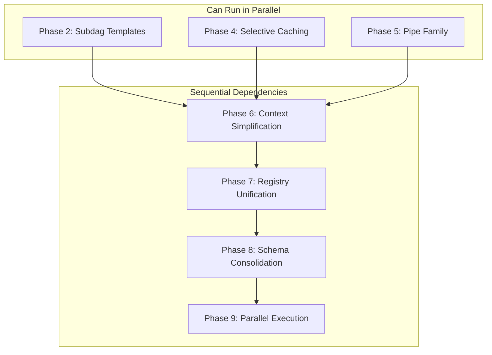

# Build Consolidation: Remaining Implementation Scope

> **Status**: Active Implementation Plan  
> **Author**: AI Assistant  
> **Date**: 2025-12-17  
> **Supersedes**: BUILD_CONSOLIDATION_AND_ENHANCEMENT_PLAN.md (for remaining scope tracking)  
> **Scope**: Remaining work in `src/codeintel/build/` (~47 native module files to consolidate)

---

## Executive Summary

This document focuses **exclusively on remaining implementation work** after analyzing the current codebase against the original plan. Phases 1, 3, 10, and 14 are complete. This plan addresses the remaining consolidation and enhancement phases.

### Completion Status

| Phase | Status | Summary |
|-------|--------|---------|
| **Phase 1**: Module Override Unification | ✅ **COMPLETE** | `allow_module_overrides()` in driver_factory.py |
| **Phase 2**: Subdag Pipeline Templates | 🔴 **NOT STARTED** | 47 native modules → target 15 |
| **Phase 3**: Hamilton Materializers | ✅ **COMPLETE** | DataSaver nodes + manifest-skip |
| **Phase 4**: Selective Caching | 🔴 **NOT STARTED** | No `@cache` usage yet |
| **Phase 5**: Pipe Family | 🟡 **PARTIAL** | 2/~10 complex targets use `@pipe_input` |
| **Phase 6**: Context Simplification | 🔴 **NOT STARTED** | Still 7+ context types |
| **Phase 7**: Registry Unification | 🟡 **PARTIAL** | `target_graph_from_hamilton()` exists |
| **Phase 8**: Schema Consolidation | 🟡 **PARTIAL** | Unified provider exists, ~13 files remain |
| **Phase 9**: Parallel Execution | 🟡 **PARTIAL** | `ThreadPoolAdapter` exists, not first-class |
| **Phase 10**: Plugin Scaffolding Removal | ✅ **COMPLETE** | plugins/ empty, no node_factory refs |
| **Phase 14**: Dead Code Removal | ✅ **COMPLETE** | Legacy materializers deleted |

### Current Metrics (Pre-Implementation)

| Category | Current | Target |
|----------|---------|--------|
| Native target files | 47 | 15-20 |
| Context types | 7+ | 2 |
| Targets using `@pipe_input` | 2 | ~10 (complex transforms) |
| Targets using `@cache` | 0 | ~8-12 (pure-Python nodes) |
| Schema-related files | 13 | 5-7 |

---

## Table of Contents

1. [What's Already Done](#1-whats-already-done)
2. [Remaining Phases](#2-remaining-phases)
3. [Phase 2: Subdag Pipeline Templates](#3-phase-2-subdag-pipeline-templates)
4. [Phase 4: Selective Caching](#4-phase-4-selective-caching)
5. [Phase 5: Pipe Family Expansion](#5-phase-5-pipe-family-expansion)
6. [Phase 6: Context Simplification](#6-phase-6-context-simplification)
7. [Phase 7: Registry Unification](#7-phase-7-registry-unification)
8. [Phase 8: Schema Consolidation](#8-phase-8-schema-consolidation)
9. [Phase 9: Parallel Execution](#9-phase-9-parallel-execution)
10. [Design Alterations](#10-design-alterations-from-prior-work)
11. [Implementation Roadmap](#11-implementation-roadmap)
12. [Success Criteria](#12-success-criteria)

---

## 1. What's Already Done

### Phase 1: Module Override Unification ✅

**Evidence**: `src/codeintel/build/hamilton/driver_factory.py`

```python
dr = (
    h_driver.Builder()
    .with_config(config or {})
    .with_modules(template_mod, *native_mods)
    .allow_module_overrides()  # ← Key consolidation lever
    .with_adapters(*adapter_list)
    .build()
)
```

- Templates + native overrides architecture established
- No mode switching or exclusion lists
- Single driver construction path

### Phase 3: Hamilton Materializers as IO Layer ✅

**Evidence**: `src/codeintel/build/hamilton/materializers/`

Implemented DataSaver nodes:
- `DuckDBIbisTableSaver` - Ibis table → DuckDB with manifest-skip
- `DuckDBRowsSaver` - Row batches → DuckDB
- `FileArtifactSaver` - Files/artifacts

The `ibis_pipeline.py` template demonstrates the pattern:

```python
@SaveToDecorator(
    [DuckDBIbisTableSaver],
    output_name_="materialization",
    env=source("env"),
    ...
)
def ibis_expr_to_save(expr: ir.Table | None) -> ir.Table | None:
    return expr
```

Native modules (`risk_factors.py`, `hotspots.py`) use this pattern directly.

### Phase 10 & 14: Plugin Scaffolding & Dead Code Removal ✅

- `plugins/` directory is nearly empty (only `__pycache__`)
- No `node_factory.py` imports found
- No `UnifiedRegistry` references found
- Legacy materializer modules deleted

---

## 2. Remaining Phases

The following phases require implementation work:

| Phase | Priority | Effort | Dependencies |
|-------|----------|--------|--------------|
| 2. Subdag Templates | High | 10-15 days | None |
| 4. Selective Caching | Medium | 3-5 days | None |
| 5. Pipe Family | Medium | 3-5 days | None |
| 6. Context Simplification | Medium | 5-7 days | Phase 2 |
| 7. Registry Unification | Low | 3-5 days | Phase 6 |
| 8. Schema Consolidation | Low | 3-5 days | Phase 7 |
| 9. Parallel Execution | Low | 3-5 days | Phase 8 |

---

## 3. Phase 2: Subdag Pipeline Templates

### Objective

Reduce 47 native module files to 15-20 using shape-based pipeline templates.

### Current State

```
hamilton/native/
├── analytics/     25 files (~4,500 lines) - Most parameterizable
├── ingestion/     10 files (~1,500 lines) - Highly similar patterns
├── graphs/         9 files (~1,800 lines) - Graph builder patterns
└── export/         3 files (~400 lines)   - Export patterns
```

### Recommended Template Architecture

Rather than one monolithic `target_pipeline.py`, use **shape-based templates**:

| Template | Shape | Current Implementations | After |
|----------|-------|------------------------|-------|
| `ibis_pipeline.py` | `ir.Table` → DuckDB → `TargetRunRecord` | 25+ | 1 template + 10-12 overrides |
| `rows_pipeline.py` | `Sequence[Row]` → DuckDB → `TargetRunRecord` | 10+ | 1 template + 3-5 overrides |
| `artifact_pipeline.py` | `bytes/str` → File → `TargetRunRecord` | 5+ | 1 template + 2-3 overrides |
| `tool_pipeline.py` | Tool invocation → Artifacts → `TargetRunRecord` | 3+ | 1 template + 1-2 overrides |

### Implementation: ibis_pipeline.py (Already Started)

The existing `ibis_pipeline.py` provides:

```python
@SaveToDecorator(...)
def ibis_expr_to_save(expr: ir.Table | None) -> ir.Table | None:
    return expr

def record(..., materialization: dict[str, Any]) -> TargetRunRecord:
    return record_from_duckdb_materialization(...)
```

**To expand**: Create `@parameterize` or `@subdag` wrappers to stamp out targets.

### Implementation: rows_pipeline.py (NEW)

```python
# templates/rows_pipeline.py

from hamilton.function_modifiers import tag
from hamilton.function_modifiers.adapters import SaveToDecorator

from codeintel.build.hamilton.materializers import DuckDBRowsSaver

@SaveToDecorator(
    [DuckDBRowsSaver],
    output_name_="materialization",
    env=source("env"),
    graph=source("graph"),
    target_name=source("target_name"),
    table_key=source("table_key"),
)
@tag(node_type="compute")
def rows_to_save(rows: Sequence[Row] | None) -> Sequence[Row] | None:
    """Pass through rows for materialization."""
    return rows

@tag(node_type="materialize")
def record(
    env: BuildEnv,
    graph: TargetGraph,
    target_name: str,
    table_key: str,
    materialization: dict[str, Any],
) -> TargetRunRecord:
    """Convert materialization metadata to TargetRunRecord."""
    return record_from_rows_materialization(
        env=env,
        graph=graph,
        target_name=target_name,
        expected_table_key=table_key,
        materialization=materialization,
    )
```

### Implementation: tool_pipeline.py (NEW)

```python
# templates/tool_pipeline.py

@SaveToDecorator(
    [FileArtifactSaver],
    output_name_="artifact_metadata",
    env=source("env"),
    graph=source("graph"),
    target_name=source("target_name"),
    artifact_name=source("artifact_name"),
)
@tag(node_type="compute")
def tool_output_to_save(
    tool_result: ToolResult,
) -> bytes | None:
    """Extract artifact bytes from tool result."""
    return tool_result.artifact_bytes if tool_result.success else None

@tag(node_type="materialize")
def record(
    env: BuildEnv,
    graph: TargetGraph,
    target_name: str,
    artifact_metadata: dict[str, Any],
) -> TargetRunRecord:
    """Convert artifact metadata to TargetRunRecord."""
    return record_from_artifact_materialization(...)
```

### Consolidation Targets by Domain

#### Analytics (25 → 10-12 files)

**Keep as separate modules** (complex transforms, unique logic):
- `risk_factors.py` - Already uses @pipe_input
- `hotspots.py` - Already uses @pipe_input
- `subsystems.py` - Complex clustering logic
- `function_metrics.py` - Core metrics

**Consolidate via templates** (simple Ibis transforms):
- `ast_features.py`, `behavioral_coverage.py`, `cfg_dfg.py` → template + parameterization
- `coverage_functions.py`, `coverage_test_edges.py` → coverage template
- `dependencies.py`, `entrypoints.py` → dependency template
- `*_graph_metrics.py` (4 files) → graph_metrics template

#### Ingestion (10 → 3-5 files)

**Keep as separate** (tool invocations with unique logic):
- `scip.py` - SCIP tool integration
- `tests.py` - Test discovery

**Consolidate** (similar AST/CST extraction patterns):
- `ast.py`, `cst.py`, `docstrings.py` → extraction_pipeline template
- `modules.py`, `coverage.py`, `typing.py` → ingestion_pipeline template

#### Graphs (9 → 3-5 files)

**Keep as separate** (complex graph building):
- `call_graph.py` - Core call graph
- `import_graph.py` - Import relationships

**Consolidate** (metric computations):
- `graph_metrics.py`, `graph_validation.py` → graph_metrics template
- `goids.py`, `symbol_uses.py`, `call_graph_views.py` → support template

### Success Criteria for Phase 2

- [ ] `rows_pipeline.py` template implemented
- [ ] `tool_pipeline.py` template implemented  
- [ ] Analytics reduced from 25 → 10-12 files
- [ ] Ingestion reduced from 10 → 3-5 files
- [ ] Graphs reduced from 9 → 3-5 files
- [ ] All tests pass
- [ ] DAG structure unchanged (same target dependencies)

---

## 4. Phase 4: Selective Caching

### Objective

Apply `@cache` to expensive pure-Python computations only. **NOT** to Ibis expressions.

### Current State

No `@cache` usage in the codebase.

### Correct Caching Strategy

| Node Type | Cache? | Rationale |
|-----------|--------|-----------|
| File enumeration (`collect_modules()`) | ✅ Yes | Pure Python, deterministic, expensive |
| AST/CST parsing | ✅ Yes | Pure Python, deterministic, expensive |
| Symbol extraction | ✅ Yes | Pure Python, deterministic |
| Ibis expressions (`ir.Table`) | ❌ **No** | Lazy query plan, not data |
| Artifact writes | ❌ Manifest-skip | Correctness-critical |

### Implementation Candidates

Search for expensive pure-Python operations in:

```
src/codeintel/build/hamilton/native/ingestion/
├── ast.py      # AST parsing
├── cst.py      # CST parsing  
├── modules.py  # File enumeration
├── scip.py     # Symbol extraction
```

Example implementation:

```python
# native/ingestion/modules.py

from hamilton.function_modifiers import cache, tag

@cache(format="pickle")  # Cache file enumeration results
@tag(domain="ingestion", target="modules", node_type="compute")
def collect_python_modules(env: BuildEnv) -> list[ModuleInfo]:
    """Enumerate Python modules in repository.
    
    This expensive file system operation benefits from caching.
    Output is deterministic for a given snapshot.
    """
    return list(enumerate_python_files(env.repo_root))


@cache(format="pickle")  # Cache AST parsing
@tag(domain="ingestion", target="ast", node_type="compute")  
def parse_module_asts(modules: list[ModuleInfo]) -> dict[str, ast.Module]:
    """Parse AST for all modules.
    
    Expensive CPU operation with deterministic output.
    """
    return {m.path: ast.parse(m.content) for m in modules}
```

### Driver Configuration

Enable caching on the driver:

```python
# driver_factory.py

dr = (
    h_driver.Builder()
    .with_config(config or {})
    .with_modules(template_mod, *native_mods)
    .allow_module_overrides()
    .with_cache()  # Enable caching
    .with_adapters(*adapter_list)
    .build()
)
```

### Success Criteria for Phase 4

- [ ] Identify 8-12 pure-Python nodes suitable for caching
- [ ] Add `@cache` decorators with appropriate format
- [ ] Enable caching in driver configuration
- [ ] Verify >80% cache hit rate for cached nodes
- [ ] Verify no `@cache` on Ibis-returning nodes
- [ ] All tests pass

---

## 5. Phase 5: Pipe Family Expansion

### Objective

Expand `@pipe_input` usage to remaining complex Ibis transforms for DAG visibility.

### Current State

Only 2 files use `@pipe_input`:
- `risk_factors.py` ✅
- `hotspots.py` ✅

### Candidates for @pipe_input

Apply `@pipe_input` to targets with **3+ transformation steps**:

| Target | Steps | Current State |
|--------|-------|---------------|
| `risk_factors` | 5 | ✅ Done |
| `hotspots` | 5 | ✅ Done |
| `subsystems` | 4+ | 🔴 Monolithic |
| `dependencies` | 3+ | 🔴 Monolithic |
| `function_contracts` | 3+ | 🔴 Monolithic |
| `semantic_roles` | 3+ | 🔴 Monolithic |
| `call_graph` | 4+ | 🔴 Monolithic |
| `import_graph` | 3+ | 🔴 Monolithic |

### Implementation Pattern

Follow the established pattern from `risk_factors.py`:

```python
# Before: Monolithic function
def t__subsystems__compute(
    q__core__modules: ir.Table,
    q__graph__import_graph_edges: ir.Table,
) -> ir.Table:
    # Step 1: Filter modules
    filtered = q__core__modules.filter(...)
    # Step 2: Build adjacency
    adjacency = q__graph__import_graph_edges.group_by(...).aggregate(...)
    # Step 3: Cluster
    clustered = ...
    # Step 4: Assign labels
    labeled = ...
    return labeled

# After: DAG-visible steps
def _filter_python_modules(modules: ir.Table, env: BuildEnv) -> ir.Table:
    """Filter to Python modules in current snapshot."""
    return modules.filter(...)

def _build_adjacency_matrix(edges: ir.Table) -> ir.Table:
    """Build import adjacency for clustering."""
    return edges.group_by(...).aggregate(...)

def _cluster_modules(adjacency: ir.Table) -> ir.Table:
    """Apply clustering algorithm."""
    return ...

def _assign_subsystem_labels(clusters: ir.Table) -> ir.Table:
    """Map clusters to subsystem labels."""
    return ...

@pipe_input(
    step(_filter_python_modules, env=source("env")),
    step(_build_adjacency_matrix, edges=source("q__graph__import_graph_edges")),
    step(_cluster_modules),
    step(_assign_subsystem_labels),
    namespace=None,
    on_input="q__core__modules",
)
@tag(domain="analytics", target="subsystems", node_type="compute")
def t__subsystems__compute(q__core__modules: ir.Table) -> ir.Table:
    """Compute subsystem assignments with DAG-visible steps."""
    return q__core__modules
```

### Success Criteria for Phase 5

- [ ] 6-8 additional targets use `@pipe_input`
- [ ] Intermediate steps visible in DAG exports
- [ ] Each step has unit tests
- [ ] All tests pass

---

## 6. Phase 6: Context Simplification

### Objective

Reduce context types from 7+ to 2 primary contexts.

### Current State

```
Found context types:
- ContextPropertiesProtocol
- BuildContext
- ExecutionContext  
- TargetExecutionContext
- MaterializationContext (deprecated, 1 reference)
- ContextResources
- Domain-specific contexts (_RunContext, GoidExtractionContext, etc.)
```

### Target Architecture

```
Primary Contexts:
├── BuildContext (immutable, session-wide)
└── TargetExecutionContext (mutable, per-target execution)
    └── Composes BuildContext (delegation, not inheritance)
```

### Implementation

#### Step 1: Merge ExecutionContext into BuildContext

The `BuildContext` already supports materialization options:

```python
@dataclass(frozen=True)
class BuildContext:
    gateway: StorageGateway
    snapshot: SnapshotRef
    paths: BuildPaths
    session: BuildSession | None = None
    validate_schemas: bool = False
    owner_target: str | None = None
    input_hash: str | None = None
```

Remove `ExecutionContext` as a separate class and ensure all its uses are migrated to `BuildContext`.

#### Step 2: Simplify TargetExecutionContext

```python
@dataclass(slots=True)
class TargetExecutionContext:
    """Mutable context for target execution.
    
    Composes BuildContext rather than duplicating fields.
    """
    build_ctx: BuildContext  # Composition
    target: OutputTarget
    resources: ContextResources
    
    @property
    def gateway(self) -> StorageGateway:
        return self.build_ctx.gateway
    
    @property
    def snapshot(self) -> SnapshotRef:
        return self.build_ctx.snapshot
    
    # ... delegate other properties
```

#### Step 3: Eliminate Domain-Specific Contexts

Convert domain-specific contexts like `GoidExtractionContext`, `_RunContext` into either:
- Parameters to functions
- Dataclasses that are **not** named `*Context`

### Success Criteria for Phase 6

- [ ] `ExecutionContext` removed
- [ ] `MaterializationContext` references eliminated
- [ ] Only `BuildContext` and `TargetExecutionContext` remain
- [ ] Domain contexts converted to simple dataclasses
- [ ] All tests pass

---

## 7. Phase 7: Registry Unification

### Objective

Evolve `TargetGraph` into the unified `TargetRegistry` derived from Hamilton DAG.

### Current State

- `target_graph_from_hamilton()` exists in `introspect.py`
- But `TargetGraph` is still manually constructed in `driver_factory.py`
- Dependencies still derived from static declarations on `OutputTarget`

### Implementation

#### Step 1: Make Hamilton DAG the Source of Truth for Dependencies

Currently in `driver_factory.py`:

```python
graph = TargetGraph()
for target in ALL_TARGETS:
    graph.register(target)  # Uses static dependencies
```

Change to:

```python
# Build driver first
dr = h_driver.Builder()...build()

# Derive dependencies from Hamilton DAG
graph = target_graph_from_hamilton(HamiltonRuntime(dr=dr, graph=TargetGraph()))
```

#### Step 2: Rename/Evolve TargetGraph to TargetRegistry

The prior agent noted: "Treat TargetGraph as the TargetRegistry rather than introducing a parallel abstraction."

```python
# build/target_registry.py

@dataclass
class TargetRegistry:
    """Single source of truth for targets, derived from Hamilton DAG.
    
    This is the evolved TargetGraph with Hamilton-derived dependencies.
    """
    _graph: TargetGraph  # Internal storage
    _driver: Driver
    
    def get(self, name: str) -> OutputTarget | None:
        return self._graph.get(name)
    
    def dependencies_of(self, name: str) -> tuple[str, ...]:
        """Get dependencies from Hamilton DAG (authoritative)."""
        return self._graph.dependencies_of(name)
    
    def is_native(self, name: str) -> bool:
        """Check if target has native implementation."""
        node = self._driver.graph.nodes.get(f"t__{name}")
        if node is None:
            return False
        return "native" in node.originating_functions[0].__module__
    
    @classmethod
    def build(cls) -> TargetRegistry:
        """Build from Hamilton driver with module overrides."""
        runtime = build_driver()
        graph = target_graph_from_hamilton(runtime, strict=True)
        return cls(_graph=graph, _driver=runtime.dr)


def get_target_registry() -> TargetRegistry:
    """Single access point for target registry."""
    return TargetRegistry.build()
```

### Success Criteria for Phase 7

- [ ] Dependencies derived from Hamilton DAG, not static declarations
- [ ] Single `get_target_registry()` accessor
- [ ] `TargetGraph` renamed/evolved to `TargetRegistry`
- [ ] All tests pass

---

## 8. Phase 8: Schema Consolidation

### Objective

Simplify the 13+ schema-related files to 5-7 with clearer responsibilities.

### Current State

```
build/schemas/
├── __init__.py
├── compile.py
├── contract_provider.py
├── declared_schemas.py
├── diff.py
├── infer_duckdb.py
├── json_schema_registry.py
├── manifest.py
├── provider_declared.py
├── provider_hamilton.py
├── provider_unified.py
├── registry.py          # Main entry point
├── row_registry.py
└── seed_harness.py
```

### Target Architecture

```
build/schemas/
├── __init__.py
├── registry.py          # Unified entry point
├── resolvers/
│   ├── __init__.py
│   ├── hamilton.py      # Hamilton-native inference
│   ├── declared.py      # Static declarations
│   └── duckdb.py        # Runtime introspection
├── diff.py              # Schema comparison (keep)
└── json_schema.py       # JSON Schema export (keep)
```

### Implementation

The current `registry.py` already provides good structure:

```python
def get_schema_provider() -> SchemaProvider:
    """Single entry point for all schema resolution."""
    return unified_schema_provider()  # 3-tier fallback
```

Main work is consolidating provider files into `resolvers/` subdirectory.

### Success Criteria for Phase 8

- [ ] Provider files consolidated into `resolvers/`
- [ ] Clear resolver interface (`SchemaResolver` protocol)
- [ ] Single `get_schema_provider()` accessor maintained
- [ ] All tests pass

---

## 9. Phase 9: Parallel Execution

### Objective

Promote `ThreadPoolAdapter` to first-class configurable mode.

### Current State

`ThreadPoolAdapter` exists with:
- Global write lock for materialize/artifact nodes
- Per-thread gateway cloning for DuckDB safety
- Future resolution for dependency handling

But it's not fully integrated as a first-class option.

### Implementation

#### Step 1: Add CLI Flag

```bash
codeintel build --parallel=threadpool --workers=4
```

#### Step 2: Add Config Support

```python
# build/config.py

@dataclass
class BuildConfig:
    parallel_backend: str = "sequential"
    parallel_workers: int | None = None
    
    def get_parallel_adapter(self) -> ThreadPoolAdapter | None:
        return create_parallel_adapter(
            backend=self.parallel_backend,
            max_workers=self.parallel_workers,
        )
```

#### Step 3: Documentation

Document which targets are safe for parallel execution:

| Category | Targets | Parallel Safe? |
|----------|---------|----------------|
| I/O-bound | scip, typing, coverage, tests | ✅ Yes (read-only) |
| CPU-bound | metrics, risk_factors, hotspots | ⚠️ Sequential writes |
| Memory-bound | call_graph, import_graph | ⚠️ Large graphs |

### Success Criteria for Phase 9

- [ ] CLI flag `--parallel` implemented
- [ ] Config file support for parallel settings
- [ ] Documentation of safe targets
- [ ] No race conditions in tests
- [ ] All tests pass with `--parallel=threadpool`

---

## 10. Design Alterations from Prior Work

The prior agent working on this scope recommended several design alterations that should be incorporated:

### 10.1 DAG-Explicit Dependencies (Critical)

**Problem**: Many native compute nodes read directly from `env.gateway` and don't accept loader/dataset nodes. This means:
- Closure planning is incomplete
- Manifest hashing may be wrong (hashes computed from DAG-derived deps)

**Solution**: For any target that depends on upstream tables, ensure the DAG includes explicit inputs:

```python
# Current (implicit dependency)
def t__risk_factors__compute(env: BuildEnv, graph: TargetGraph) -> ir.Table:
    metrics = env.gateway.ibis.table("analytics.function_metrics")
    # ...

# Target (explicit dependency)
def t__risk_factors__compute(
    q__analytics__function_metrics: ir.Table,  # Explicit DAG input
    q__graph__call_graph_edges: ir.Table,       # Explicit DAG input
) -> ir.Table:
    # ...
```

**Enforcement**: Add a lint rule or test that verifies all Ibis tables read by compute nodes are declared as function parameters, not read from gateway.

### 10.2 Centralized Skip Token

**Problem**: Skip computation (input hash, manifest check) is duplicated between compute nodes and saver nodes.

**Solution**: Introduce a standard "skip info" node:

```python
@tag(node_type="skip_check")
def skip_info(
    env: BuildEnv,
    graph: TargetGraph,
    target_name: str,
) -> dict[str, Any]:
    """Compute skip decision once, share with compute and saver."""
    target = graph.require(target_name)
    input_hash = compute_input_hash(target, env)
    should_skip = should_skip_native_target(env, target, input_hash)
    return {
        "input_hash": input_hash,
        "should_skip": should_skip,
        "manifest": env.manifest_index.get(target_name),
    }
```

Then compute and saver nodes use this:

```python
def t__risk_factors__compute(
    ...,
    skip_info: dict[str, Any],  # Shared skip decision
) -> ir.Table | None:
    if skip_info["should_skip"]:
        return None  # Early exit
    # ... compute
```

### 10.3 Import Boundary Enforcement

**Problem**: Analytics modules importing build-layer materializers creates coupling.

**Solution**: Establish and enforce import boundaries:

```
codeintel.analytics.*  → Pure compute only (no build imports)
codeintel.build.*      → I/O, materialization, orchestration
```

Add to `pyproject.toml`:

```toml
[tool.import-linter]
root_packages = ["codeintel"]

[[tool.import-linter.contracts]]
name = "Analytics must not import build"
type = "forbidden"
source_modules = ["codeintel.analytics"]
forbidden_modules = ["codeintel.build"]
```

---

## 11. Implementation Roadmap

### Phase Ordering



### Time Estimates

| Phase | Effort | Dependencies |
|-------|--------|--------------|
| Phase 2: Subdag Templates | 10-15 days | None |
| Phase 4: Selective Caching | 3-5 days | None |
| Phase 5: Pipe Family | 3-5 days | None |
| Phase 6: Context Simplification | 5-7 days | Phases 2, 4, 5 |
| Phase 7: Registry Unification | 3-5 days | Phase 6 |
| Phase 8: Schema Consolidation | 3-5 days | Phase 7 |
| Phase 9: Parallel Execution | 3-5 days | Phase 8 |

**Total**: ~6-8 weeks (with parallel execution of initial phases)

### Recommended Sprint Plan

**Sprint 1 (2 weeks)**: Foundation
- Phase 2: Create `rows_pipeline.py` and `tool_pipeline.py` templates
- Phase 2: Consolidate 5-10 analytics targets
- Phase 4: Add `@cache` to 4-6 pure-Python nodes

**Sprint 2 (2 weeks)**: Consolidation  
- Phase 2: Complete analytics/ingestion/graphs consolidation
- Phase 5: Expand `@pipe_input` to 4-6 targets
- Phase 6: Begin context simplification

**Sprint 3 (2 weeks)**: Unification
- Phase 6: Complete context simplification
- Phase 7: Registry unification
- Phase 8: Schema consolidation

**Sprint 4 (1 week)**: Polish
- Phase 9: Parallel execution promotion
- Documentation updates
- Final cleanup

---

## 12. Success Criteria

### Quantitative

| Metric | Current | Target | Validation |
|--------|---------|--------|------------|
| Native target files | 47 | 15-20 | `find hamilton/native -name "*.py" \| wc -l` |
| Context types | 7+ | 2 | Manual audit |
| Targets using @pipe_input | 2 | 8-10 | `grep -r "@pipe_input" \| wc -l` |
| Targets using @cache | 0 | 8-12 | `grep -r "@cache" \| wc -l` |
| Schema files | 13 | 5-7 | `ls build/schemas/*.py \| wc -l` |
| Test pass rate | 100% | 100% | `uv run pytest` |

### Qualitative

| Criterion | Validation |
|-----------|------------|
| Shape-based templates | `ibis_pipeline`, `rows_pipeline`, `tool_pipeline`, `artifact_pipeline` exist |
| DAG-explicit dependencies | No direct `env.gateway.ibis.table()` calls in compute nodes |
| Centralized skip logic | `skip_info` node pattern used |
| Import boundaries enforced | `import-linter` passes |
| Single registry accessor | `get_target_registry()` is only entry point |
| Parallel execution first-class | `--parallel` CLI flag works |

---

## Appendix: Files to Create

### New Templates

| File | Purpose |
|------|---------|
| `templates/rows_pipeline.py` | Row batch → DuckDB template |
| `templates/tool_pipeline.py` | Tool → Artifact template |
| `templates/artifact_pipeline.py` | Bytes → File template |

### New Consolidation Modules

| File | Consolidates |
|------|-------------|
| `native/analytics/coverage_targets.py` | `coverage_functions.py`, `coverage_test_edges.py`, `behavioral_coverage.py` |
| `native/analytics/metrics_targets.py` | `*_graph_metrics.py` (4 files) |
| `native/ingestion/extraction_targets.py` | `ast.py`, `cst.py`, `docstrings.py` |
| `native/graphs/metrics_targets.py` | `graph_metrics.py`, `graph_validation.py` |

### Files to Modify

| File | Changes |
|------|---------|
| `driver_factory.py` | Add cache, derive dependencies from DAG |
| `context_base.py` | Remove ExecutionContext |
| `context.py` | Simplify TargetExecutionContext |
| `registry.py` | Add TargetRegistry |
| `build/config.py` | Add parallel config |

### Files to Delete (After Consolidation)

All files consolidated into templates can be deleted once templates are working and tested.

---

*This document is the authoritative implementation plan for remaining build consolidation work. Update as phases complete.*

