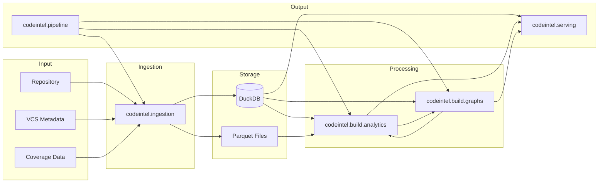

# Architecture Overview

This page provides a high-level view of CodeIntel's architecture, covering the
major subsystems and their interactions.

## High-Level Dataflow



## Subsystems

### Core Infrastructure

- **[Core](../reference/codeintel/core/)** - Shared types and singleton patterns
- **[Config](../reference/codeintel/config/)** - Configuration models, primitives, and step configs
- **[Runtime](runtime.md)** - Runtime context and orchestration identity

### Data Processing

- **[Ingestion](ingestion.md)** - Source code parsing, AST/CST extraction, SCIP indexing
- **[Storage](storage.md)** - DuckDB persistence, dataset contracts, schema management
- **[Graphs](graphs.md)** - Graph builders (call, import, CFG, DFG) and metrics
- **[Analytics](analytics.md)** - Plugin-based analytics computations

### External Interfaces

- **[Serving](serving.md)** - HTTP APIs, MCP server, backend services
- **[Pipeline](pipeline.md)** - Unified orchestration across all engines

## Layering Rules

See [Layering and Boundaries](layering.md) for the explicit layering constraints
that govern imports and dependencies between modules.

## Module Dependency Graph

The following diagram shows the import dependencies between CodeIntel's subpackages:


This intermediate-level view shows subfolders within each major package (e.g.,
`analytics.core`, `analytics.plugins`, `storage.gateway`) while coalescing individual
modules. This provides more detail than top-level packages while remaining readable.
Arrows point from importing to imported packages.

!!! note "Detailed Diagrams"
    For full UML class and package diagrams with all internal details, run:
    ```bash
    make docs-diagrams
    ```
    This generates `codeintel-packages.svg` and `codeintel-classes.svg` in
    `mkdocs-build/docs/architecture/`.

## Key Design Principles

1. **Plugin-Based Architecture**: Analytics, graphs, and ingestion all use plugin
   protocols for extensibility.

2. **Layered Design**: Clear separation between core, engines, and interfaces
   prevents circular dependencies.

3. **Dataset Contracts**: All persistent data has explicit schemas and validation.

4. **Type Safety**: Strict typing throughout with pyright and pyrefly verification.

5. **Observability**: Structured logging, Prometheus metrics, and OpenTelemetry traces.

## Where to Look for Code

The source code lives under `src/codeintel`:

| Directory | Purpose |
|-----------|---------|
| `src/codeintel/core/` | Core types and abstractions |
| `src/codeintel/config/` | Configuration models and schemas |
| `src/codeintel/ingestion/` | Source code ingestion pipeline |
| `src/codeintel/storage/` | DuckDB gateway and dataset contracts |
| `src/codeintel/build/graphs/` | Graph building and metrics |
| `src/codeintel/build/analytics/` | Analytics plugin system |
| `src/codeintel/serving/` | HTTP and MCP interfaces |
| `src/codeintel/pipeline/` | Unified orchestration |
| `src/codeintel/runtime/` | Runtime context management |

