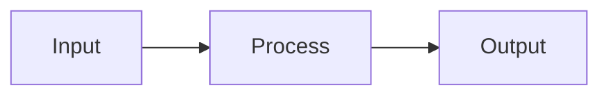

# Documentation Guide

This guide explains how to use, navigate, and contribute to the CodeIntel documentation.

## Quick Start

### Building the Documentation

From the repository root:

```bash
# Build the full documentation site
make docs

# Serve locally with hot-reload
make docs-serve

# Generate architecture diagrams only
make docs-diagrams

# Generate combined overview for LLM context
make docs-summary
```

### Accessing the Documentation

After running `make docs-serve`, open [http://localhost:8000](http://localhost:8000) in your browser.

---

## Site Structure

The documentation is organized into three main sections:

### 1. Overview (Home)

The landing page (`index.md`) provides:

- High-level description of CodeIntel
- Key subsystems summary
- Quick navigation links

### 2. Architecture

Detailed technical documentation of each subsystem:

| Page | Description |
|------|-------------|
| [Overview](architecture/overview.md) | High-level dataflow and system architecture |
| [Layering](architecture/layering.md) | Import rules and layer boundaries |
| [Datasets & Snapshots](architecture/datasets-and-snapshots.md) | Snapshot model and dataset contracts |
| [Ingestion](architecture/ingestion.md) | Code extraction and metadata building |
| [Analytics](architecture/analytics.md) | Metrics, profiles, and risk analysis |
| [Graphs](architecture/graphs.md) | Call graphs, import graphs, CFG/DFG |
| [Storage](architecture/storage.md) | DuckDB, Parquet, and data contracts |
| [Serving](architecture/serving.md) | HTTP APIs and MCP tools |
| [Pipeline](architecture/pipeline.md) | Orchestration and workflow |
| [Runtime](architecture/runtime.md) | Environment and configuration |

### 3. Code Reference

Auto-generated API documentation from Python docstrings. This section is built dynamically from the source code in `src/`.

---

## Navigation Features

### Search

Press `/` or click the search icon to open the search dialog. The search supports:

- **Suggestions**: Type to see matching results
- **Highlighting**: Search terms are highlighted in results
- **Sharing**: Copy search URLs to share with others

### Table of Contents

Each page has a right-side table of contents showing:

- All headings on the current page
- Clickable links with `#` permalinks
- Active section highlighting as you scroll

### Tabs Navigation

The top navigation bar shows main sections as tabs:

- **Overview** - Home page
- **Architecture** - Technical documentation
- **Code Reference** - API documentation

### Section Navigation

The left sidebar shows the current section's pages with expandable subsections.

---

## Reading API Documentation

The Code Reference section uses `mkdocstrings` to generate documentation from Python source code.

### Understanding the Format

Each module/class/function page shows:

```
Module Path
├── Description (from docstring)
├── Parameters (with types)
├── Returns (with type)
├── Raises (exceptions)
├── Attributes (for classes)
└── Examples (if provided)
```

### Docstring Style

We use **NumPy-style docstrings**:

```python
def example_function(param1: str, param2: int = 10) -> bool:
    """Short description of function.

    Longer description with more details about behavior,
    edge cases, and usage notes.

    Parameters
    ----------
    param1
        Description of param1.
    param2
        Description of param2. Defaults to 10.

    Returns
    -------
    bool
        Description of return value.

    Raises
    ------
    ValueError
        When param1 is empty.

    Examples
    --------
    >>> example_function("test")
    True
    """
```

### Cross-References

API docs automatically link to:

- Other functions/classes in CodeIntel
- Python standard library documentation
- Related sections in architecture docs

Click any type annotation or reference to navigate to its documentation.

---

## Mermaid Diagrams

The documentation supports Mermaid diagrams for visualizing:

- **Flowcharts** - Process flows and decision trees
- **Sequence diagrams** - Interaction between components
- **Class diagrams** - Object relationships
- **State diagrams** - State machines

Example syntax:

````markdown

````

Renders as an interactive diagram in the browser.

---

## Code Blocks

### Syntax Highlighting

Code blocks are highlighted with Python as the default language:

```python
from codeintel.storage import StorageGateway

gateway = StorageGateway.open(config)
```

Specify other languages explicitly:

````markdown
```bash
make docs
```

```sql
SELECT * FROM functions WHERE module = 'codeintel.core';
```
````

### Copy Button

Every code block has a copy button (top-right corner) to copy the code to your clipboard.

---

## Admonitions

The documentation uses admonitions (callout boxes) for important information:

!!! note "Note"
    General information or tips.

!!! warning "Warning"
    Important cautions or potential issues.

!!! danger "Danger"
    Critical warnings about breaking changes or security.

!!! tip "Tip"
    Helpful suggestions and best practices.

!!! info "Info"
    Background information or context.

!!! example "Example"
    Worked examples and use cases.

Syntax:

```markdown
!!! note "Title"
    Content of the admonition.
```

---

## Generated Artifacts

### Architecture Diagrams

The `make docs-diagrams` command generates:

| Diagram | Description | Location |
|---------|-------------|----------|
| `codeintel-imports.svg` | Module dependency graph (pydeps) | `docs/architecture/` |
| `codeintel-packages.svg` | Package structure (pyreverse) | `docs/architecture/` |
| `codeintel-classes.svg` | Class relationships (pyreverse) | `docs/architecture/` |

These are embedded in the [Architecture Overview](architecture/overview.md).

### Combined Overview

The `make docs-summary` command generates:

- **File**: `CodeIntel_architecture_overview.md` (repo root)
- **Purpose**: Single-file export for LLM context
- **Contents**: All architecture docs with TOC and line numbers

This file is excluded from git (see `.gitignore`).

---

## Contributing to Documentation

### File Structure

```
mkdocs-build/
├── mkdocs.yml          # MkDocs configuration
└── docs/
    ├── index.md        # Landing page
    ├── guide.md        # This file
    └── architecture/   # Technical docs
        ├── overview.md
        ├── layering.md
        └── ...

mkdocs-gen/
├── gen_ref_pages.py       # API reference generator
├── gen_arch_diagrams.py   # Diagram generator
└── build_single_markdown.py  # Combined overview generator
```

### Adding New Pages

1. Create the markdown file in the appropriate directory
2. Add it to the `nav:` section in `mkdocs.yml`
3. Run `make docs-serve` to preview

### Writing Guidelines

1. **Use headings hierarchically** - Start with `#`, use `##` for sections
2. **Include code examples** - Runnable examples are better than descriptions
3. **Link to related pages** - Use `[text](path/to/page.md)` or autorefs
4. **Add diagrams for complex flows** - Mermaid diagrams render automatically
5. **Keep pages focused** - One topic per page, link to related pages

### API Documentation

API docs are generated automatically from source code docstrings. To improve API docs:

1. Add or update docstrings in the Python source files
2. Follow NumPy docstring conventions
3. Include type annotations
4. Add `Examples` sections where helpful
5. Rebuild with `make docs` to see changes

---

## Makefile Commands Reference

| Command | Description |
|---------|-------------|
| `make docs` | Build full documentation site with progress tracking |
| `make docs-fast` | Build docs, skipping diagram generation |
| `make docs-serve` | Start local dev server at `localhost:8000` |
| `make docs-diagrams` | Generate architecture diagrams only |
| `make docs-summary` | Generate combined overview markdown |

### Build Options

The `make docs` command uses an orchestrator script with several options:

```bash
# Full build with parallel diagram generation (default)
python mkdocs-gen/build_docs.py

# Skip diagram generation for faster iteration
python mkdocs-gen/build_docs.py --skip-diagrams

# Disable parallel execution (useful for debugging)
python mkdocs-gen/build_docs.py --no-parallel
```

### Build Output

The build shows real-time progress:

```
======================================================================
CodeIntel Documentation Build
======================================================================
  Source modules: 504
  Parallel mode:  enabled
  Output:         mkdocs-output/
----------------------------------------------------------------------

Building docs: 3/3 [04:30<00:00] ██████████

----------------------------------------------------------------------
Build Summary
----------------------------------------------------------------------
  [OK  ] Pydeps import graph            (200.0s)
  [OK  ] Pyreverse UML diagrams         (18.5s)
  [OK  ] MkDocs build                   (26.0s)
----------------------------------------------------------------------
Build completed successfully in 226.0s
======================================================================
```

The diagram generation runs in parallel to reduce total build time.

---

## Troubleshooting

### Build Errors

**"Config file not found"**

Ensure you're running from the repository root, not inside `mkdocs-build/`.

**"Module not found" in API docs**

The source must be importable. Run:

```bash
uv sync
source .venv/bin/activate
```

**Broken cross-references**

Check that referenced pages exist and paths are relative to `docs/`.

### Development Server Issues

**Port already in use**

The default port is 8000. Either stop the existing process or use:

```bash
mkdocs serve -f mkdocs-build/mkdocs.yml -a localhost:8001
```

**Changes not reflecting**

The dev server watches for changes automatically. If changes don't appear:

1. Check the terminal for errors
2. Hard-refresh the browser (Ctrl+Shift+R)
3. Restart the dev server

---

## Further Reading

- [MkDocs Documentation](https://www.mkdocs.org/)
- [Material for MkDocs](https://squidfunk.github.io/mkdocs-material/)
- [mkdocstrings](https://mkdocstrings.github.io/)
- [Mermaid Diagrams](https://mermaid.js.org/)

